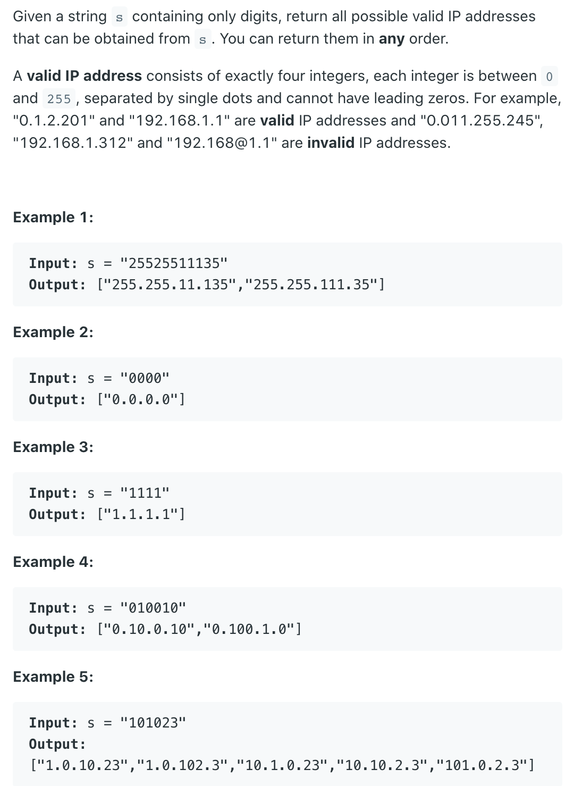
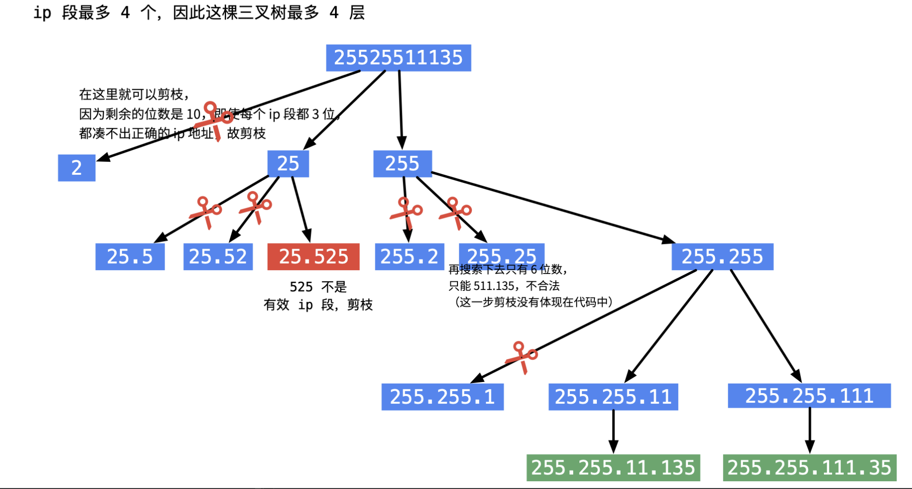
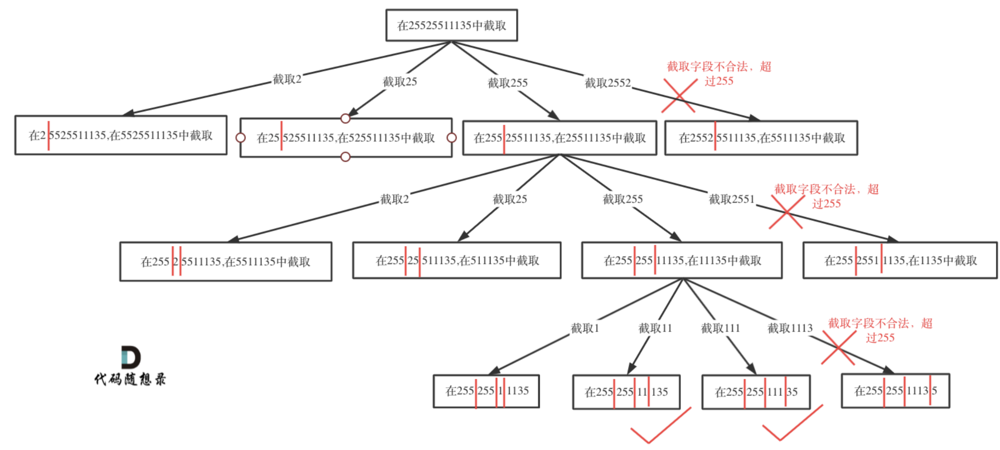

## 93. Restore IP Addresses

---
- [中文解释 I](https://programmercarl.com/0093.%E5%A4%8D%E5%8E%9FIP%E5%9C%B0%E5%9D%80.html#%E5%9B%9E%E6%BA%AF%E4%B8%89%E9%83%A8%E6%9B%B2)
- [youtube](https://www.youtube.com/watch?v=YqQvmemMbe4)




- **递归用来纵向遍历，for循环用来横向遍历**

- 递归终止条件：
  - `pointNum` 表示逗点数量，`pointNum` 为`3`说明字符串分成了`4`段了。

```java
if (pointNum == 3) { // 逗点数量为3时，分隔结束
    // 判断第四段子字符串是否合法，如果合法就放进result中
    if (isValid(s, startIndex, s.size() - 1)) {
        result.push_back(s);
    }
    return;
}
```

- 在`for (int i = startIndex; i < s.size(); i++)` 循环中 `[startIndex, i]` 这个区间就是截取的子串，需要判断这个子串是否合法。
  如果合法就在字符串后面加上符号`.`表示已经分割。

---
### Brute Force
```java
class Solution {
    public List<String> restoreIpAddresses(String s) {
        List<String> res = new ArrayList<>();
        int len = s.length();
        for (int i = 1; i < 4 && i < len - 2; i++) {
            for (int j = i + 1; j < i + 4 && j < len - 1; j++) {
                for (int k = j + 1; k < j + 4 && k < len; k++) {
                    String s1 = s.substring(0, i),
                            s2 = s.substring(i, j),
                            s3 = s.substring(j, k),
                            s4 = s.substring(k, len);
                    if (isValid(s1) && isValid(s2) && isValid(s3) && isValid(s4)) {
                        res.add(s1 + "." + s2 + "." + s3 + "." + s4);
                    }

                }
            }
        }
        return res;
    }

    private boolean isValid(String s) {
        if (s.length() > 3 || s.length() == 0 ||
                (s.charAt(0) == '0' && s.length() > 1) || Integer.parseInt(s) > 255) {
            return false;
        }
        return true;
    }

    public static void main(String[] args) {
        Solution soln = new Solution();
        String s = "101023";
        List<String> res = soln.restoreIpAddresses(s);
        System.out.println(res);
    }
}
```

---

- [中文解释 II](https://www.youtube.com/watch?v=wLuFymFZORQ&t=957s)

```java
class Restore_IP_Addresses_StringBuilder {
    public List<String> restoreIpAddresses(String s) {
        List<String> res = new ArrayList<>();
        if (s.length() < 4 || s.length() > 12) {
            return res;
        }

        StringBuilder sb = new StringBuilder(s);
        dfs(res, sb, 0, 0);
        return res;
    }

    //优化：使用stringBuilder，故优化时间、空间复杂度，因为向字符串插入字符时无需复制整个字符串，从而减少了操作的时间复杂度，
    // 也不用开新空间存subString，从而减少了空间复杂度。
    private void dfs(List<String> res, StringBuilder sb, int startIndex, int pointNum) {
        if (pointNum == 3) {
            if (isValid(sb.substring(startIndex))) {
                res.add(sb.toString());
            }
            return;
        }

        for (int i = startIndex; i < sb.length(); i++) {
            if (isValid(sb.substring(startIndex, i + 1))) {
                sb.insert(i + 1, '.'); //在str的后⾯插⼊⼀个逗点
                pointNum++;
                dfs(res, sb, i + 2, pointNum);// 插⼊逗点之后下⼀个⼦串的起始位置为 i+2
                pointNum--;
                sb.deleteCharAt(i + 1); // 回溯删掉逗点
            } else {
                break;
            }
        }
    }

    private boolean isValid(String s) {
        if (s.length() > 3) {
            return false;
        }
        if (s.length() == 0) {
            return false;
        }
        if (s.charAt(0) == '0' && s.length() > 1) { // "01"
            return false;
        }
        if (Integer.parseInt(s) > 255) {
            return false;
        }
        return true;
    }
}
```
