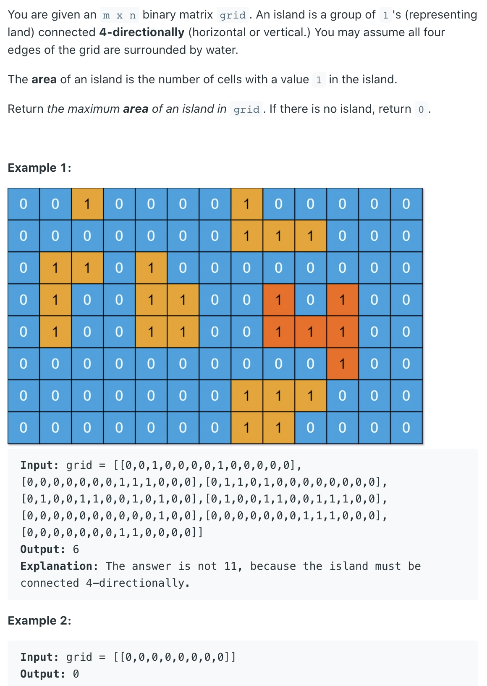

## 695. Max Area of Island


- `if (grid[i][j] == 1)`, 这句判断之后默认数值为`1`, 所以递归本身 `return 1 + dfs(...) + dfs(...) + ...`
- 每次调用的时候默认为1，进入后判断如果不是岛屿，则直接返回0，就可以避免预防错误的情况。
- 每次找到岛屿，则直接把找到的岛屿改成0，这是传说中的沉岛思想，就是遇到岛屿就把他和周围的全部沉没。
- ps：如果能用沉岛思想，那么自然可以用朋友圈思想。

---
```java
class _695_MaxAreaOfIsland {
    public int maxAreaOfIsland(int[][] grid) {
        int m = grid.length, n = grid[0].length;
        int[] res = new int[1];

        for (int i = 0; i < m; i++) {
            for (int j = 0; j < n; j++) {
                if (grid[i][j] == 1) {
                    res[0] = Math.max(res[0], dfs(grid, i, j));
                }
            }
        }

        return res[0];
    }

    private int dfs(int[][] grid, int i, int  j) {
        if (i < 0 || i >= grid.length || j < 0 || j >= grid[0].length) {
            return 0;
        }
        if (grid[i][j] == 0) {
            return 0;
        }

        grid[i][j] = 0;

        return 1 + dfs(grid, i + 1, j)
                + dfs(grid, i, j + 1)
                + dfs(grid, i - 1, j)
                + dfs(grid, i, j - 1);
    }
}
```
---

```py
class Solution:
    def maxAreaOfIsland(self, grid: List[List[int]]) -> int:
        m, n = len(grid), len(grid[0])
        res = 0

        def dfs(grid, i, j):
            if i < 0 or i >= m or j < 0 or j >= n or grid[i][j] == 0:
                return 0

            grid[i][j] = 0

            return (dfs(grid, i + 1, j)
                    + dfs(grid, i, j + 1)
                    + dfs(grid, i - 1, j)
                    + dfs(grid, i, j - 1) + 1)

        for i in range(m):
            for j in range(n):
                if grid[i][j] == 1:
                    res = max(res, dfs(grid, i, j))

        return res
```