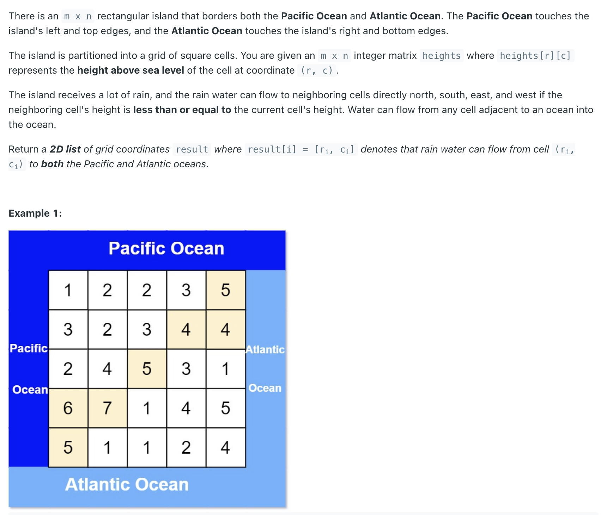
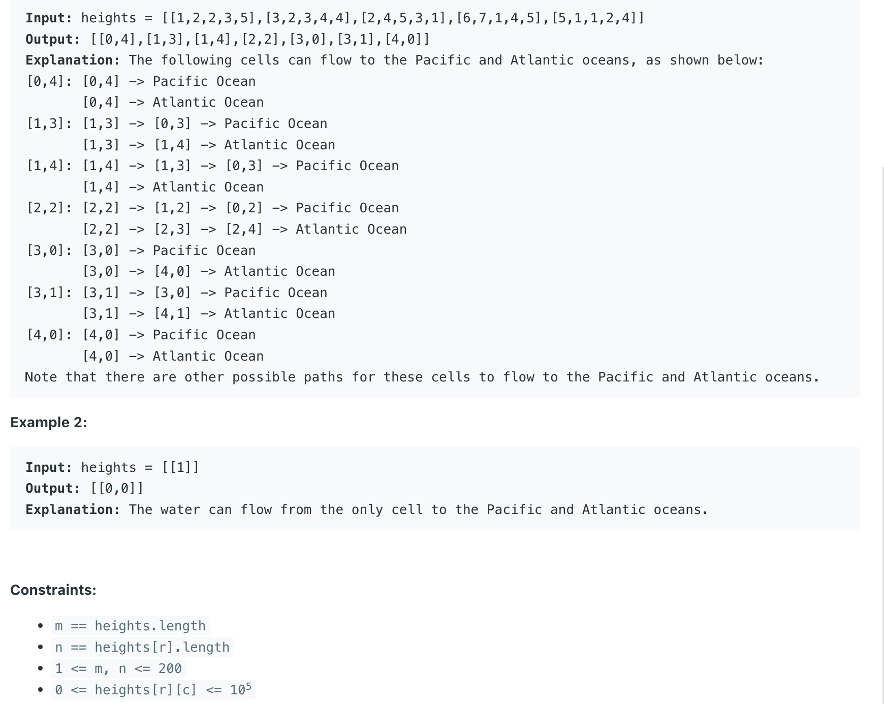

## 417. Pacific Atlantic Water Flow



- The island receives a lot of rain, and the rain water can **flow to neighboring cells directly north, south, east, and west** if the neighboring cell's 
  **height is less than or equal** to the current cell's height. 

- [中文教程](https://www.youtube.com/watch?v=blOc3KlAR2I)
- **本题读题目的 example 就可以理解题意**

---

```java
class Solution {
    public List<List<Integer>> pacificAtlantic(int[][] heights) {
        List<List<Integer>> res = new ArrayList<>();
        int m = heights.length, n = heights[0].length;
        if (m == 0) return res;
        
        boolean[][] pacific = new boolean[m][n];
        boolean[][] atlantic = new boolean[m][n];
        
        // Perform DFS starting from the top and bottom borders (Atlantic)
        // Water flows from higher to lower or equal height, so we start from the ocean borders
        // and mark cells that can reach the ocean by flowing "uphill" (or level)

        // Start DFS from the top row (Pacific border) and bottom row (Atlantic border)
        for (int col = 0; col < n; col++) {
            dfs(heights, 0, col, heights[0][col], pacific);
            dfs(heights, m - 1, col, heights[m - 1][col], atlantic);
        }
        
        // Start DFS from the left column (Pacific border) and right column (Atlantic border)
        for (int row = 0; row < m; row++) {
            dfs(heights, row, 0, heights[row][0], pacific);
            dfs(heights, row, n - 1, heights[row][n - 1], atlantic);
        }
        
        // After performing DFS from all borders, iterate through the grid
        // If a cell is reachable by both the Pacific and Atlantic oceans, add its coordinates to the result list        
        for (int i = 0; i < m; i++) {
            for (int j = 0; j < n; j++) {
                // Check if the current cell is reachable by both oceans
                if (pacific[i][j] && atlantic[i][j]) {
                    List<Integer> cur = new ArrayList<>();
                    cur.add(i);
                    cur.add(j);
                    res.add(cur);
                }
            }
        }
        return res;
    }

    // Depth First Search function to explore reachable cells from an ocean border
    // heights: the elevation grid
    // i, j: current cell coordinates
    // prevHeight: the height of the previous cell visited (used to check flow direction)
    // ocean: the boolean matrix for the current ocean (pacific or atlantic)    
    private void dfs(int[][] heights, int i, int j, int prevHeight, boolean[][] ocean) {
        // Base cases for stopping the recursion:
        // 1. Out of bounds
        // 2. Current cell height is less than the previous cell height (water cannot flow uphill)
        // 3. The cell has already been visited for this ocean        
        if (i < 0 || i >= heights.length || j < 0 || j >= heights[0].length || 
                                             heights[i][j] < prevHeight || ocean[i][j]) {
            return;
        }
        
        // Mark the current cell as reachable by this ocean
        ocean[i][j] = true;

        // The current cell's height becomes the prevHeight for the next call
        dfs(heights, i+1, j, heights[i][j], ocean);
        dfs(heights, i, j+1, heights[i][j], ocean);
        dfs(heights, i-1, j, heights[i][j], ocean);
        dfs(heights, i, j-1, heights[i][j], ocean);        
    }
}
```
---

```py
class Solution:
    def pacificAtlantic(self, heights: List[List[int]]) -> List[List[int]]:
        m, n = len(heights), len(heights[0])
        pacific = [[False for _ in range(n)] for _ in range(m)]
        atlantic = [[False for _ in range(n)] for _ in range(m)]
        for col in range(n):
            self.dfs(0, col, heights, heights[0][col], pacific)
            self.dfs(m - 1, col, heights, heights[m - 1][col], atlantic)
        for row in range(m):
            self.dfs(row, 0, heights, heights[row][0], pacific)
            self.dfs(row, n - 1, heights, heights[row][n - 1], atlantic)

        res = []
        for i in range(m):
            for j in range(n):
                if pacific[i][j] and atlantic[i][j]:
                    cell = []
                    cell.append(i)
                    cell.append(j)
                    res.append(cell)
        return res

    def dfs(self, i, j, heights, prev, ocean) -> None:
        if i < 0 or i >= len(heights) or j < 0 or j >= len(heights[0]) or heights[i][j] < prev \
                or ocean[i][j]:
            return

        ocean[i][j] = True

        self.dfs(i - 1, j, heights, heights[i][j], ocean)
        self.dfs(i, j - 1, heights, heights[i][j], ocean)
        self.dfs(i + 1, j, heights, heights[i][j], ocean)
        self.dfs(i, j + 1, heights, heights[i][j], ocean)
```