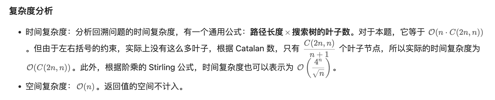

## 22. Generate Parentheses | DFS (All Permutations Of Parentheses I)


```ruby
For example, given n = 3, a solution set is:

[
  "((()))",
  "(()())",
  "(())()",
  "()(())",
  "()()()"
]
```
---


## Analysis:

- `n` storres total number of `pair of ()` need to add. 
  So total levels is  `2 * n`
- `l` stores the number of left parenthesis `(` **added so far**
- `r` stores the number of right parenthesis `)` **added so far**
- `soluPrefix`: solution so far

- what does it store on each level?
  - six levels, each level considers one position (in which there will be only one parenthesis added
    in this position)
- How many different states should we try to put on this level?
  - **two**, either left or right parenthesis
  
---


---

- [中文教程](https://leetcode.cn/problems/generate-parentheses/solution/hui-su-suan-fa-by-liweiwei1419/)


---
```java
class GenerateParentheses_v2 {
    public List<String> generateParenthesis(int n) {
        List<String> res = new ArrayList<>();
        if (n == 0) {
            return res;
        }
        StringBuilder soluPrefix = new StringBuilder();
        dfs(soluPrefix, 0, 0, n, res);
        return res;
    }

    private void dfs(StringBuilder soluPrefix, int left, int right, int n, List<String> res) {
        if (left == n && right == n) {
            res.add(soluPrefix.toString());
            return;
        }

        // 剪枝（如图，左括号可以使用的个数严格大于右括号可以使用的个数，才剪枝，注意这个细节）
        if (left < right) {
            return;
        }

        if (left < n) {
            soluPrefix.append("(");
            dfs(soluPrefix, left + 1, right, n, res);
            soluPrefix.deleteCharAt(soluPrefix.length() - 1);
        }

        if (right < n) {
            soluPrefix.append(")");
            dfs(soluPrefix, left, right + 1, n, res);
            soluPrefix.deleteCharAt(soluPrefix.length() - 1);
        }
    }

    public static void main(String[] args) {
        GenerateParentheses_v2 generateParentheses = new GenerateParentheses_v2();
        List<String> res = generateParentheses.generateParenthesis(3);
        System.out.println(res);// [ ((())), (()()), (())(), ()(()), ()()() ]
    }
}
```

---

### Python

```py
class Solution:
    def generateParenthesis(self, n: int) -> List[str]:
        res = []
        path = []
        def dfs(left, right):
            if left == right == n:
                res.append("".join(path))
                return

            if left < n:
                path.append('(')
                dfs(left + 1, right)
                path.pop()
            if right < left:
                path.append(')')
                dfs(left, right + 1)
                path.pop()

        dfs(0, 0)
        return res
```




