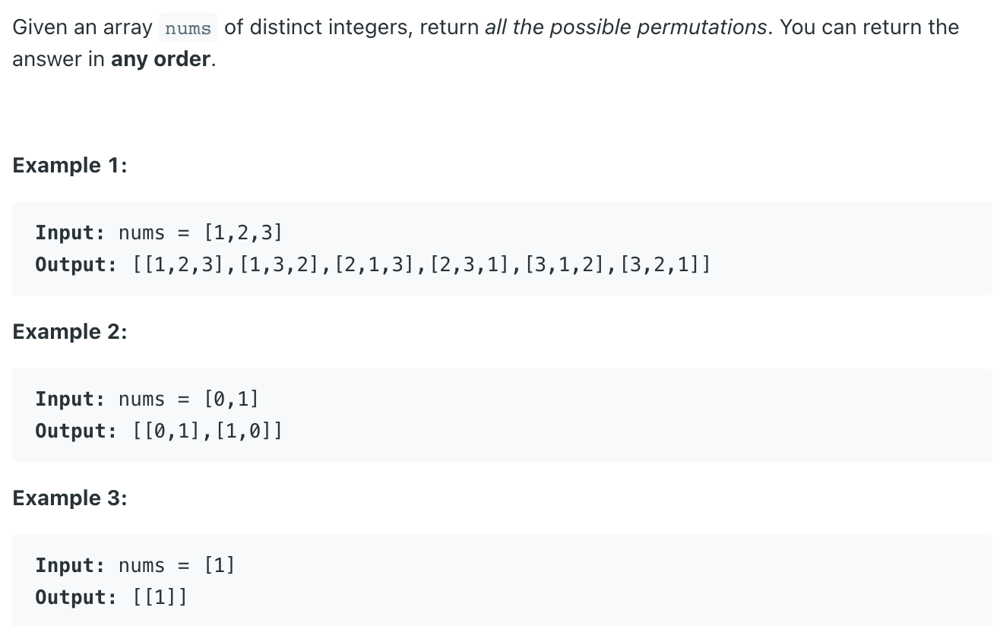
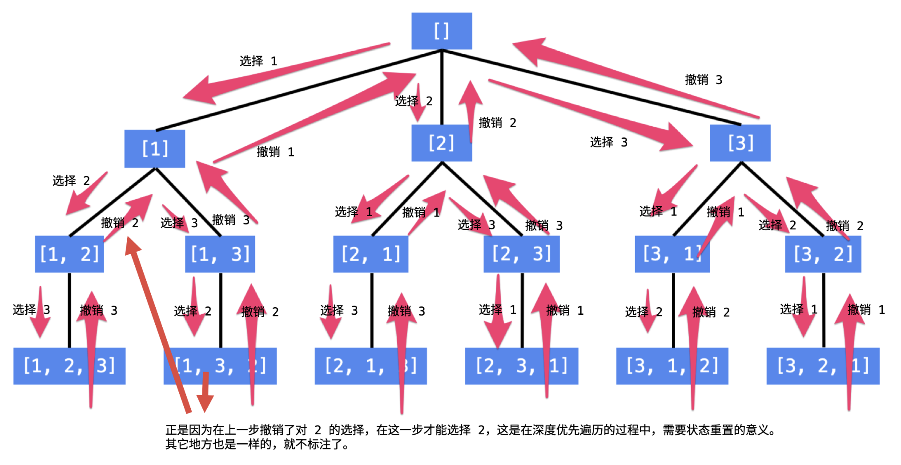
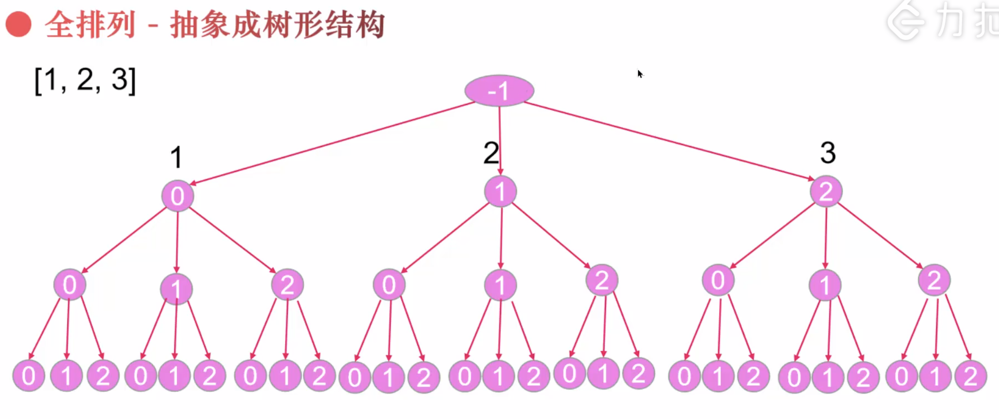
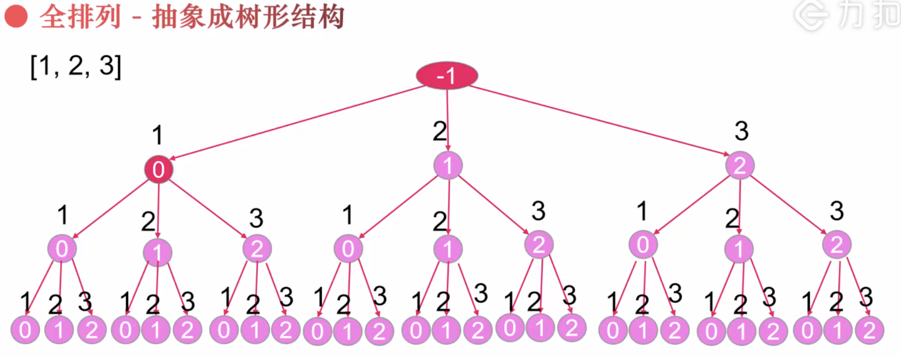

## 46. Permutations


### Analysis:

- [all permutations | DFS](https://novemberfall.github.io/LeetCode-NoteBook/#/m10/permutationsWithStr)



---
```java
class Solution {
    public List<List<Integer>> permute(int[] nums) {
        List<List<Integer>> res = new ArrayList<>();
        if (nums == null || nums.length == 0) {
            return res;
        }
        
        boolean[] visited = new boolean[nums.length];
        dfs(nums, res, new ArrayList<>(), visited);
        return res;
    }
    
    private void dfs(int[] nums, List<List<Integer>> res, List<Integer> permutation, boolean[] visited) {
        if (permutation.size() == nums.length) {
            res.add(new ArrayList<>(permutation));
            return;
        }
        
        for (int i = 0; i < nums.length; i++) {
            if (visited[i]) {
                continue;
            }
            
            permutation.add(nums[i]);
            visited[i] = true;
            dfs(nums, res, permutation, visited);
            visited[i] = false;
            permutation.remove(permutation.size() - 1);
        }
    }
}
```

---

- If we don't add `boolean[] visited`:



```java
class Permutations_v1 {
    public List<List<Integer>> permute(int[] nums) {
        List<List<Integer>> res = new ArrayList<>();
        if (nums == null || nums.length == 0) return res;

        dfs(res, new ArrayList<>(), nums);
        return res;
    }

    private void dfs(List<List<Integer>> res, List<Integer> path, int[] nums) {
        if (path.size() == nums.length) {
            res.add(new ArrayList<>(path));
            return;
        }

        for (int i = 0; i < nums.length; i++) {
            path.add(nums[i]);
            dfs(res, path, nums);
            path.remove(path.size() - 1);
        }
    }

    public static void main(String[] args) {
        int[] nums = new int[]{1, 2, 3};
        Permutations_v1 pv1 = new Permutations_v1();
        List<List<Integer>> res = pv1.permute(nums);
        System.out.println(res);
    }
}
```

