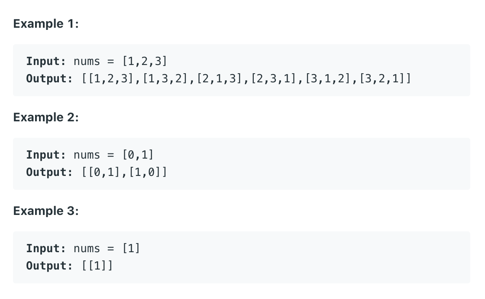
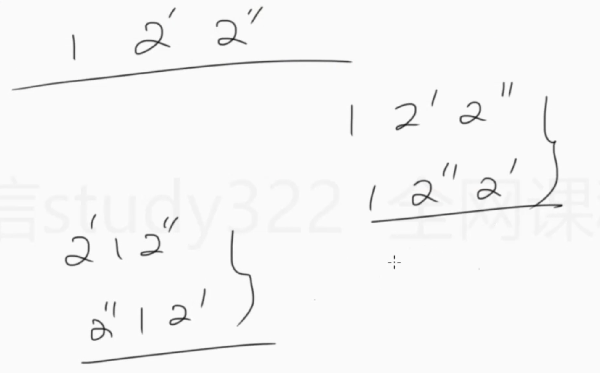
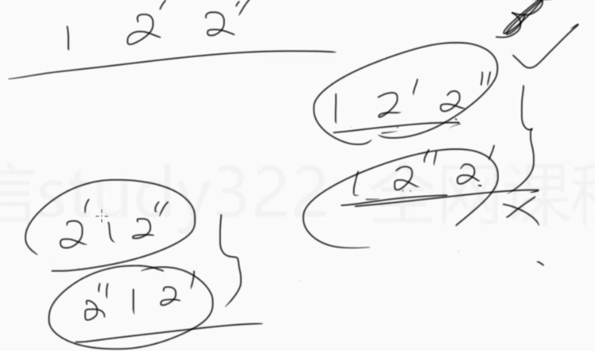

## 46. Permutations

```ruby
Given an array nums of distinct integers, 
return all the possible permutations.
You can return the answer in any order.
```



### Analysis:

- [all permutations | DFS](https://novemberfall.github.io/LeetCode-NoteBook/#/m10/permutationsWithStr)


- 对以上的`122` 的排列进行去重


---
```java
class Solution {
    public List<List<Integer>> permute(int[] nums) {
        List<List<Integer>> res = new ArrayList<>();
        if (nums == null || nums.length == 0) {
            return res;
        }
        
        boolean[] visited = new boolean[nums.length];
        dfs(nums, res, new ArrayList<>(), visited);
        return res;
    }
    
    private void dfs(int[] nums, List<List<Integer>> res, List<Integer> permutation, boolean[] visited) {
        if (permutation.size() == nums.length) {
            res.add(new ArrayList<>(permutation));
            return;
        }
        
        for (int i = 0; i < nums.length; i++) {
            if (visited[i]) {
                continue;
            }
            
            permutation.add(nums[i]);
            visited[i] = true;
            dfs(nums, res, permutation, visited);
            visited[i] = false;
            permutation.remove(permutation.size() - 1);
        }
    }
}
```

---
```java
class Solution {
    public List<List<Integer>> permute(int[] nums) {
        List<List<Integer>> res = new ArrayList<>();
        dfs(nums, 0, res);
        return res;
    }
    
    private void dfs(int[]nums, int index ,List<List<Integer>> res) {
        if (index == nums.length) {
            List<Integer> cur = new ArrayList<>();
            for (int num : nums) {
                cur.add(num);
            }
            res.add(cur);
            return;
        }
        
        for (int i = index; i < nums.length; i++) {
            swap(nums, index, i);
            dfs(nums, index+1, res);
            swap(nums, index, i);
        }
    }
    
    private void swap(int[] nums, int index, int i) {
        int tmp = nums[index];
        nums[index] = nums[i];
        nums[i] = tmp;
    }
}
```

