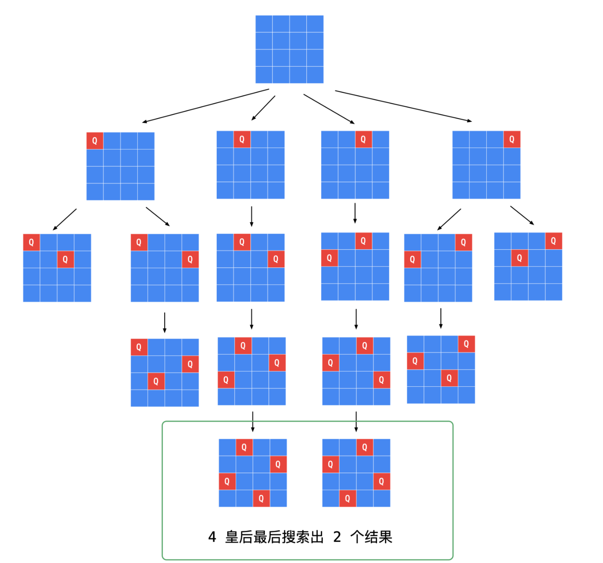
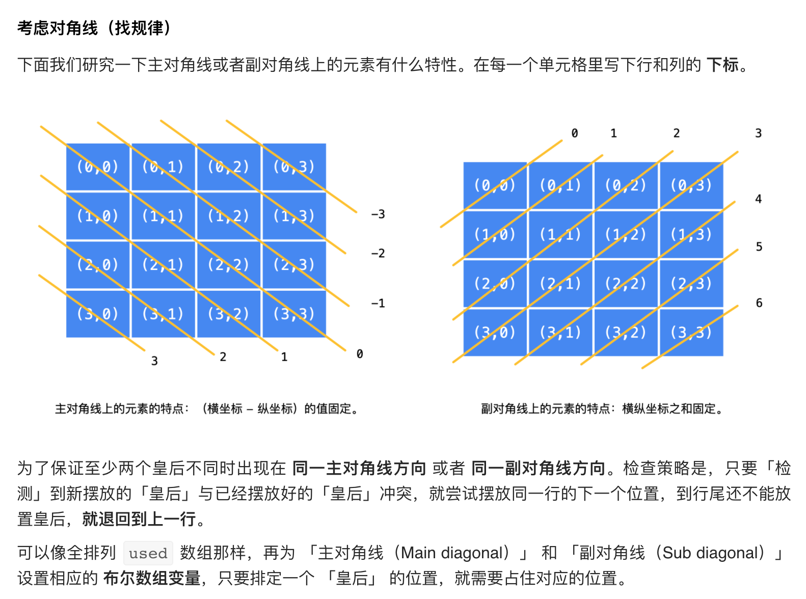

## 51. N-Queens






- [参考教程](https://leetcode.cn/problems/n-queens/solution/gen-ju-di-46-ti-quan-pai-lie-de-hui-su-suan-fa-si-/)
---
- [中文教程](https://leetcode.cn/problems/n-queens/solution/dai-ma-sui-xiang-lu-51-n-queenshui-su-fa-2k32/)

- [youTuBe video](https://www.youtube.com/watch?v=E8A9m8xAin0)

```java
public class _51_NQueens {
    public List<List<String>> solveNQueens(int n) {
        List<List<String>> res = new ArrayList<>();
        char[][] board = new char[n][n];
        for (int i = 0; i < n; i++) {
            for (int j = 0; j < n; j++) {
                board[i][j] = '.';
            }
        }
        dfs(res, 0, n, board);
        return res;
    }

    private void dfs(List<List<String>> res, int rowIndex, int n, char[][] board) {
        if (rowIndex == n) {
            List<String> list = new ArrayList<>();
            for (char[] row : board) {
                StringBuilder sb = new StringBuilder();
                for (char c : row) {
                    sb.append(c);
                }
                list.add(sb.toString());
            }
            res.add(list);
        }

        for (int colIndex = 0; colIndex < n; colIndex++) {
            if (isValid(rowIndex, colIndex, n, board)) {
                board[rowIndex][colIndex] = 'Q';
                dfs(res, rowIndex + 1, n, board);
                board[rowIndex][colIndex] = '.';
            }
        }
    }

    private boolean isValid(int rowIndex, int colIndex, int n, char[][] board) {
        for (int i = 0; i < rowIndex; i++) {
            if (board[i][colIndex] == 'Q') {
                return false;
            }
        }

        // check Diagonal
        for (int i = rowIndex - 1, j = colIndex - 1; i >= 0 && j >= 0; i--, j--) {
            if (board[i][j] == 'Q') {
                return false;
            }
        }

        // check negative Diagonal
        for (int i = rowIndex - 1, j = colIndex + 1; i >= 0 && j < n ; i--, j++) {
            if (board[i][j] == 'Q') {
                return false;
            }
        }

        return true;
    }
}
```

---
- [中文教程2](https://leetcode.cn/problems/n-queens/solution/gen-ju-di-46-ti-quan-pai-lie-de-hui-su-suan-fa-si-/)

---
- [youtube video](https://www.youtube.com/watch?v=_ey1pyQy7Bg)

```java
/*

[0, 0] [0, 1] [0, 2] [0, 3]

[1, 0] [1, 1] [1, 2] [1, 3]

[2, 0] [2, 1] [2, 2] [2, 3]

[3, 0] [3, 1] [3, 2] [3, 3]

*/

class Solution {
    Set<Integer> col = new HashSet<>();
    Set<Integer> main = new HashSet<>();    
    Set<Integer> sub = new HashSet<>();
    
    public List<List<String>> solveNQueens(int n) {
        List<List<String>> res = new ArrayList<>();
        if (n <= 0) {
            return res;
        }
        char[][] board = new char[n][n];
        for (int i = 0; i < n; i++) {
            for (int j = 0; j < n; j++) {
                board[i][j] = '.';
            }
        }
        dfs(0, n, res, board);
        return res;
    }
    
    private void dfs(int row, int n, List<List<String>>res,
                     char[][] board) {
        if (row == n) {
            List<String> tmp = new ArrayList<>();
            for (int i = 0; i < n; i++) {
                tmp.add(String.valueOf(board[i]));
            }
            res.add(tmp);
        }
        
        for (int i = 0; i < n; i++) {
            if (!col.contains(i) && !main.contains(row - i) 
                && !sub.contains(row + i)) {
                
                col.add(i);
                main.add(row - i);
                sub.add(row + i);
                board[row][i] = 'Q';
                
                dfs(row + 1, n, res, board);
                
                board[row][i] = '.';
                sub.remove(row + i);
                main.remove(row - i);
                col.remove(i);
            }
        }        
    }
}
```