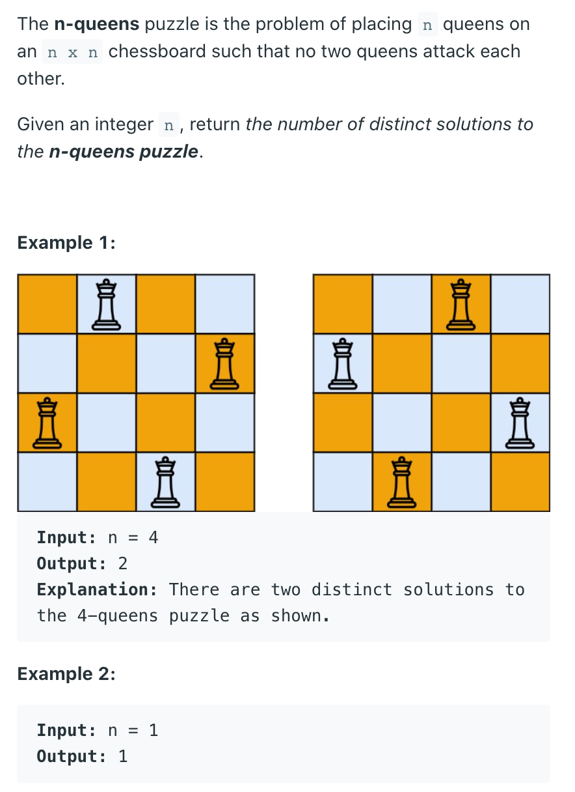

## 52. N-Queens II



```java
/*

[0, 0] [0, 1] [0, 2] [0, 3]

[1, 0] [1, 1] [1, 2] [1, 3]

[2, 0] [2, 1] [2, 2] [2, 3]

[3, 0] [3, 1] [3, 2] [3, 3]

*/

class Solution {
    public int res = 0;
    Set<Integer> col = new HashSet<>();
    Set<Integer> main = new HashSet<>();
    Set<Integer> sub = new HashSet<>();
    
    public int totalNQueens(int n) {
        if (n <= 0) {
            return res;
        }
        
        dfs(0, n);
        return res;
    }
    
    private void dfs(int row, int n) {
        if (row == n) {
            res++;
            return;
        }
        
        for (int i = 0; i < n; i++) {
            if (!col.contains(i) && !main.contains(row - i) 
                && !sub.contains(row + i)) {
                
                col.add(i);
                main.add(row - i);
                sub.add(row + i);
                
                dfs(row + 1, n);
                
                sub.remove(row + i);
                main.remove(row - i);
                col.remove(i);
            }
        }
    }
}
```