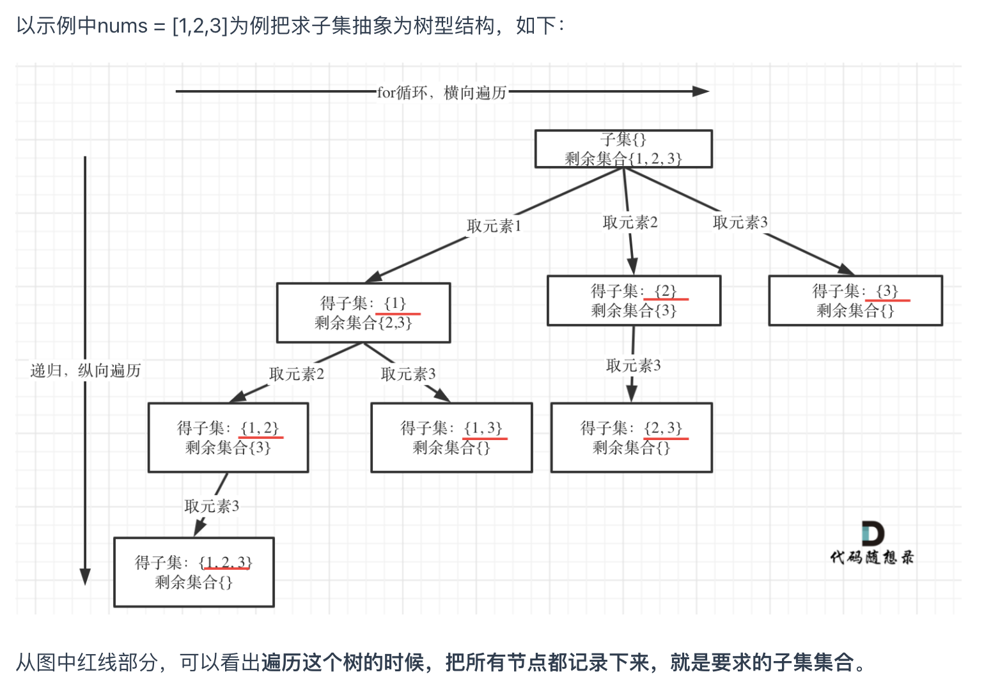
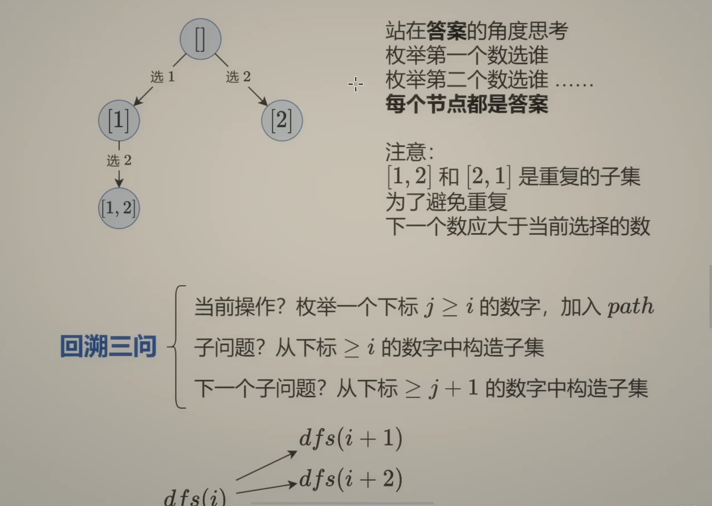
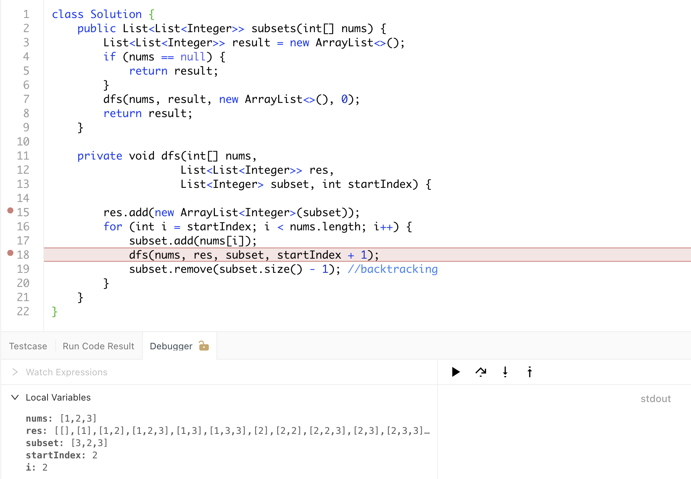
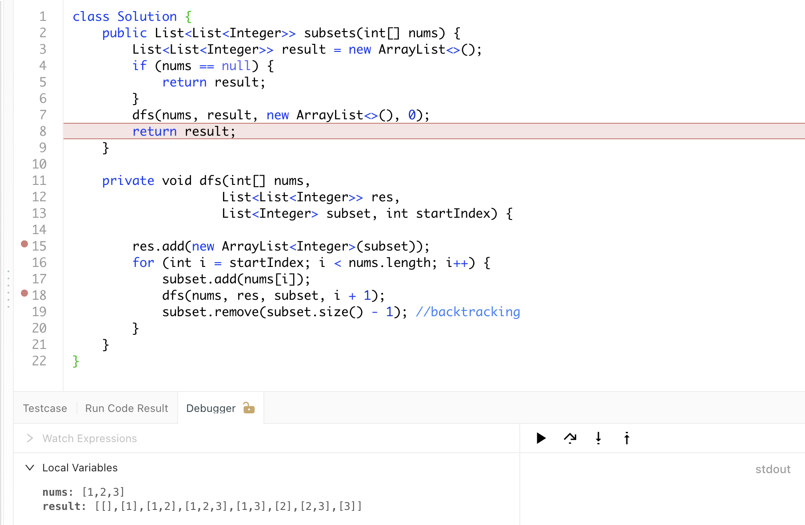

## 78. Subsets | DFS | backtrack 解释

---

## BackTracking

- [中文解释](https://leetcode.cn/problems/subsets/solutions/2059409/hui-su-bu-hui-xie-tao-lu-zai-ci-pythonja-8tkl/)




- [两种模版](https://www.bilibili.com/video/BV1mG4y1A7Gu?t=497.1)



---
#### `i + 1`  vs `startIndex + 1`

- if it was `startIndex + 1`



---

- if it was `i + 1`



---
- 递归 vs 循环 | 递归实现搜索的本质是，实现了按照规定给定参数来决定循环层数的一个多重循环]
  - 递归实现的搜索 `= n` 重循环, `n` 由输入决定 

```java
class Solution {
    public List<List<Integer>> subsets(int[] nums) {
        List<List<Integer>> result = new ArrayList<>();
        if (nums == null) {
            return result;
        }
        dfs(nums, result, new ArrayList<>(), 0);
        return result;
    }
    
    private void dfs(int[] nums, 
                    List<List<Integer>> res, 
                    List<Integer> subset, int startIndex) {
        
        //拆解 deep copy
        res.add(new ArrayList<Integer>(subset));
        //为什么这一步,一开始就加，而不是最后加？因为它第一次加了一个empty list 
        for (int i = startIndex; i < nums.length; i++) {
            subset.add(nums[i]);
            dfs(nums, res, subset, i + 1);
            subset.remove(subset.size() - 1); //backtracking
        }
    }
}
```

---

### DFS


```java
import java.util.ArrayList;
import java.util.List;

public class subsetI {
    public List<List<Integer>> subsets(int[] nums) {
        List<List<Integer>> result = new ArrayList<>();
        if (nums == null) {
            return result;
        }
        List<Integer> path = new ArrayList<>();
        dfs(nums, 0, path, result);
        return result;
    }

    private void dfs(int[] nums, int index, 
                        List<Integer> path, 
                        List<List<Integer>>result) {
        if (index == nums.length) {
            List<Integer> temp = new ArrayList<>(path);
            // deep copy 
            result.add(temp);
            return;
        }
        path.add(nums[index]); //吃
        dfs(nums, index+1, path, result);
        path.remove(path.size() - 1); //🤮
        dfs(nums, index+1, path, result);
    }


    public static void main(String[] args) {
        subsetI sb = new subsetI();
        int[] arr = {1, 2, 3};
        List<List<Integer>> result = sb.subsets(arr);
        System.out.println(result);
    }
}
```
---

### Anylysis:

- **解题之前就知道DFS要recurse 多少层**？
  - Three level. For each level, it makes the decision on whether to put this element
    into the final set
- **How many different states should we try to put on this level**?
  - 每层有多少状态。 **Two**, each state consider either **select** or **not select**

---
- [AII subsets](https://novemberfall.github.io/Algorithm-FullStack/csPractice/review-dfs.html)

- 对每一层进行 “加” 与 “不加” 的操作
- 由于binary tree 分成 二叉 => 一定是调用两次递归，(分成几叉就调用几次递归)
- 为什么 吃了🤮？ 因为从child节点回到parent节点的时候，要恢复parent本身的状态，不删除(吃进去的)， 
  那就和原来的状态不一样了。

- 递归可以从三个部分考虑： 1. base case 2. 分几个叉根据逻辑，是什么，想尝试的是什么。3. 吃了🤮

- 递归的编写，先不要往下走，重要的是给出正确的assume, 找准关系(一般情况：本层的进入，和离开时候保持一致)
- 什么时候需要用 deep Copy? 如果中间状态是mutable => 那就需要
