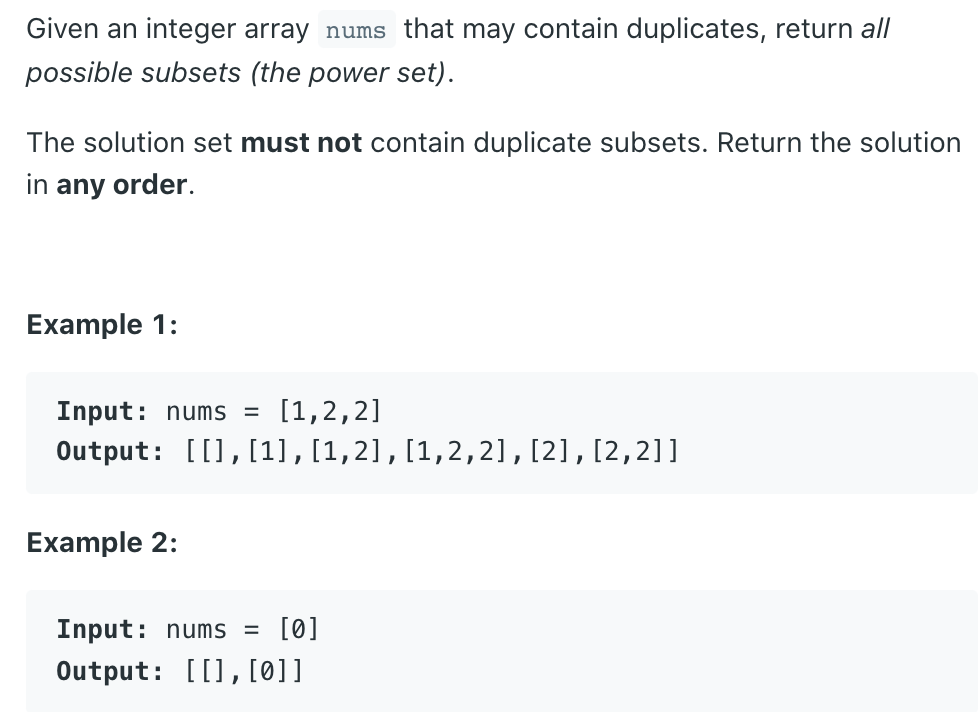
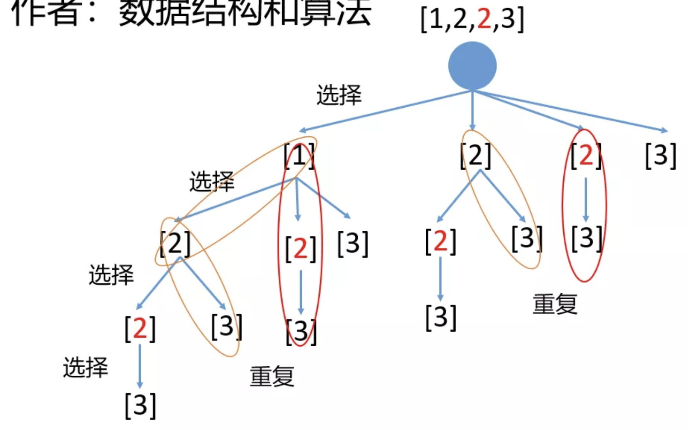
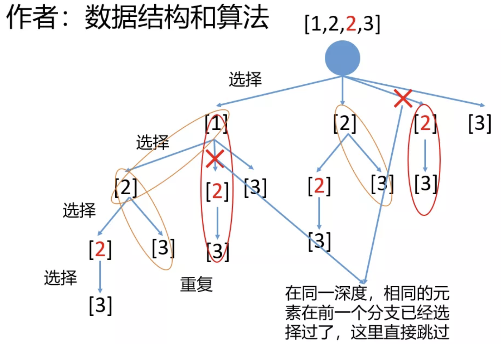
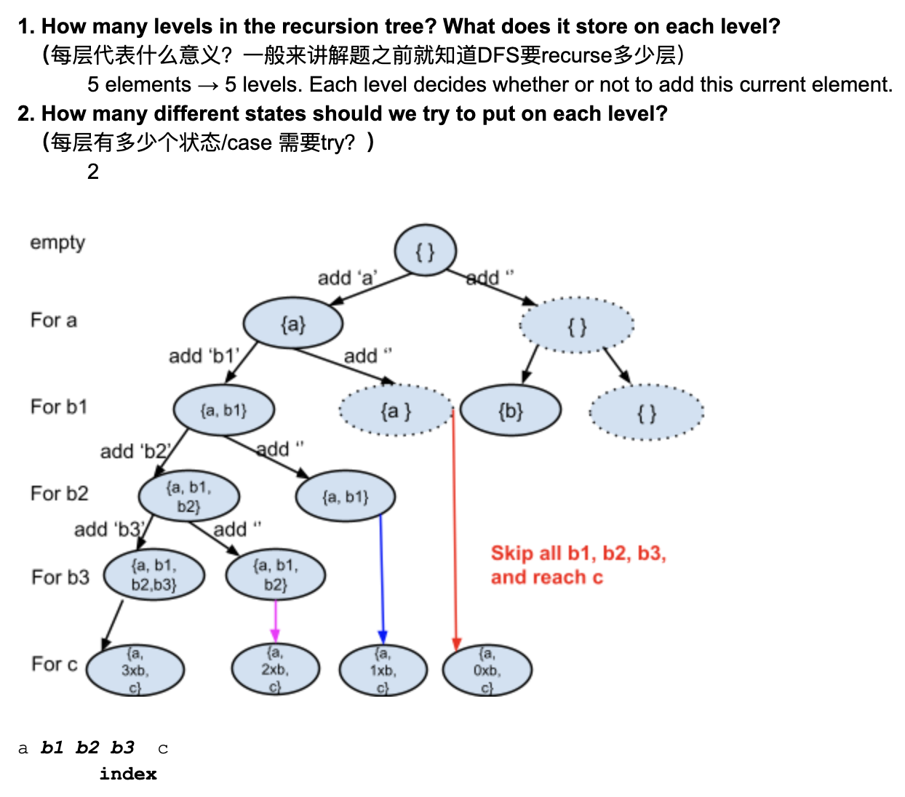

## 90. Subsets II



- assume an array `[1, 1, 1, 1, 1, 1]`, we need to remove duplicate subset
  - there are `2^6` possible subset, 这样做时间复杂度太高
  - 如果先找到所有可能性，再去重，时间复杂度太高。
  - 如果按照 `subset I` 的方法写这道题，可以发现我们有重复的结果
    - 需要进一步去重!

```ruby
[1, 2, 3]
[2, 1, 3]
[3, 1, 2]
比如这三组为重复，但我们选 [1, 2, 3] 为代表，因为它是有序的
```



- 这里出现了重复的子集，那么怎么过滤掉重复的呢，
  就是在**同一深度的两个不同的分支，如果当前元素和前面的元素相同，我们就跳过**。



```java
class Solution {
    public List<List<Integer>> subsetsWithDup(int[] nums) {
        List<List<Integer>> res = new ArrayList<>();
        if (nums == null) {
            return res;
        }
        Arrays.sort(nums);
        List<Integer> subset = new ArrayList<>();
        dfs(nums, res, subset, 0);
        return res;
    }
    
    private void dfs(int [] nums,
                     List<List<Integer>> res, 
                     List<Integer> subset, 
                     int startIndex) {
        //Deep Copy & add to results                
        res.add(new ArrayList<>(subset));
        for (int i = startIndex; i < nums.length; i++) {
   //这里遍历的时候每次都有从之前选择元素的下一个开始，所以这里i的初始值是level    
            if (i > startIndex && nums[i] == nums[i - 1]) {
                continue;
            }
            subset.add(nums[i]);
            dfs(nums, res, subset, i + 1);
            subset.remove(subset.size() - 1);
        }
    }
}
```
---

### Method 2



```java
class Solution {
    public List<List<Integer>> subsetsWithDup(int[] nums) {
        List<List<Integer>> res = new ArrayList<>();
        if (nums == null) {
            return res;
        }
        Arrays.sort(nums);
        List<Integer> subset = new ArrayList<>();
        dfs(nums, res, subset, 0);
        return res;
    }
    
    private void dfs(int [] nums,
                     List<List<Integer>> res, 
                     List<Integer> subset, 
                     int index) {
        if (index == nums.length) {
            //拆解 deep copy
            res.add(new ArrayList<>(subset));
            return;
        }
        
        subset.add(nums[index]);
        dfs(nums, res, subset, index + 1);
        
        while (index < nums.length - 1 && 
               nums[index] == nums[index + 1]) {
            index++;
        }
        subset.remove(subset.size() - 1);
        dfs(nums, res, subset, index + 1);     
    }
}
```