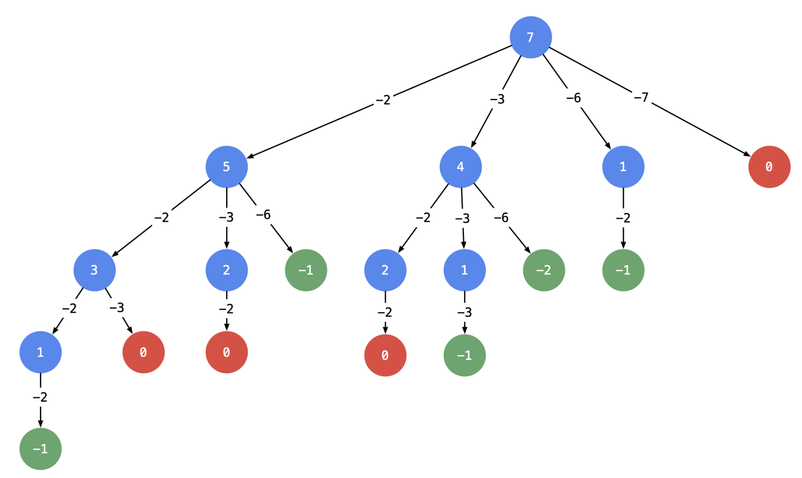

## 39. Combination Sum

---

- [Associated](https://novemberfall.github.io/LeetCode-NoteBook/#/m10/cents)
- [中文分析](https://leetcode.cn/problems/combination-sum/solution/hui-su-suan-fa-jian-zhi-python-dai-ma-java-dai-m-2/)
- 以输入：candidates = [2, 3, 6, 7], target = 7 为例：


- 可不可以在搜索的时候就去重呢？答案是可以的。遇到这一类相同元素不计算顺序的问题，我们在搜索的时候就需要 按某种顺序搜索。具体的做法是：每一次搜索的时候设置 **下一轮搜索的起点 begin**，请看下图:


```java
class Solution {
    public List<List<Integer>> combinationSum(int[] candidates, int target) {
        List<List<Integer>> res = new ArrayList<>();
        if (candidates == null || candidates.length == 0) {
            return res;
        }
        Arrays.sort(candidates);
        dfs(res, new ArrayList<>(), 0, candidates, target);
        return res;
    }

    private void dfs(List<List<Integer>> res, List<Integer> combine,
                     int startIdx, int[] candidates, int target) {
        if (target < 0) {
            return;
        }
        if (target == 0) {
            res.add(new ArrayList<>(combine));
            return;
        }

        for (int i = startIdx; i < candidates.length; i++) {
            combine.add(candidates[i]);
            dfs(res, combine, i, candidates, target - candidates[i]);
            combine.remove(combine.size() - 1);
        }
    }
}
```

---

## Without `startIndex` parameter

```java
class Solution {
    public List<List<Integer>> combinationSum(int[] candidates, int target) {
        List<List<Integer>> res = new ArrayList<>();
        
        dfs(res, new ArrayList<>(), candidates, target, 0);
        return res;
    }
    
    private void dfs(List<List<Integer>> res, List<Integer> list, int[] candidates, int target, int sum) {
        if (sum == target) {
            res.add(new ArrayList<>(list));
            return;
        }
        
        for (int i = 0; i < candidates.length; i++) {
            if (sum  > target) {
                return;
            }
            
            list.add(candidates[i]);
            dfs(res, list, candidates, target, sum + candidates[i]);
            list.remove(list.size() - 1);
        }
    }
}

/*
   Input; [2,3,6,7], target = 7

   Ouput: [[2,2,3],[2,3,2],[3,2,2],[7]]
   
   Expected: [[2,2,3],[7]]
 */

```

- Consider the candidates `[2, 3, 6, 7]` and the target `7`. We'll use your original code without the 
  `startIndex` parameter 

- As you can see, there are duplicate combinations `[2, 2, 3]` and `[3, 2, 2]`.

- By using the `startIndex` parameter, the modified code ensures that each candidate is considered only once 
  at each level of the recursion, preventing the generation of duplicate combinations.

---

```py
class Solution:
    def combinationSum(self, candidates: List[int], target: int) -> List[List[int]]:
        candidates.sort()
        n = len(candidates)
        res = []
        path = []
        def dfs(index, target):
            if target == 0:
                res.append(path.copy())
                return

            if target - candidates[index] < 0:
                return

            for j in range(index, n):
                path.append(candidates[j])
                dfs(j, target - candidates[j])
                path.pop()
        dfs(0, target)
        return res
```