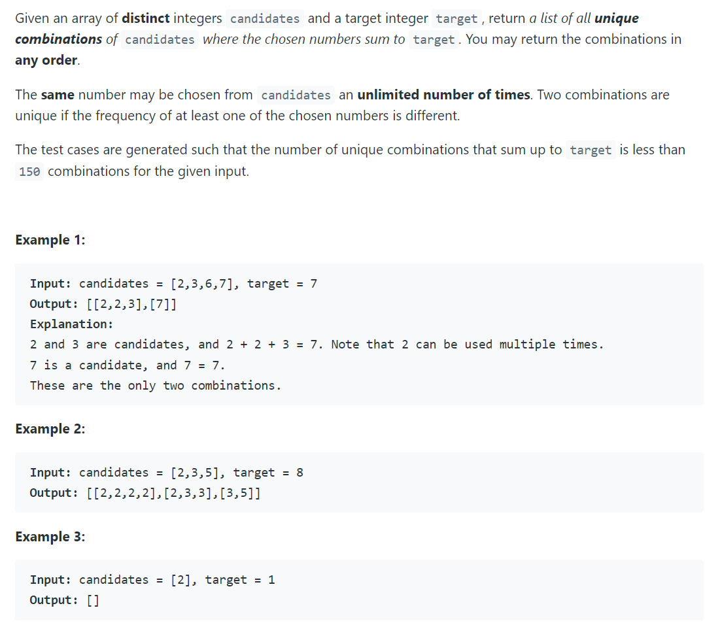
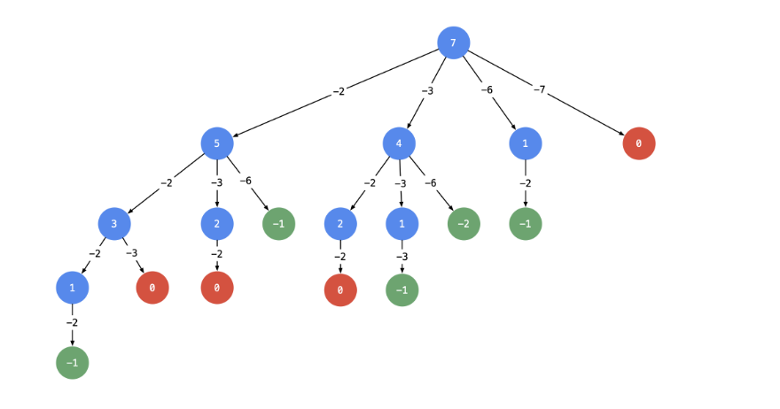
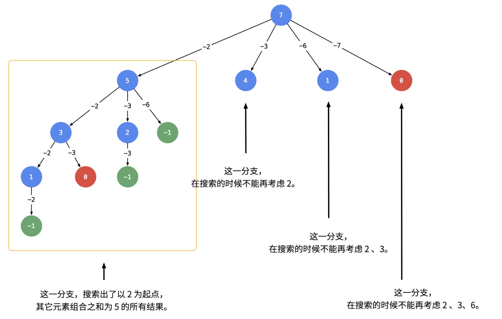

## 39. Combination Sum

---

- [Associated](https://novemberfall.github.io/LeetCode-NoteBook/#/m10/cents)
- [中文分析](https://leetcode.cn/problems/combination-sum/solution/hui-su-suan-fa-jian-zhi-python-dai-ma-java-dai-m-2/)
- 以输入：candidates = [2, 3, 6, 7], target = 7 为例：


- 可不可以在搜索的时候就去重呢？答案是可以的。遇到这一类相同元素不计算顺序的问题，我们在搜索的时候就需要 按某种顺序搜索。具体的做法是：每一次搜索的时候设置 **下一轮搜索的起点 begin**，请看下图:



```java
class Solution {
    public List<List<Integer>> combinationSum(int[] candidates, int target) {
        List<List<Integer>> res = new ArrayList<>();
        List<Integer> path = new ArrayList<>();
        backtracking(candidates, target, 0, path, res);
        return res;
    }
    
    private void backtracking(int[] candidates, int target, int begin, 
                              List<Integer> path, List<List<Integer>> res) {
        if (target < 0) {
            return;
        }
        
        if (target == 0) {
            res.add(new ArrayList<>(path));
            return;
        }
        
        for (int i = begin; i < candidates.length; i++) {
            path.add(candidates[i]);
            backtracking(candidates, target-candidates[i], i, path, res);
            path.remove(path.size() - 1);
        }
    }
}
```