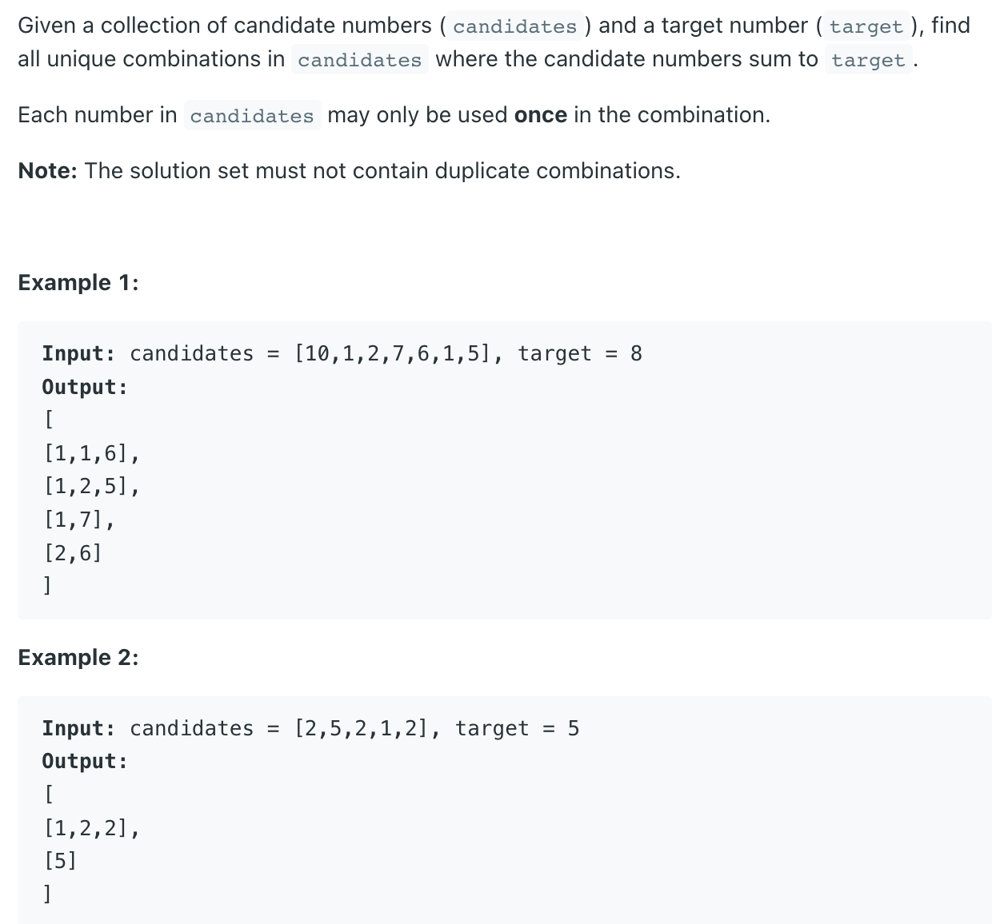
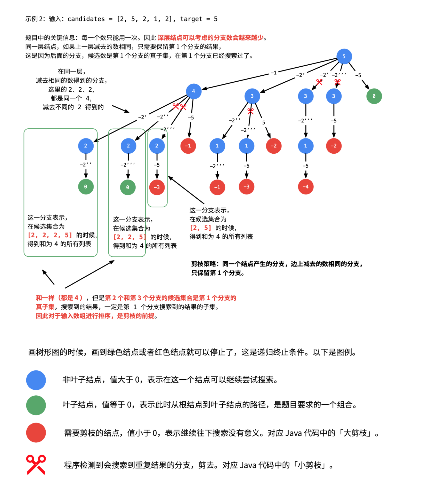

## 40. Combination Sum II


---
- [树层dedup && 树枝 dedup](https://novemberfall.github.io/LeetCode-NoteBook/#/m10/subset2)

```java
class Solution {
    public List<List<Integer>> combinationSum2(int[] candidates, int target) {
        List<List<Integer>> res = new ArrayList<>();
        if (candidates == null || candidates.length == 0) return res;
        
        Arrays.sort(candidates);
        boolean[] visited = new boolean[candidates.length];
        dfs(res, new ArrayList<>(), 0, candidates, target, visited);
        return res;
    }
    
    private void dfs(List<List<Integer>> res, List<Integer> combine, int startIdx, 
                    int[] candidates, int target, boolean[] visited) {
        if (target < 0) {
            return;
        }
        if (target == 0) {
            res.add(new ArrayList<>(combine));
            return;
        }
        
        for (int i = startIdx; i < candidates.length; i++) {
            if (i > 0 && candidates[i] == candidates[i - 1] && !visited[i - 1]) {
                continue;
            }
            combine.add(candidates[i]);
            visited[i] = true;
            dfs(res, combine, i + 1, candidates, target - candidates[i], visited);
            visited[i] = false;
            combine.remove(combine.size() - 1);            
        }
    }
}
```

---


---

```java
class Solution {
    public List<List<Integer>> combinationSum2(int[] candidates, int target) {
        List<List<Integer>> res = new ArrayList<>();
        List<Integer> path = new ArrayList<>();
        Arrays.sort(candidates);
        dfs(candidates, 0, target, res, path);
        return res;
    }
    
    private void dfs(int[] candidates, int index, int target,  
                     List<List<Integer>> res,  List<Integer> path){
        
        if (target == 0) {
            res.add(new ArrayList<>(path));
            return;
        } 

        for (int i = index; i < candidates.length; i++) {
            //alpha pruning 大剪枝
            if (target - candidates[i] < 0) {
                break;
            }
            
            //beta pruning 小剪枝
            if (i > index && candidates[i] == candidates[i - 1]) {
                continue;
            }
            
            path.add(candidates[i]);
            dfs(candidates, i+1, target-candidates[i], res, path);
            path.remove(path.size() - 1);
        }
    }
}
```