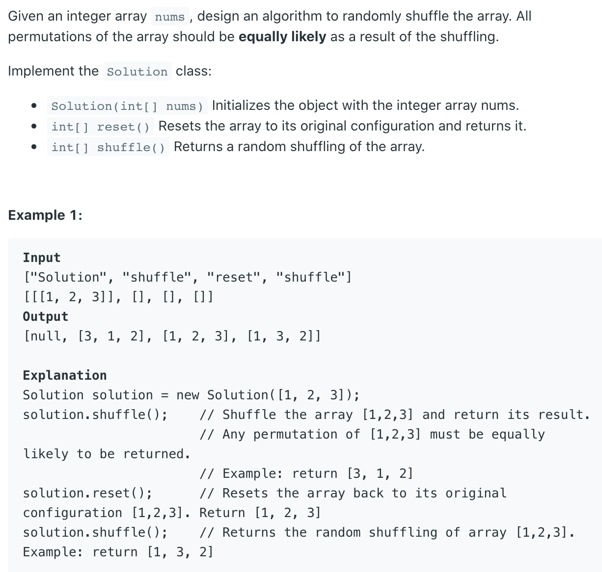

## 384. Shuffle an Array



- `int random(int x)` : generate a random number btn `0` and `x - 1`

- int j = some random number btn i and array.length - 1
- random number btn a and b
- random(b - a + 1) + a
- (any random number between 0 and b - a) + a
- a random number between a and b

```java
class Solution {
    private int[] nums;

    public Solution(int[] nums) {
        this.nums = nums;
    }
    
    /** Resets the array to its original configuration and return it. */
    public int[] reset() {
        return nums;
    }
    
    /** Returns a random shuffling of the array. */
    public int[] shuffle() {
        int[] a = nums.clone();  

        // for(int i = 0; i < a.length; i++) {
        //     int idx = (int) (Math.random() * (i + 1));
        //     swap(a, i, idx);
        // }         
        
        for(int i = 0; i < a.length; i++) {
            int idx = (int) (new Random().nextInt(a.length - i) + i);
            swap(a, i, idx);
        }                 
        return a;
    }
    
    private void swap(int[] a, int i, int j) {
        int t = a[i];
        a[i] = a[j];
        a[j] = t;
    }
}

/**
 * Your Solution object will be instantiated and called as such:
 * Solution obj = new Solution(nums);
 * int[] param_1 = obj.reset();
 * int[] param_2 = obj.shuffle();
 */
```