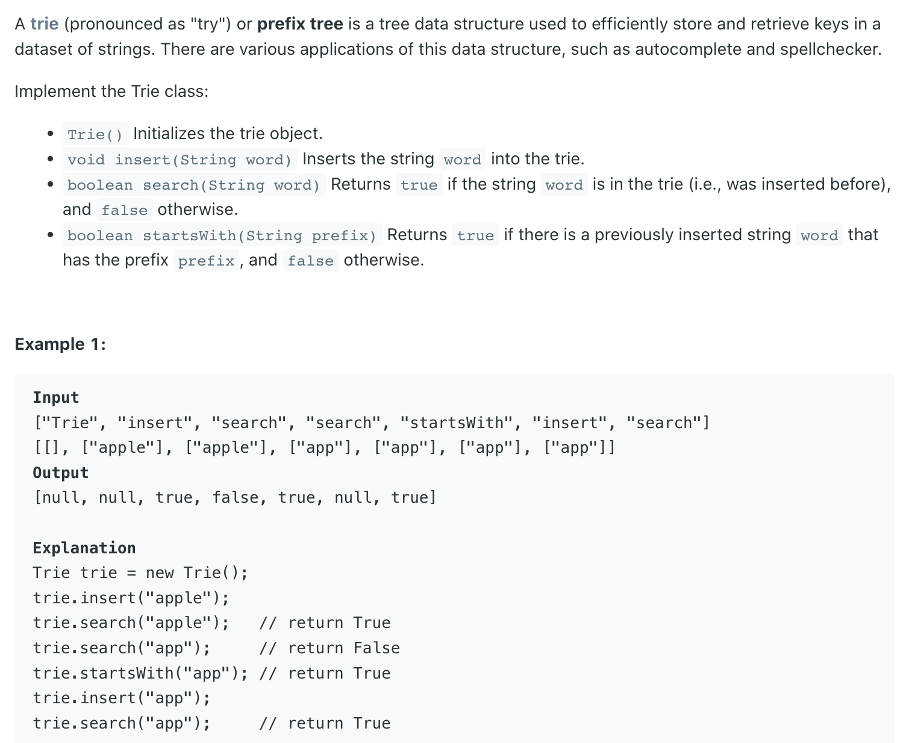
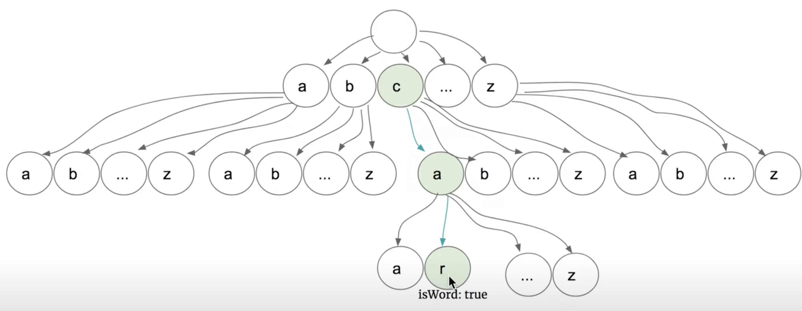
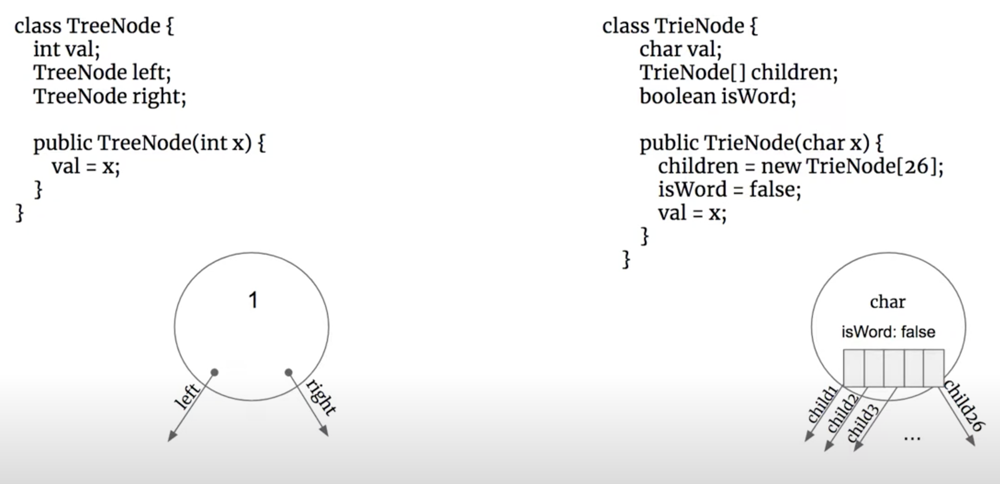
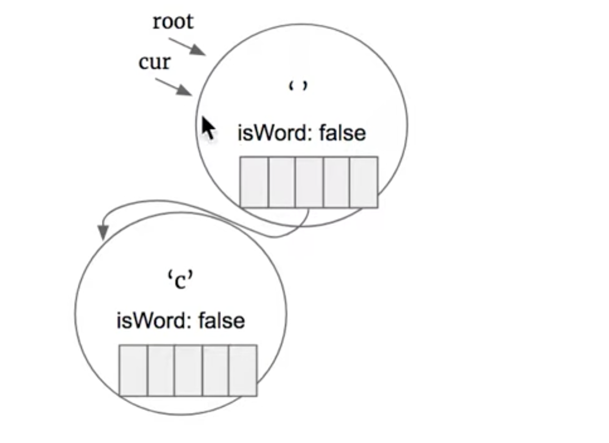
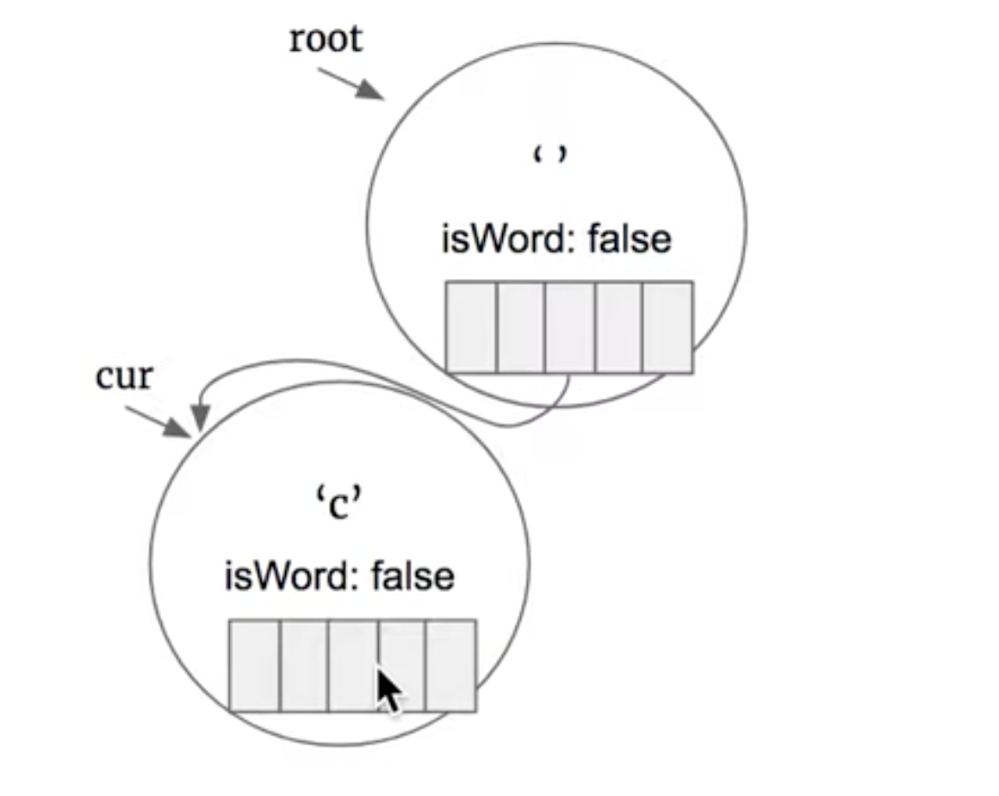
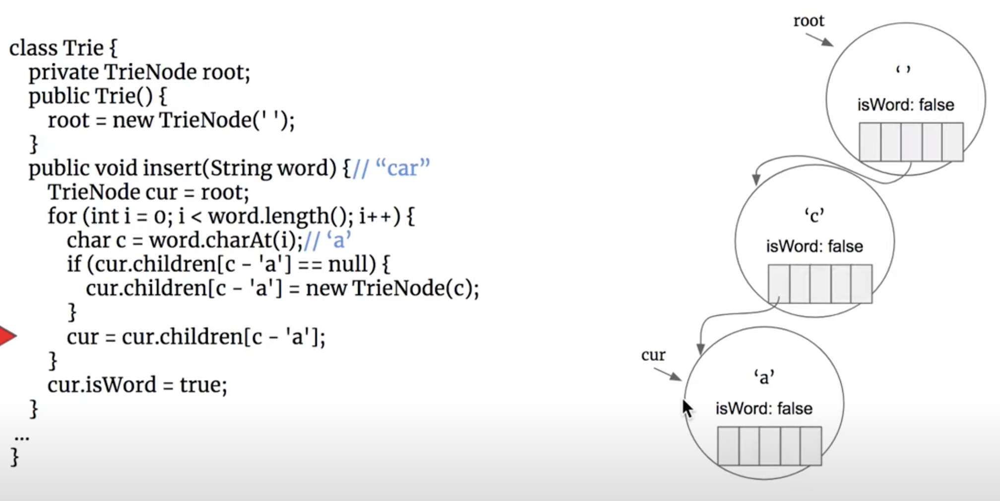
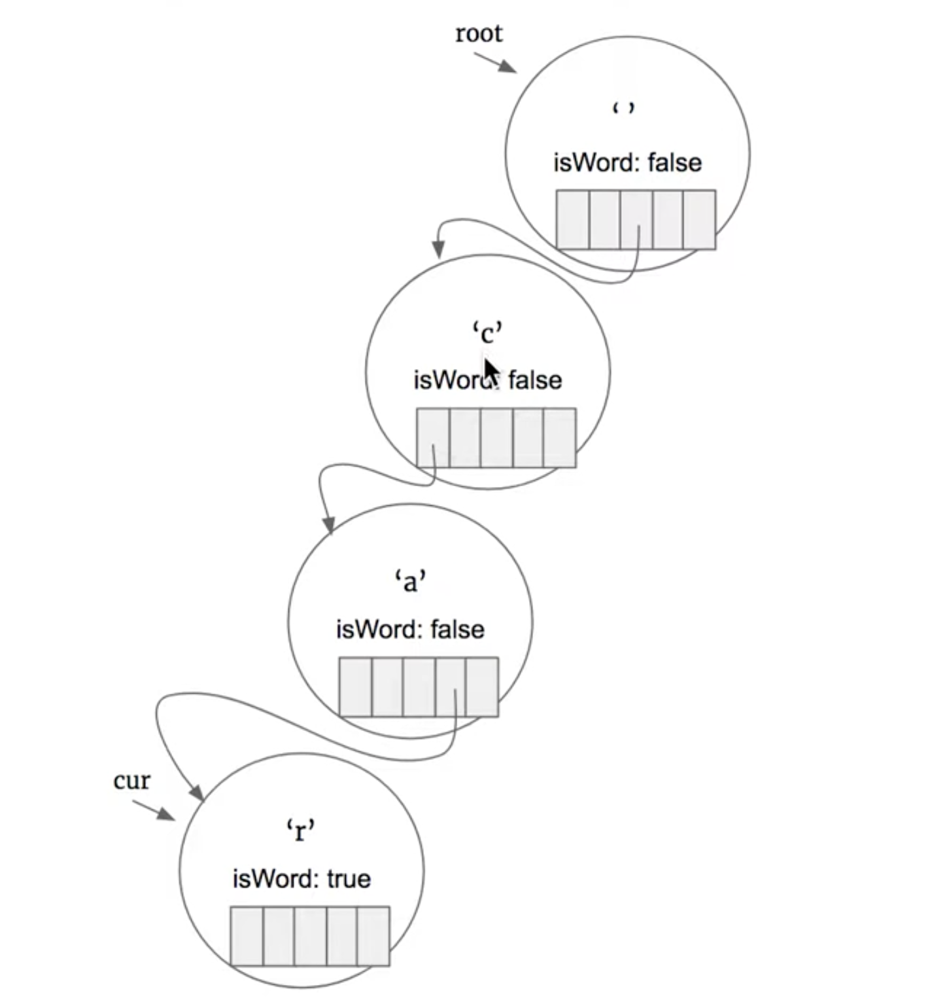
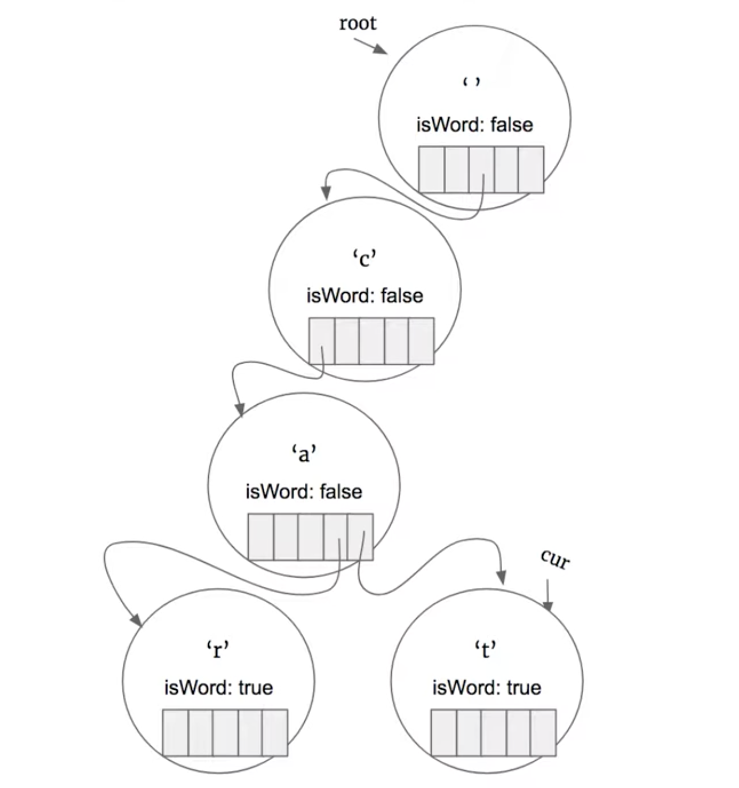
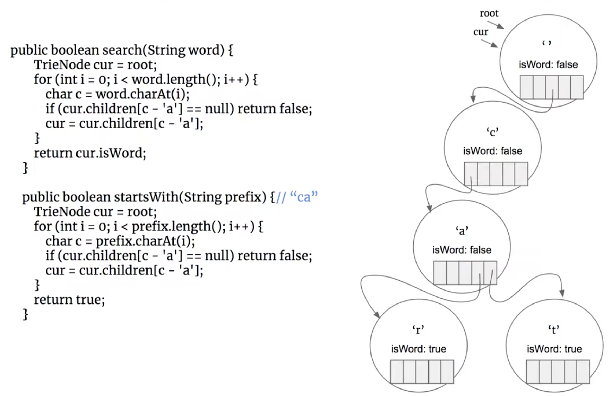

## 208. Implement Trie (Prefix Tree)

---

- 怎样往字典树里加一个单词呢？`insert` 操作
  - 假设找单词 `car` :

---

- 现在尝试再找一个单词： `cat` :

---

- `search` 操作:
  - 比如 search `ca`:
  - 这里需要查看自己的trie 树里，是否曾经含有该单词，如果没有就遍历到 `ca`, 还是false.

- `startWith` 操作：
  - 比如 遍历到 `ca`, 发现for 循环走完，依然没有return false, 说明start with `ca`

---

