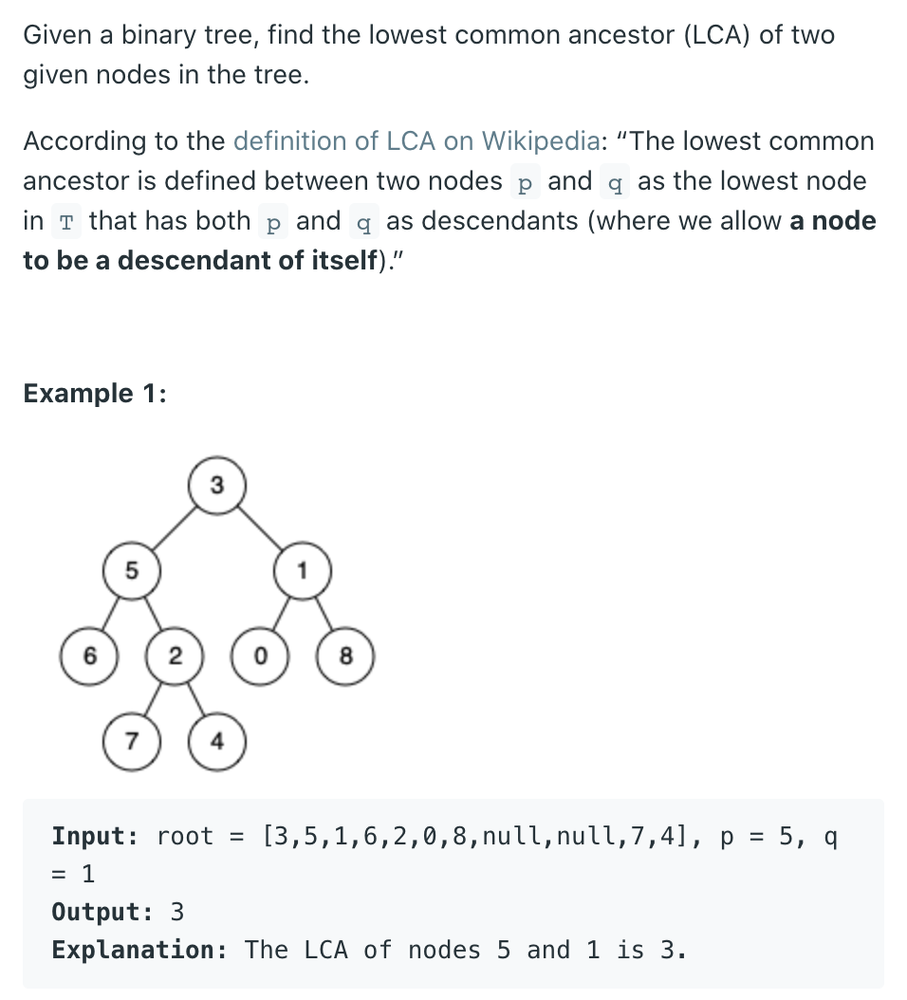
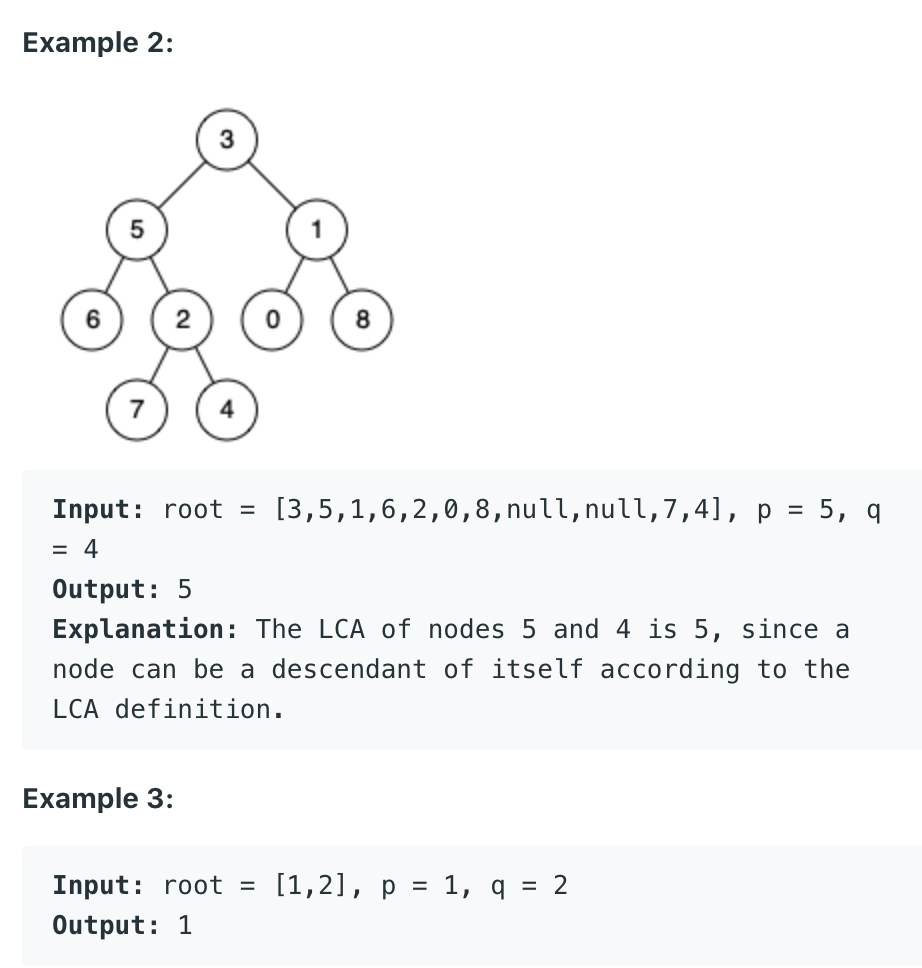
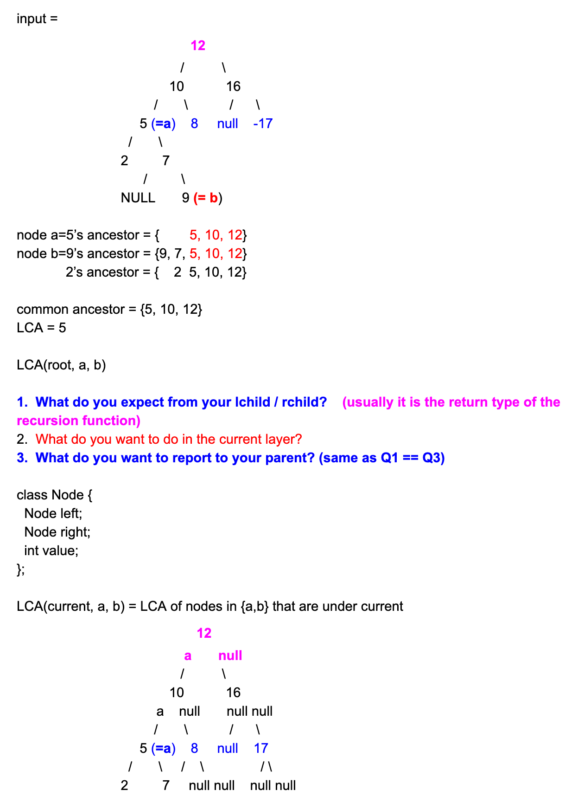
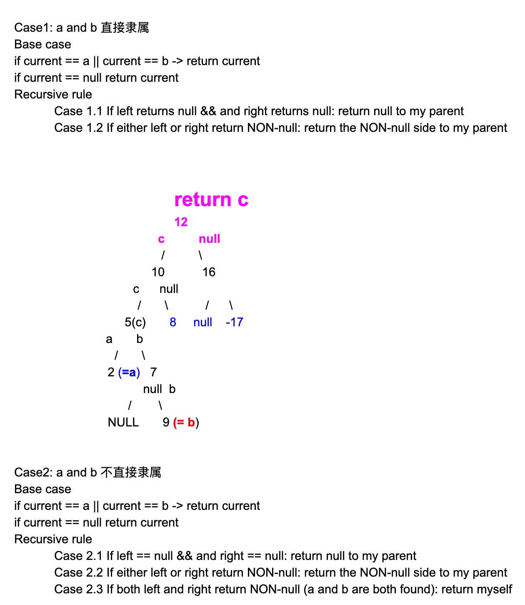

## 236. Lowest Common Ancestor of a Binary Tree









```java
class Solution {
    public TreeNode lowestCommonAncestor(TreeNode root, TreeNode p, TreeNode q) {
        if (root == null) return null;
        if (root == p || root == q) {
            return root;            
        }
        
        TreeNode left = lowestCommonAncestor(root.left, p, q);
        TreeNode right = lowestCommonAncestor(root.right, p, q);
        
        
        if (left == null && right != null) {
            return right;
        } else if (right == null && left != null) {
            return left;
        } else if (left != null && right != null) {
            return root;
        } 
        return null; //left == null && right == null
    }
}                                                               


/**
 * Definition for a binary tree node.
 * public class TreeNode {
 *     int val;
 *     TreeNode left;
 *     TreeNode right;
 *     TreeNode(int x) { val = x; }
 * }
 */
class Solution {
    public TreeNode lowestCommonAncestor(
        TreeNode root, TreeNode p, TreeNode q) {
        
        if (root == null) {
            return null;
        }
        if (root == p || root == q) {
            return root;
        }

        TreeNode left = lowestCommonAncestor(root.left, p, q);
        TreeNode right = lowestCommonAncestor(root.right, p, q);
        
        if (left != null && right != null) {
            return root;
        } 
        
        if (left != null) {
            return left;
        } else {
            return right;
        }        
    }
}
```