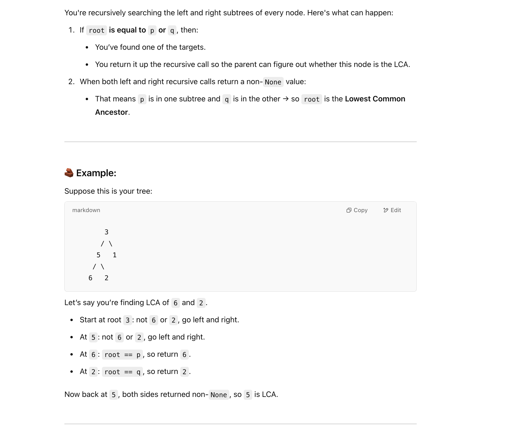

## 236. Lowest Common Ancestor of a Binary Tree


- [中文图解](https://leetcode.cn/problems/lowest-common-ancestor-of-a-binary-tree/solutions/240096/236-er-cha-shu-de-zui-jin-gong-gong-zu-xian-hou-xu/)

---
```java
class Solution {
    public TreeNode lowestCommonAncestor(TreeNode root, TreeNode p, TreeNode q) {
        if (root == null) return null;
        if (root == p || root == q) {
            return root;            
        }
        
        TreeNode left = lowestCommonAncestor(root.left, p, q);
        TreeNode right = lowestCommonAncestor(root.right, p, q);
        
        
        if (left == null && right != null) {
            return right;
        } else if (right == null && left != null) {
            return left;
        } else if (left != null && right != null) {
            return root;
        } 
        return null; //left == null && right == null
    }
}                                                               
```
---





```py
class TreeNode:
    def __init__(self, x):
        self.val = x
        self.left = None
        self.right = None

class Solution:
    def lowestCommonAncestor(self, root: 'TreeNode', p: 'TreeNode', q: 'TreeNode') -> 'TreeNode':
        if root is None:
            return None
        if root == p or root == q:
            return root

        left = self.lowestCommonAncestor(root.left, p, q)
        right = self.lowestCommonAncestor(root.right, p, q)
        if left is None and right is not None:
            return right
        elif right is None and left is not None:
            return left
        elif left and right:
            return root

        return None # left is none and right is none
```