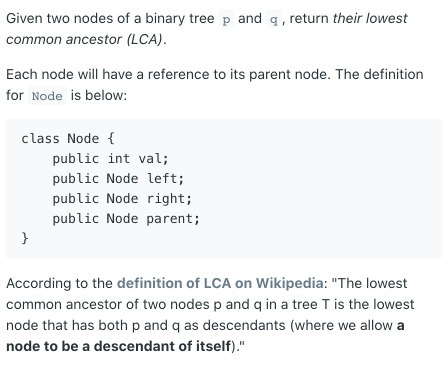
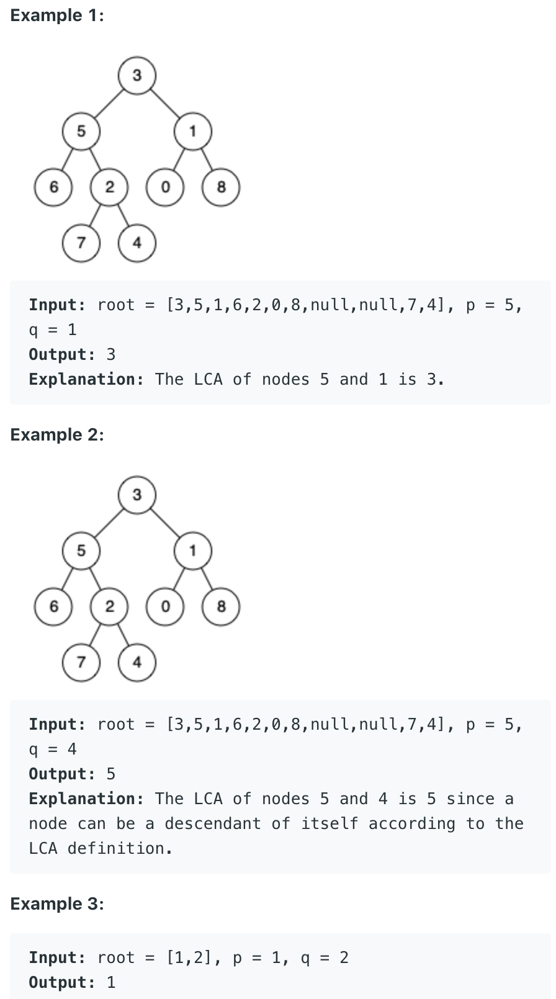

## 1650. Lowest Common Ancestor of a Binary Tree III




- [explanation](https://novemberfall.github.io/LeetCode-NoteBook/#/ch4/intersect)

```java
/*
// Definition for a Node.
class Node {
    public int val;
    public Node left;
    public Node right;
    public Node parent;
};
*/

class Solution {
    public Node lowestCommonAncestor(Node p, Node q) {
        Node a = p;
        Node b = q;
        
        while (a != b) {
            if (a != null) {
                a = a.parent;
            } else {
                a = q;
            }
            
            if (b != null) {
                b = b.parent;
            } else {
                b = p;
            }
        }
        return a;
    }
}
```