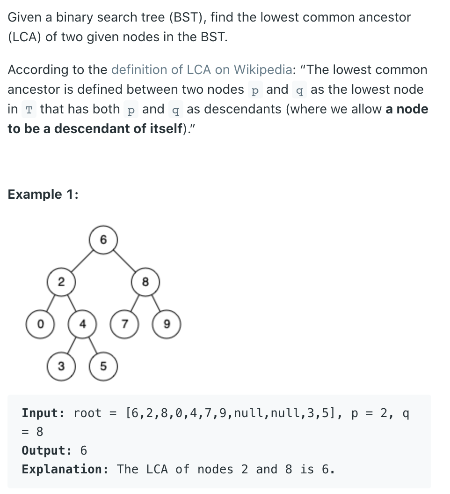
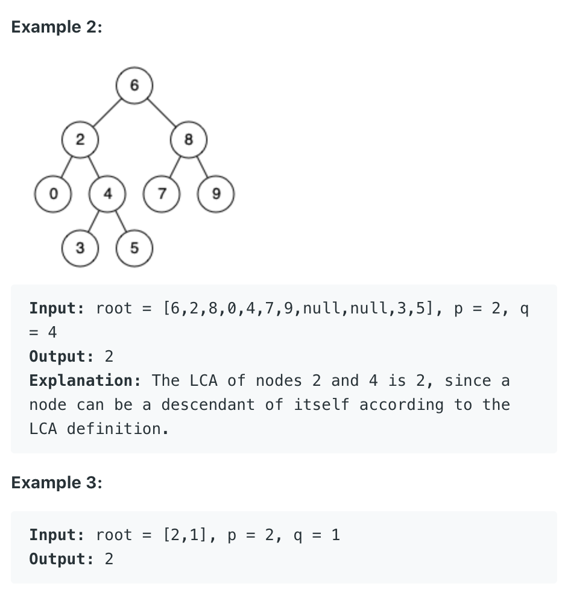

## 235. Lowest Common Ancestor of a Binary Search Tree


---



---

```java
/**
 * Definition for a binary tree node.
 * public class TreeNode {
 *     int val;
 *     TreeNode left;
 *     TreeNode right;
 *     TreeNode(int x) { val = x; }
 * }
 */

class Solution {
    public TreeNode lowestCommonAncestor(TreeNode root, TreeNode p, TreeNode q) {
        if (root == null || root == p || root == q) {
            return root;
        }
        int val = root.val;
        int pVal = p.val;
        int qVal = q.val;
        if (val > pVal && val > qVal) {
            return lowestCommonAncestor(root.left, p, q);
        } else if (val < pVal && val < qVal) {
            return lowestCommonAncestor(root.right, p, q);
        } else {
            return root;
        }
    }
}
```

---

### Iterator

```java
class LCA_BST_Iter {
    public TreeNode lowestCommonAncestor(TreeNode root, TreeNode p, TreeNode q) {
        TreeNode cur = root;

        while (cur != null) {
            if (p.val > cur.val && q.val > cur.val) {
                cur = cur.right;
            } else if (p.val < cur.val && q.val < cur.val) {
                cur = cur.left;
            } else {
                return cur;
            }
        }
        return cur;
    }
}
```