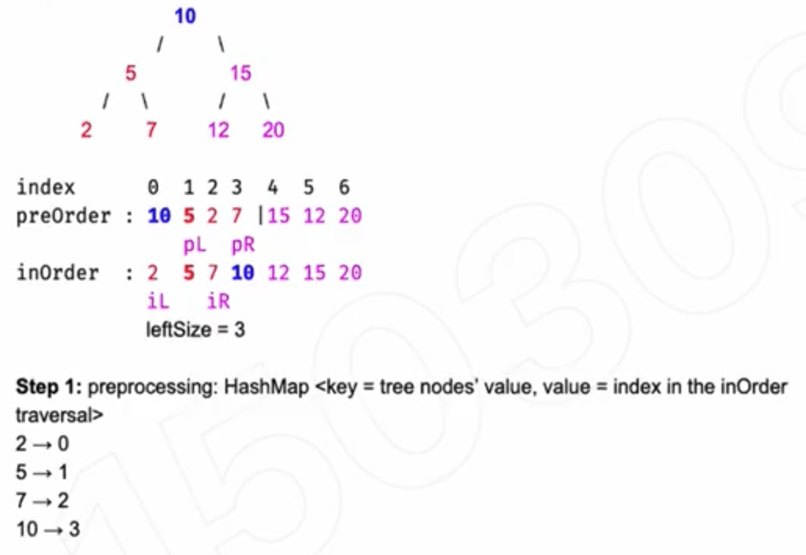

## 105. Construct Binary Tree from Preorder and Inorder Traversal

---




- key point: 把global的问题一分为二(recursively), 每半边返回一个subtree的
  root node。
- [YouTuBe c21 | 38:40]()

---


```java
class Solution {
    public TreeNode buildTree(int[] preorder, int[] inorder) {
        Map<Integer, Integer> inMap = inOrderIdx(inorder);
        return construct(inMap, preorder, 0, preorder.length-1, inorder, 0, inorder.length-1);
    }
    
    private Map<Integer, Integer> inOrderIdx(int[] inorder) {
        Map<Integer, Integer> map = new HashMap<>();
        for (int i = 0; i < inorder.length; i++) {
            map.put(inorder[i], i);
        }
        return map;
    }
    
    private TreeNode construct(Map<Integer, Integer> inMap, 
                                int[] preorder, int preLeft, int preRight, int[] inorder, int inLeft, int inRight) {
        
        if (preLeft > preRight) {
            return null;
        }
        TreeNode root = new TreeNode(preorder[preLeft]);
        int leftSize = inMap.get(root.val) - inLeft;
        root.left = construct(inMap, preorder, preLeft + 1, preLeft + leftSize, inorder, inLeft, inLeft + leftSize - 1);
        root.right = construct(inMap, preorder, preLeft + leftSize + 1, preRight, inorder, inLeft + leftSize + 1, inRight);    
        return root;
    }
}
```
---

### Could we add if (inLeft > inRight) too?

- Why checking only `preLeft > preRight` is **sufficient**:
  - Because you're **recursively slicing both** `preorder` and `inorder` arrays in **sync**, **the lengths of the subarrays always match**.


---

```py
class Solution:
    def buildTree(self, preorder: List[int], inorder: List[int]) -> Optional[TreeNode]:
        inMap = {}
        for i in range(len(inorder)):
            inMap[inorder[i]] = i

        return self.construct(inMap, preorder, 0, len(preorder) - 1, inorder, 0, len(inorder) - 1)

    def construct(self, inMap, preorder, pLeft, pRight, inorder, inLeft, inRight):
        if pLeft > pRight:
            return None

        root = TreeNode(preorder[pLeft])
        leftSize = inMap[preorder[pLeft]] - inLeft
        root.left = self.construct(inMap, preorder, pLeft + 1, pLeft + leftSize, inorder, inLeft, inLeft + leftSize - 1)
        root.right = self.construct(inMap, preorder, pLeft + leftSize + 1, pRight, inorder, inLeft + leftSize + 1,inRight)
        return root
```