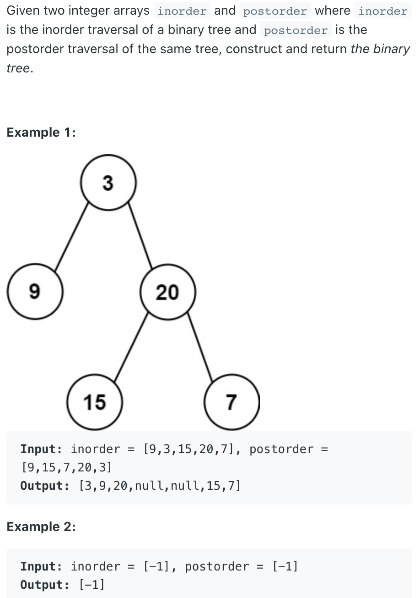
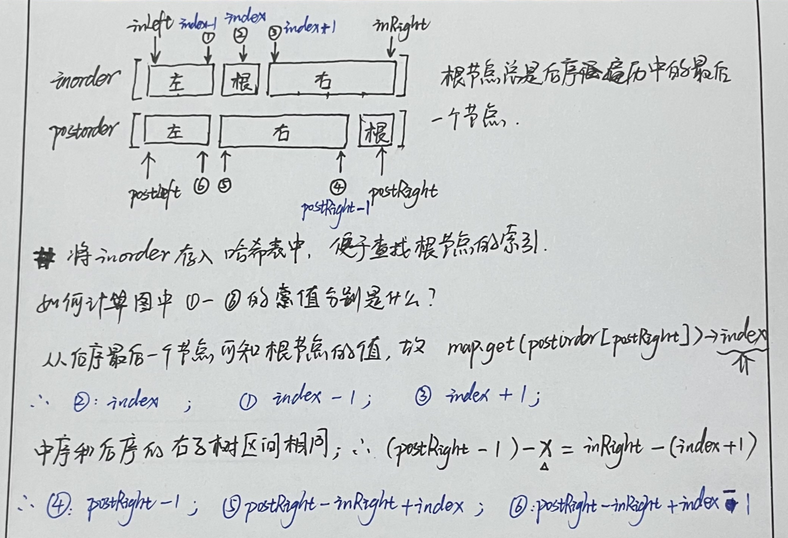

## 106. Construct Binary Tree from Inorder and Postorder Traversal

---
- example:

```ruby
       13
     /    \
    2      3
   / \    /
  5   6  7
        / \
       8   9
            \
            10
            /
          12

preorder  13,  2,  5,  6,  3,  7,  8,  9,  10,  12
         root ---left----  ---------right---------

inorder   5,  2,  6,  13,  8,  7,  9,  12,  10,  3
          ---left--- root  ---------right---------

postorder 5,  6,  2,  8,  12,  10,  9,  7,  3,  13
          ---left---  ---------right---------- root 
```



```java
/**
 * Definition for a binary tree node.
 * public class TreeNode {
 *     int val;
 *     TreeNode left;
 *     TreeNode right;
 *     TreeNode() {}
 *     TreeNode(int val) { this.val = val; }
 *     TreeNode(int val, TreeNode left, TreeNode right) {
 *         this.val = val;
 *         this.left = left;
 *         this.right = right;
 *     }
 * }
 */
class Solution {
    public TreeNode buildTree(int[] inorder, int[] postorder) {
        Map<Integer, Integer> inMap = inOrderIdx(inorder);
        return build(inMap, 
                    inorder, 0, inorder.length - 1, 
                    postorder, 0, postorder.length - 1);
    }
    
    private Map<Integer, Integer> inOrderIdx(int[] inorder) {
        Map<Integer, Integer> map = new HashMap<>();
        for (int i = 0; i < inorder.length; i++) {
            map.put(inorder[i], i);
        }
        return map;
    }
    
    private TreeNode build( Map<Integer, Integer> inMap,
        int[] inorder, int inLeft, int inRight,
        int[] postorder, int postLeft, int postRight) {
        
        if (postLeft > postRight) {
            return null;
        }
        TreeNode root = new TreeNode(postorder[postRight]);
        int index = inMap.get(root.val);
        root.left = build(inMap, 
                    inorder, inLeft, index - 1, 
            postorder, postLeft, postRight - inRight + index - 1);
        root.right = build(inMap,
                    inorder, index + 1, inRight,       
            postorder, postRight - inRight + index, postRight - 1);
        return root;
    }
}
```