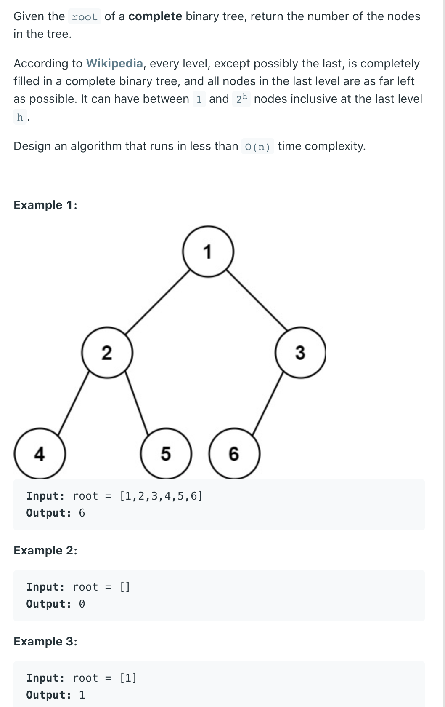

## 222. Count Complete Tree Nodes



- Time: O(logn * logn)

```java
/**
 * Definition for a binary tree node.
 * public class TreeNode {
 *     int val;
 *     TreeNode left;
 *     TreeNode right;
 *     TreeNode() {}
 *     TreeNode(int val) { this.val = val; }
 *     TreeNode(int val, TreeNode left, TreeNode right) {
 *         this.val = val;
 *         this.left = left;
 *         this.right = right;
 *     }
 * }
 */
class Solution {
    public int countNodes(TreeNode root) {
        if (root == null) {
            return 0;
        }
        if (root != null && root.left == null && root.right == null) {
            return 1;
        }
        return countNodes(root.left) + countNodes(root.right) + 1;
    }
}
```