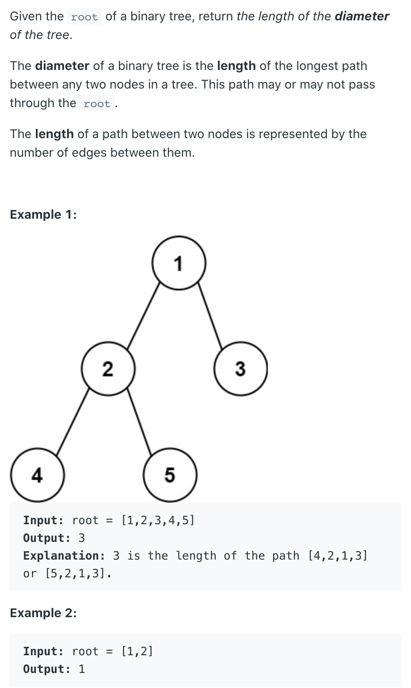
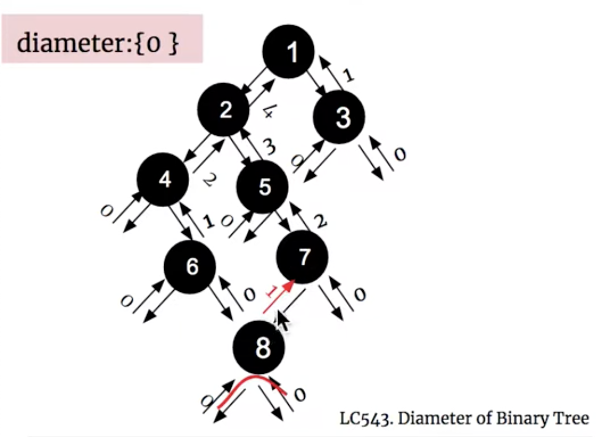

## 543. Diameter of Binary Tree | path


- [youtube](https://youtu.be/3vZV-6qPDmE?t=160)



- T = O(n)
- Space = O(Height)

---
```java
/**
 * Definition for a binary tree node.
 * public class TreeNode {
 *     int val;
 *     TreeNode left;
 *     TreeNode right;
 *     TreeNode() {}
 *     TreeNode(int val) { this.val = val; }
 *     TreeNode(int val, TreeNode left, TreeNode right) {
 *         this.val = val;
 *         this.left = left;
 *         this.right = right;
 *     }
 * }
 */
class Solution {
    public int diameterOfBinaryTree(TreeNode root) {
        if (root == null) return 0;
        
        int[] res = new int[1];
        dfs(root, res);
        return res[0];
    }
    
    private int dfs(TreeNode root, int[] res) {
        if (root == null) return 0;
        
        int lh = dfs(root.left, res);
        int rh = dfs(root.right, res);
        res[0] = Math.max(res[0], lh + rh);
        return Math.max(lh, rh) + 1;
    }
}
```