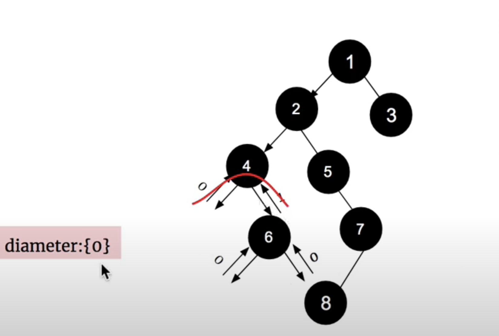

## 543. Diameter of Binary Tree | path


- [youtube](https://youtu.be/3vZV-6qPDmE?t=160)




- T = O(n)
- Space = O(Height)

---
```java
/**
 * Definition for a binary tree node.
 * public class TreeNode {
 *     int val;
 *     TreeNode left;
 *     TreeNode right;
 *     TreeNode() {}
 *     TreeNode(int val) { this.val = val; }
 *     TreeNode(int val, TreeNode left, TreeNode right) {
 *         this.val = val;
 *         this.left = left;
 *         this.right = right;
 *     }
 * }
 */
class Solution {
    public int diameterOfBinaryTree(TreeNode root) {
        if (root == null) return 0;
        
        int[] res = new int[1];

        // This will find the max depth going through each node,
        // and update the global maximum to the class member 'max'        
        dfs(root, res);
        return res[0];
    }
    
    private int dfs(TreeNode root, int[] res) {
        // Height of null is 0
        if (root == null) return 0;
        
        // Find height of left and right subTrees
        int lh = dfs(root.left, res);
        int rh = dfs(root.right, res);

        // New global max is either already reached,
        // or is acheived using this node as the root
        res[0] = Math.max(res[0], lh + rh);
        // 如果哪个path 更大，就取哪个，关键看是否可以打破之前的纪律。

        // Return height of tree rooted at this node
        return Math.max(lh, rh) + 1;
    }
}
```