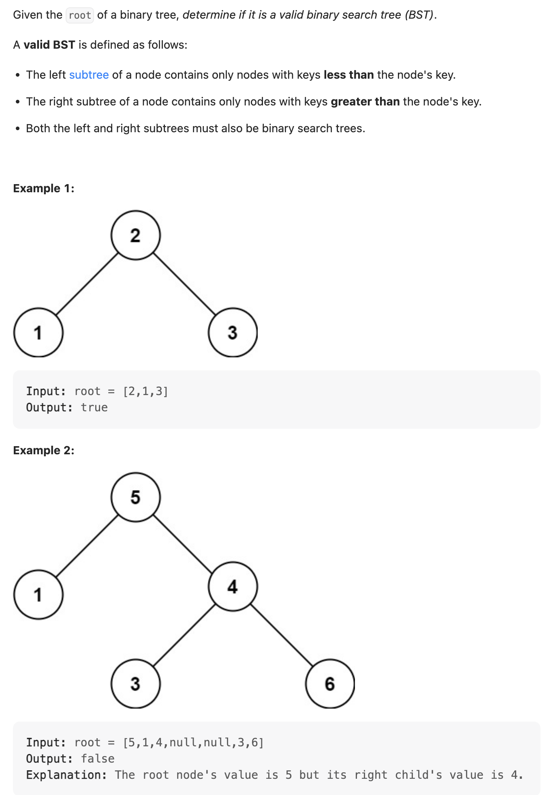
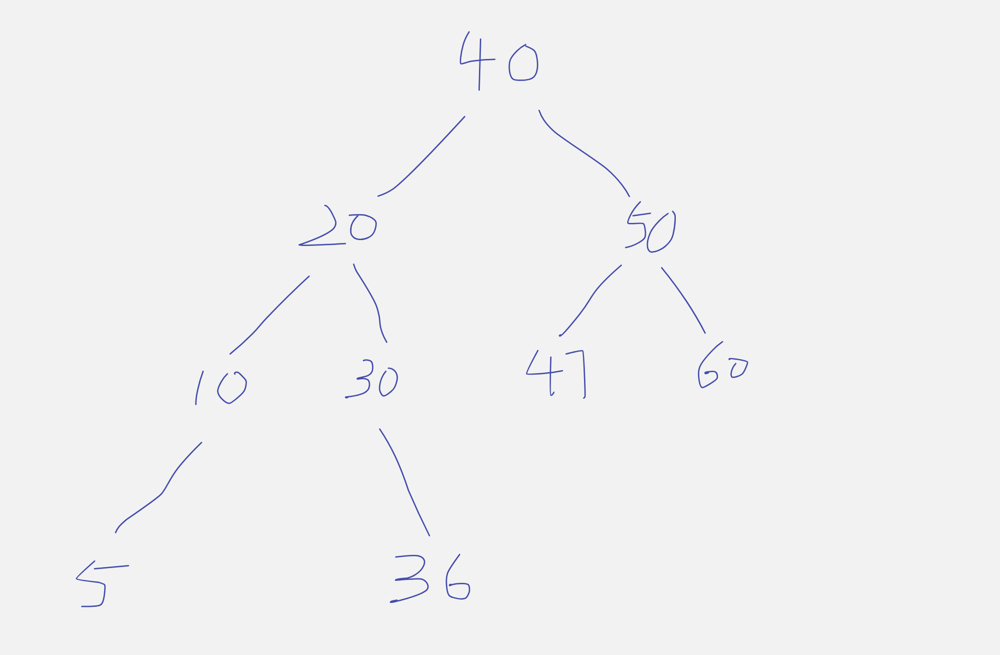
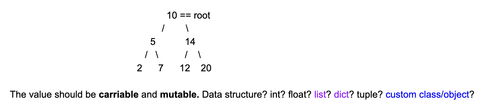

## 98. Validate Binary Search Tree

---


### Example:

- the following is an valid `Binary Search Tree`:




## Analysis:

- Primitive way but very bad in terms of sapce consumption

1. **inorder traverse the tree and store all numbers in an arrayList**
2. iterate over the array to determine, whether `A[i] < A[i + 1]`
---   

- Our idea:

```ruby
                   10(min=-inf, max =+inf) == root

                   /                      \

            5(min=-inf,max=10)  AND         15

          /         \                     /    \   

2(min=-inf,max=5)   X(min=5,max=10)      12     20
```

- why we set root, `min=-inf, max =+inf`? because we don't know its left child and 
  right child, **we need to know if current level is so far so good**

- Time = `O(n)`    : since we need to iterate all nodes
- Space = `O(height)`

---

```java
class Solution {
    public boolean isValidBST(TreeNode root) {
        return isBST(root, Long.MIN_VALUE, Long.MAX_VALUE);
    }

    private boolean isBST(TreeNode root, long left, long right) {
        if (root == null) {
            return true;
        }

        int x = root.val;

        if (left < x && x < right) {
            return isBST(root.left, left, x) && isBST(root.right, x, right);
        }

        return false;
    }
}
```

#### Python

```py
class TreeNode:
    def __init__(self, val=0, left=None, right=None):
        self.val = val
        self.left = left
        self.right = right


class Solution:
    def isValidBST(self, root: Optional[TreeNode]) -> bool:
        return self.isBST(root, float('-inf'), float('inf'))

    def isBST(self, root: TreeNode, left: float, right: float) -> bool:
        if root is None:
            return True

        x = root.val

        if left < x < right:
            return self.isBST(root.left, left, x) and self.isBST(root.right, x, right)

        return False
```


---

### Binary Search Tree Operations

- [class39 35:04]()

#### Binary Search Tree Traversal
  - if we do an inorder traversal on a binary search tree(recrsively traverse on the left subtree and then root node, then recursively traverse on the
    right subtree), what characteristics does the output sequence have?
  - **ANS**: All items in this sequence will be organized in an increasing order.

```py
class Solution:
    def isValidBST(self, root: Optional[TreeNode]) -> bool:
        res = []
        self.inorder(root, res)
        for i in range(len(res) - 1):
            if res[i] >= res[i + 1]:
                return False
        return True

    def inorder(self, root, res):
        if root is None:
            return
        self.inorder(root.left, res)
        res.append(root.val)
        self.inorder(root.right, res)
```

- TC = O(N)
- SC = O(Height + N) = O(N)

---
## further optimize the code
- [class39 50:45]() 

### Solution 2:



