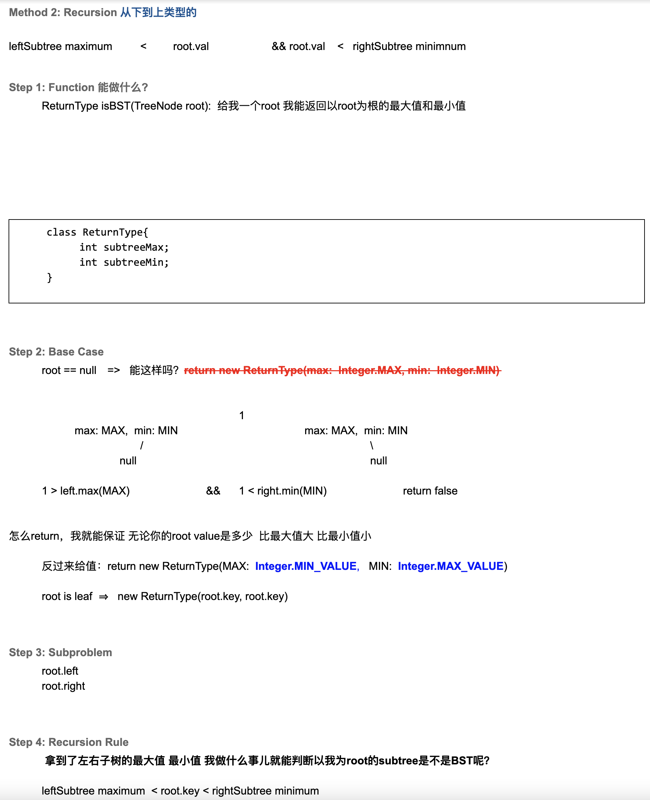

## 98. Validate Binary Search Tree

---

## Analysis:

- Primitive way but very bad in terms of sapce consumption

1. **inorder traverse the tree and store all numbers in an arrayList**
2. iterate over the array to determine, whether `A[i] < A[i + 1]`
---   

- Our way:

```ruby
                   10(min=-inf, max =+inf) == root

                   /                      \

            5(min=-inf,max=10)  AND         15

          /         \                     /    \   

2(min=-inf,max=5)   X(min=5,max=10)      12     20
```

- why we set root, `min=-inf, max =+inf`? because we don't know its left child and 
  right child, **we need to know if current level is so far so good**

- Time = `O(n)`    : since we need to iterate all nodes
- Space = `O(height)`

---

```java
/**
 * Definition for a binary tree node.
 * public class TreeNode {
 *     int val;
 *     TreeNode left;
 *     TreeNode right;
 *     TreeNode() {}
 *     TreeNode(int val) { this.val = val; }
 *     TreeNode(int val, TreeNode left, TreeNode right) {
 *         this.val = val;
 *         this.left = left;
 *         this.right = right;
 *     }
 * }
 */
class Solution {
    public boolean isValidBST(TreeNode root) {
        return isBST(root, Long.MIN_VALUE, Long.MAX_VALUE);
    }

    private boolean isBST(TreeNode root, long min, long max) {
        if (root == null) {
            return true;
        }
        if (root.val <= min || root.val >= max) {
            return false;
        }
        return isBST(root.left, min, root.val) &&
                isBST(root.right, root.val, max);
    }    
}
```
---
### Recursion

- 本题前面的递归，是**至上而下**传递，但是如果我希望**从下往上**传递, 我当如何做？


```java
public class isBST_MultiReturnValue {
    static class ReturnType {
        long subtreeMin;
        long subtreeMax;
        boolean isBST;

        public ReturnType(long subtreeMin, long subtreeMax, boolean isBST) {
            this.subtreeMin = subtreeMin;
            this.subtreeMax = subtreeMax;
            this.isBST = isBST;
        }
    }

    public boolean isValidBST(TreeNode root) {
        ReturnType result = recursion(root);
        return result.isBST;
    }

    private ReturnType recursion(TreeNode root) {
        if (root == null) {
            return new ReturnType(Long.MAX_VALUE, Long.MIN_VALUE, true);
        }

        // leaf Node
        if (root.left == null && root.right == null) {
            return new ReturnType(root.val, root.val, true);
        }

        ReturnType left = recursion(root.left);
        ReturnType right = recursion(root.right);

        if (!left.isBST || !right.isBST) {
            return new ReturnType(-1, -1, false);
        }

        if (left.subtreeMax >= root.val || root.val >= right.subtreeMin) {
            return new ReturnType(-1, -1, false);
        }

        long curMin = Math.min(root.val, left.subtreeMin);
        long curMax = Math.max(root.val, right.subtreeMax);

        return new ReturnType(curMin, curMax, true);
    }
}
```

---

### Brute Force

```java
public class isBST_BruteForce {
    public boolean isValidBST_ForLoop(TreeNode root) {
        if (root == null) {
            return true;
        }
        List<Integer> res = new ArrayList<>();
        convertToList(res, root);
        for (int i = 1; i < res.size(); i++) {
            if (res.get(i - 1) >= res.get(i)) {
                return false;
            }
        }
        return true;
    }

    public boolean isValidBST(TreeNode root) {
        if (root == null) {
            return true;
        }
        List<Integer> res = new ArrayList<>();
        convertToList(res, root);
        return res.stream().sorted().distinct().collect(Collectors.toList()).equals(res);
    }

    private void convertToList(List<Integer> res, TreeNode root) {
        if (root == null) {
            return;
        }
        convertToList(res, root.left);
        res.add(root.val);
        convertToList(res, root.right);
    }


    public static TreeNode create() {
        TreeNode root = new TreeNode(40);
        root.left = new TreeNode(20);
        root.left.left = new TreeNode(10);
        root.left.left.left = new TreeNode(5);
        root.left.right = new TreeNode(30);
        root.right = new TreeNode(50);
        root.right.right = new TreeNode(60);
        root.right.left = new TreeNode(47);
        root.left.right.right = new TreeNode(36);
        return root;
    }

    public List<Integer> createList() {
        TreeNode root = create();
        List<Integer> res = new ArrayList<>();
        convertToList(res, root);
        return res;
    }

    public static void main(String[] args) {
        isBST_BruteForce isBST_bruteForce = new isBST_BruteForce();
        List<Integer> res = isBST_bruteForce.createList();
        System.out.println(res);
        System.out.println("======================================");
        TreeNode root = create();
        System.out.println(isBST_bruteForce.isValidBST(root));
    }
}
```

