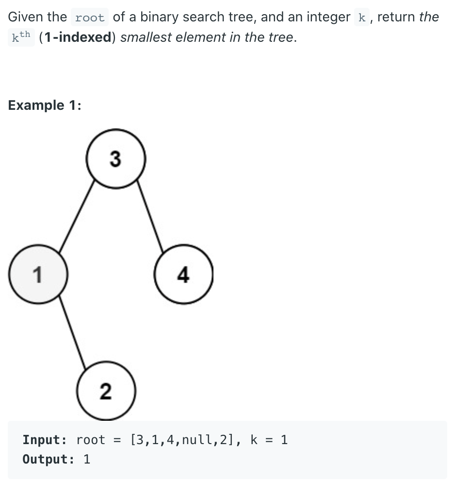
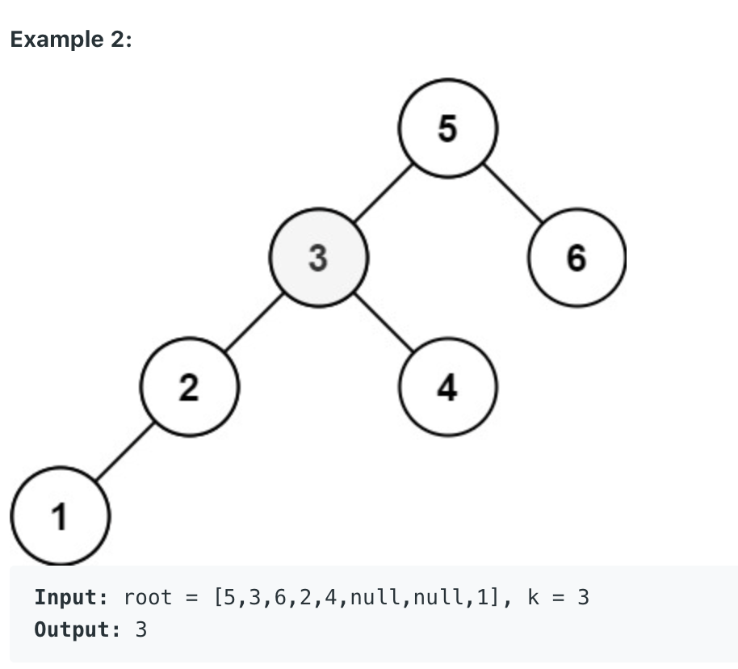

## 230. Kth Smallest Element in a BST




---

### explanation

- 1. bst
- 2. kth smallest(1, 2, 3, ... k)

- left -> root -> right
- inorder traversal => 按照输出的顺序(从小到大)保留treenode(val) Queue
---

```java
/**
 * Definition for a binary tree node.
 * public class TreeNode {
 *     int val;
 *     TreeNode left;
 *     TreeNode right;
 *     TreeNode() {}
 *     TreeNode(int val) { this.val = val; }
 *     TreeNode(int val, TreeNode left, TreeNode right) {
 *         this.val = val;
 *         this.left = left;
 *         this.right = right;
 *     }
 * }
 */
class Solution {
    public int kthSmallest(TreeNode root, int k) {
        Queue<Integer> queue = new LinkedList<>();
        dfs(root, queue);//inorder traversal
        for (int i = 0; i < k - 1; i++) {
            queue.poll();
        }
        return queue.poll();
    }
    
    private void dfs(TreeNode root, Queue<Integer> queue) {
        if (root == null) return;
        //inorder: left -> root -> right
        dfs(root.left, queue);
        queue.offer(root.val);
        dfs(root.right, queue);
    }
}
```
---

```py
class Solution:
    def kthSmallest(self, root: Optional[TreeNode], k: int) -> int:
        res = []
        self.dfs(root, res)
        return res[k - 1]

    def dfs(self, root, res):
        if not root:
            return

        self.dfs(root.left, res)
        res.append(root.val)
        self.dfs(root.right, res)
```

---

### 剪枝

- 1. bst
- 2. kth smallest(1, 2, 3, ... k)

- left -> root -> right
- inorder traversal => 按照输出的顺序(从小到大)保留treenode(val) 
  - 计数

---

```java
class Solution {
    private int cnt = 0;
    private int res = 0;
    
    public int kthSmallest(TreeNode root, int k) {
        dfs(root, k);
        return res;
    }
    
    private void dfs(TreeNode root, int k) {
        if (root == null) return;
        
        dfs(root.left, k);
        
        cnt++;
        if (cnt == k) {
            res = root.val;
        } 
            
        dfs(root.right, k);
        
    }
}
```
---

```py
class Solution:
    def kthSmallest(self, root: Optional[TreeNode], k: int) -> int:
        self.cnt = 0
        self.res = 0

        self.dfs(root, k)
        return self.res

    def dfs(self, root, k):
        if not root:
            return

        self.dfs(root.left, k)

        self.cnt += 1
        if self.cnt == k:
            self.res = root.val

        self.dfs(root.right, k)
```