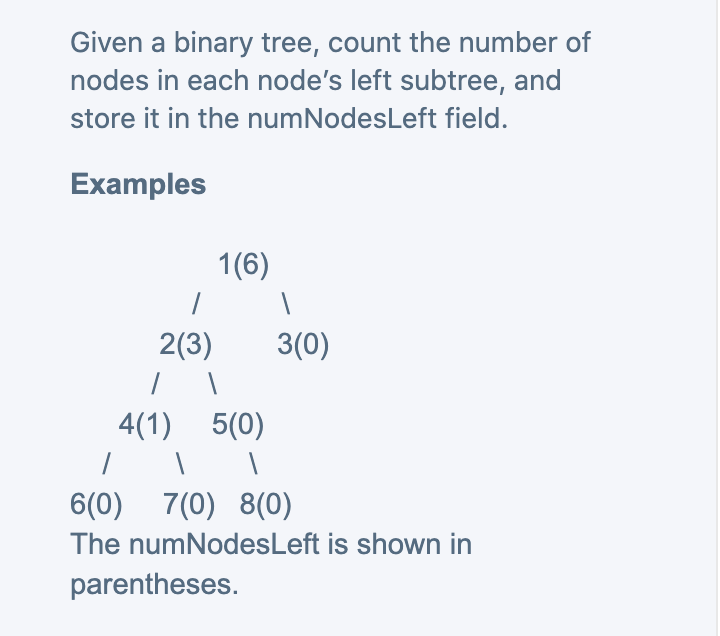
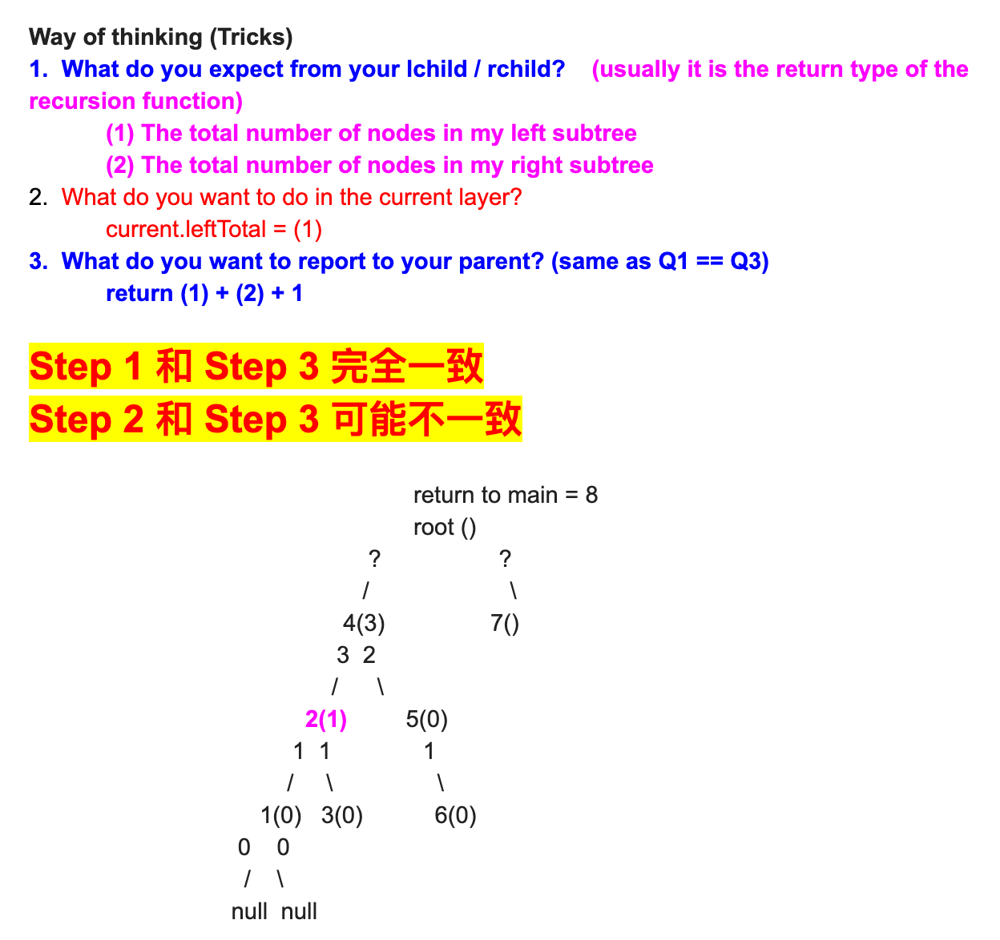

## Store Number Of Nodes In Left Subtree



- **从下往上返值**:



```java
/**
 * public class TreeNodeLeft {
 *   public int key;
 *   public TreeNodeLeft left;
 *   public TreeNodeLeft right;
 *   public int numNodesLeft;
 *   public TreeNodeLeft(int key) {
 *     this.key = key;
 *   }
 * }
 */
public class Solution {
  public void numNodesLeft(TreeNodeLeft root) {
    // Write your solution here
    numNodes(root);
  }

  private int numNodes(TreeNodeLeft root) {
    if (root == null) {
      return 0;
    }
    int leftCount = numNodes(root.left);
    int rightCount = numNodes(root.right);
    root.numNodesLeft = leftCount;
    return leftCount + rightCount + 1;
  }
}
```