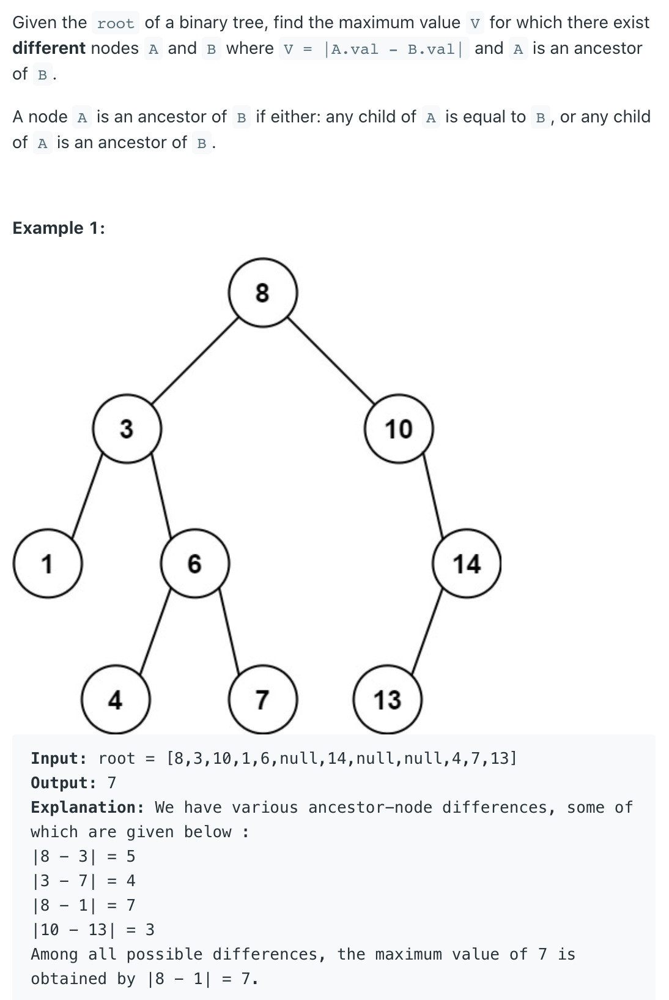

## 1026. Maximum Difference Between Node and Ancestor




```java
/**
 * Definition for a binary tree node.
 * public class TreeNode {
 *     int val;
 *     TreeNode left;
 *     TreeNode right;
 *     TreeNode() {}
 *     TreeNode(int val) { this.val = val; }
 *     TreeNode(int val, TreeNode left, TreeNode right) {
 *         this.val = val;
 *         this.left = left;
 *         this.right = right;
 *     }
 * }
 */
class Solution {
    
    public int maxAncestorDiff(TreeNode root) {
        if (root == null) {
            return 0;
        }//如果当前节点没有子节点，则直接返回
        int[] res = new int[1];
        dfs(res, root, root.val, root.val);
        return res[0];
    }
    
    /*
      每条从根节点到叶子节点的路径中的最大值和最小值，并求出差值更新全局变量
    */
    private void dfs(int[] res, TreeNode node, int max, int min) {
        if (node == null) {
            return;
        }
        max = Math.max(node.val, max);
        min = Math.min(node.val, min);
        //leaf node, left child and right child are null
        if (node.left == null && node.right == null) {
            res[0] = Math.max(res[0], Math.abs(max - min));
        }
        dfs(res, node.left, max, min);
        dfs(res, node.right, max, min);
    }
}
```