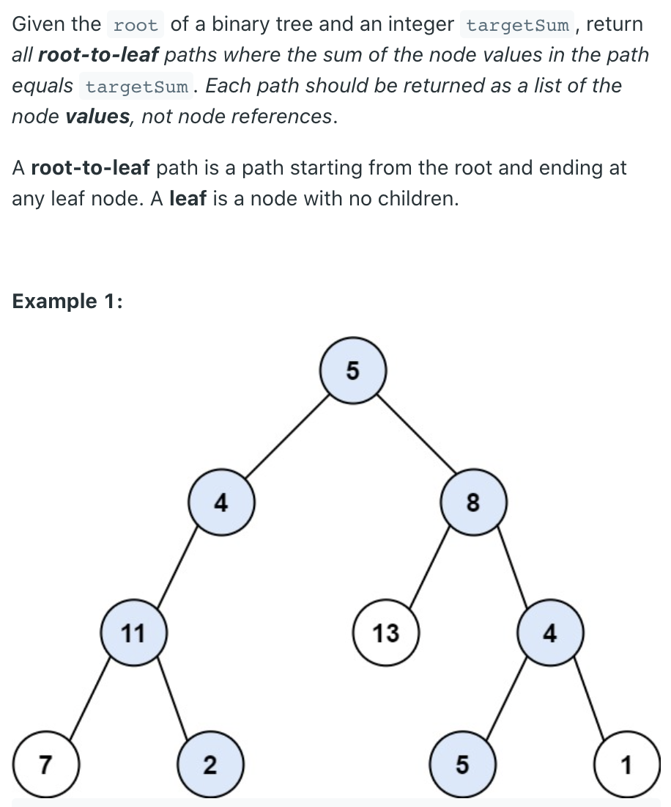
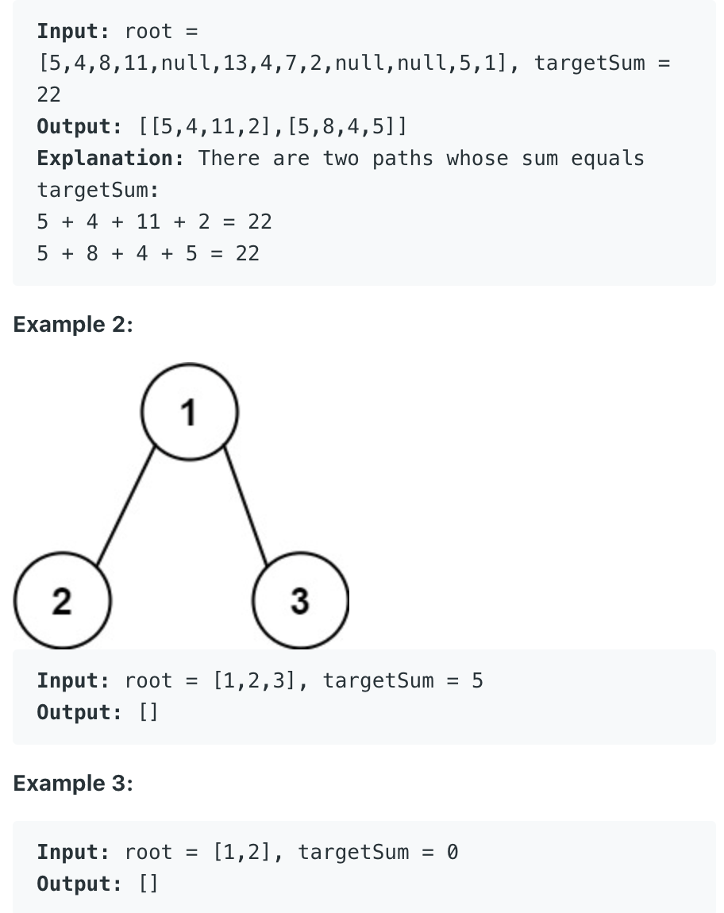

## 113. Path Sum II




#### 三部曲

1. What do you expect from your leftChild / rightChild? (usually it is the return type of the
   recursion function)
   - left: max single path in my left subtree that starts from leftChild
   - right: max single path in my right subtree that starts from rightChild
2. What do you want to do in the current layer?
   - update 
3. What do you want to report to your parent? (same as Q1 == Q3)
   - return 

---

### 复杂度分析
- 时间复杂度：O(N^2) 其中 N 是树的节点数。在最坏情况下，树的上半部分为链状，下半部分为完全二叉树，并且从根节点到每一个叶子节点的路径都符合题目要求。此时，路径的数目为 O(N)，并且每一条路径的节点个数也为 O(N)，因此要将这些路径全部添加进答案中，时间复杂度为 O(N^2)。
- 空间复杂度：O(N)，其中 N 是树的节点数。空间复杂度主要取决于栈空间的开销，栈中的元素个数不会超过树的节点数。

```java
class Solution {
    public List<List<Integer>> pathSum(TreeNode root, int targetSum) {
        List<List<Integer>> res = new ArrayList<>();
        
        dfs(res, new ArrayList<>(), root, targetSum);
        return res;
    }
    
    private void dfs(List<List<Integer>> res, List<Integer> path, 
                                             TreeNode root, int sum){
        if (root == null) {
            return;
        }
        
        path.add(root.val);
        
        sum -= root.val;
        //出口2 leaf node
        if (root.left == null && root.right == null && sum == 0) {
            res.add(new ArrayList<>(path));   
        }
        
        //拆解:        
        dfs(res, path, root.left, sum);
        dfs(res, path, root.right, sum);
        path.remove(path.size() - 1);
    }
}
```