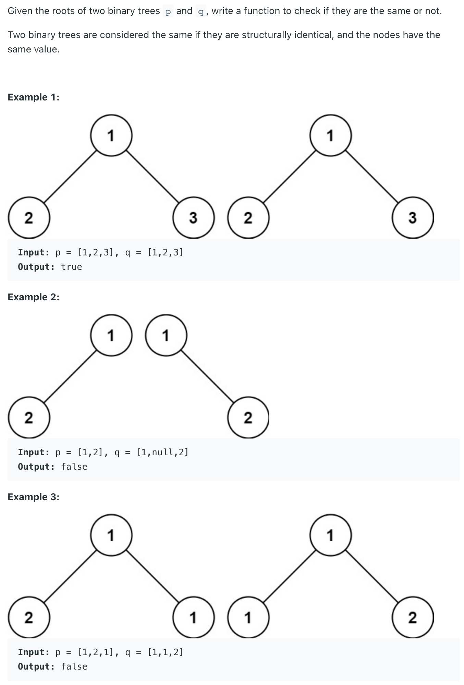

## 100. Same Tree

---

- [reference to 951. Flip Equivalent Binary Trees](https://novemberfall.github.io/LeetCode-NoteBook/#/m2/tweakTree)


```java
/**
 * Definition for a binary tree node.
 * public class TreeNode {
 *     int val;
 *     TreeNode left;
 *     TreeNode right;
 *     TreeNode() {}
 *     TreeNode(int val) { this.val = val; }
 *     TreeNode(int val, TreeNode left, TreeNode right) {
 *         this.val = val;
 *         this.left = left;
 *         this.right = right;
 *     }
 * }
 */
class Solution {
    public boolean isSameTree(TreeNode p, TreeNode q) {
        if(p == null && q == null){
            return true;
        }else if(p == null || q == null){
            return false;
        }else if(p.val != q.val){
            return false;
        }
        
        return isSameTree(p.left, q.left) && isSameTree(p.right, q.right);
    }
}
```