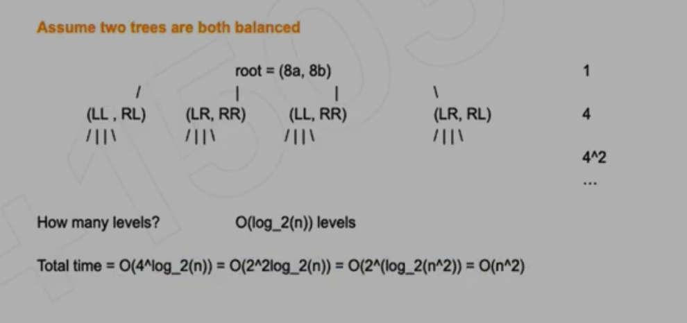

## 951. Flip Equivalent Binary Trees

---


```ruby
=====================================================================

Why in the worst case, the recursion tree  = log_2(n)	  levels?
1, 4, 16, 4^log_2(n)


4^(log_2(n))  = 2^(2log_2(n)) = 2^(log_2(n^2)) =   n^2
```




```java
/**
 * Definition for a binary tree node.
 * public class TreeNode {
 *     int val;
 *     TreeNode left;
 *     TreeNode right;
 *     TreeNode() {}
 *     TreeNode(int val) { this.val = val; }
 *     TreeNode(int val, TreeNode left, TreeNode right) {
 *         this.val = val;
 *         this.left = left;
 *         this.right = right;
 *     }
 * }
 */
class Solution {
    public boolean flipEquiv(TreeNode root1, TreeNode root2) {
        if(root1 == null && root2 == null){
            return true;
        }else if(root1 == null || root2 == null){
            return false;
        }else if(root1.val != root2.val){
            return false;
        }
        return flipEquiv(root1.left, root2.left) && flipEquiv(root1.right, root2.right)
            ||
            flipEquiv(root1.left, root2.right) && flipEquiv(root1.right, root2.left);
    }
}
```