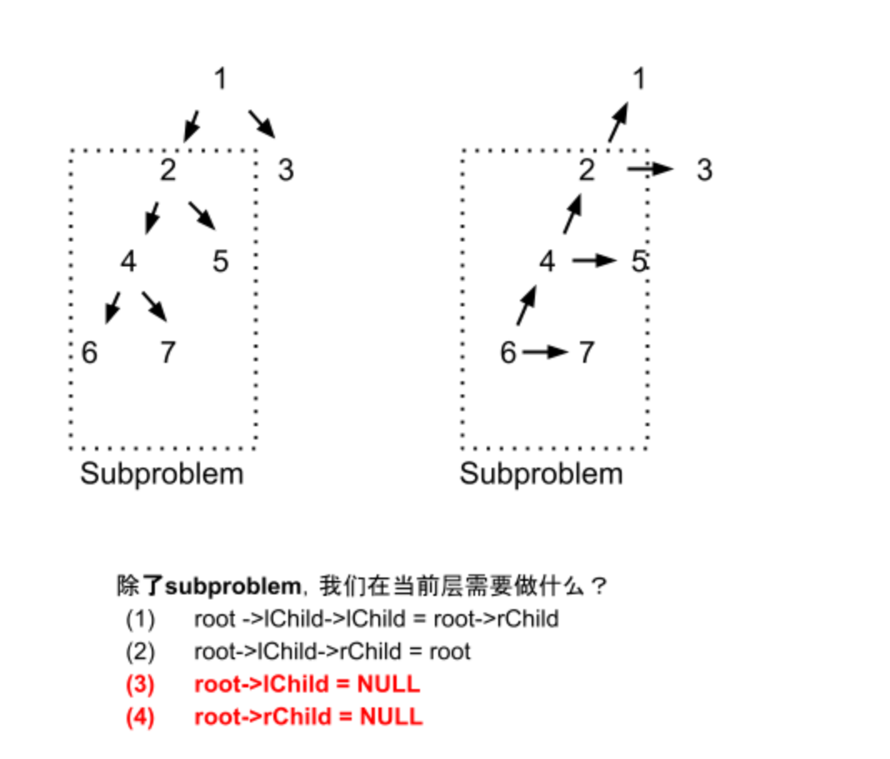

## 156. Binary Tree Upside Down


- Given a binary tree where all the right nodes are either leaf nodes with 
  a sibling (a left node that shares the same parent node) or empty, flip it upside down and 
  turn it into a tree where the original right nodes turned into left leaf nodes. 
- Return the new root.


```ruby
Example:

Input: [1,2,3,4,5]

    1
   / \
  2   3
 / \
4   5

Output: 
return the root of the binary tree [4,5,2,#,#,3,1]

   4
  / \
 5   2
    / \
   3   1  
```





## Analysis:

- 先看它的subproblem, 返回什么？
  - 返回一个相当于 `root` 的节点

- 当 root.left 到最上面的时候，root.left, root.right 都为null


```java
/**
 * Definition for a binary tree node.
 * public class TreeNode {
 *     int val;
 *     TreeNode left;
 *     TreeNode right;
 *     TreeNode() {}
 *     TreeNode(int val) { this.val = val; }
 *     TreeNode(int val, TreeNode left, TreeNode right) {
 *         this.val = val;
 *         this.left = left;
 *         this.right = right;
 *     }
 * }
 */
class Solution {
    public TreeNode upsideDownBinaryTree(TreeNode root) {
        if (root == null || root.left == null) {
            return root;
        }
        TreeNode newRoot = upsideDownBinaryTree(root.left);
        root.left.right = root;
        root.left.left = root.right;
        root.left = null;
        root.right = null;
        return newRoot;
    }
}


// same method:
class Solution {
    public TreeNode upsideDownBinaryTree(TreeNode root) {
        if (root == null || root.left == null) {
            return root;
        }
        TreeNode newRoot = upsideDownBinaryTree(root.left);
        TreeNode leftNode = root.left;
        TreeNode rightNode = root.right;
        root.left = null;
        root.right = null;
        leftNode.right = root;
        leftNode.left = rightNode;
        return newRoot;
    }
}
```