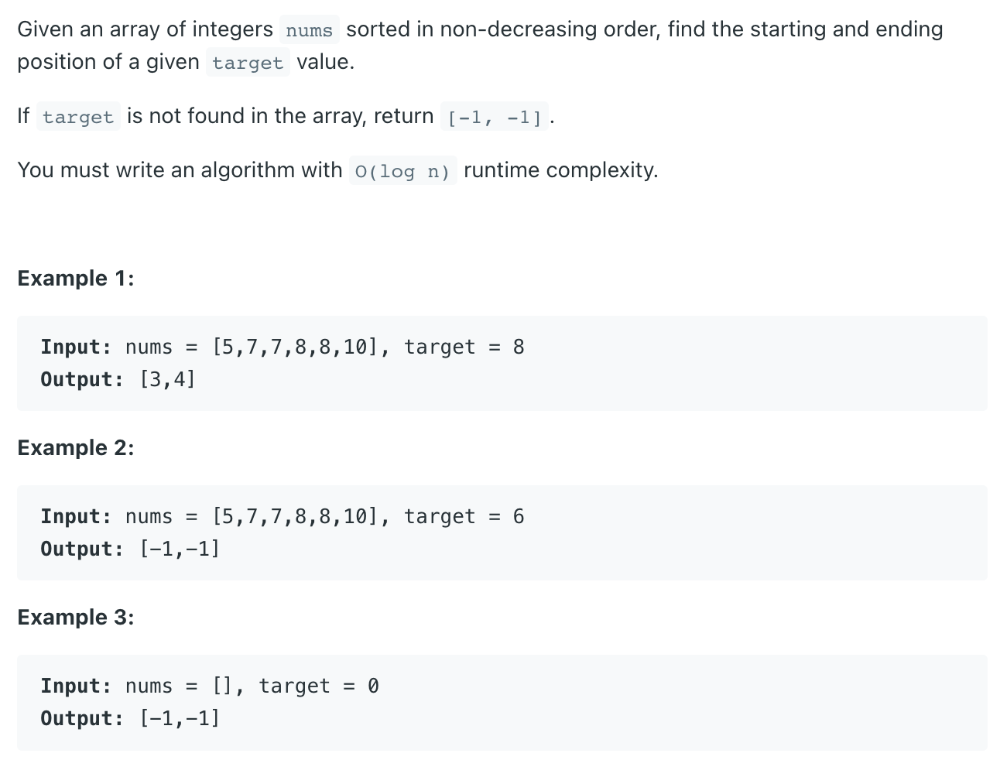
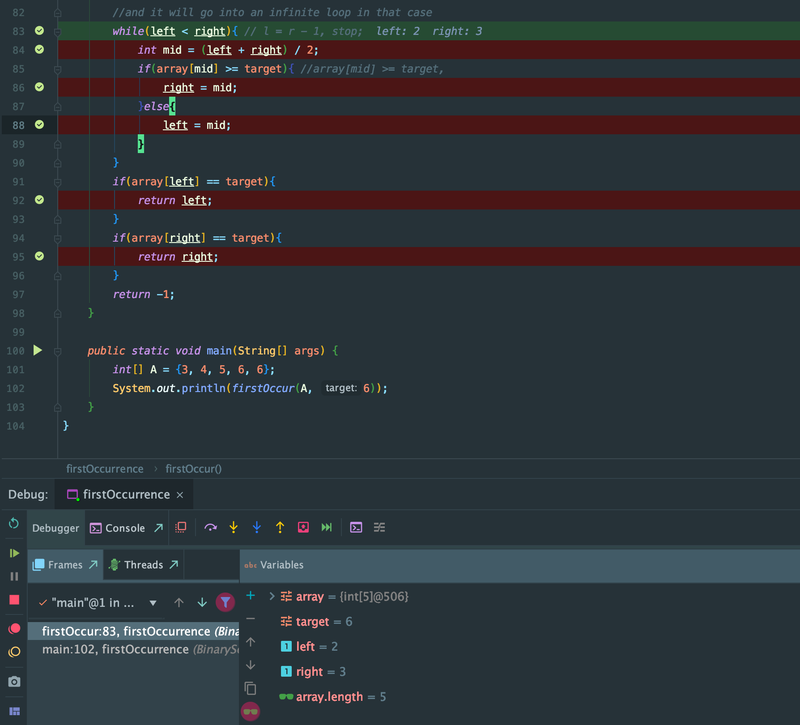

## 34. Find First and Last Position of Element in Sorted Array

---
```java
public class _34_FindFirstAndLastPositionInSortedArray {
    public int[] searchRange(int[] nums, int target) {
        int[] res = new int[]{-1, -1};
        res[0] = findFirst(nums, target);
        res[1] = findLast(nums, target);
        return res;
    }

    private static int findFirst(int[] nums, int target) {
        int idx = -1;
        int left = 0, right = nums.length - 1;
        while (left <= right) {
            int mid = left + (right - left) / 2;
            if (nums[mid] == target) {
                idx = mid;
                // because nothing after mid can be the first occurrence of target.
                // maybe mid is the first occurrence , maybe not
                // so let's narrow the target for [0... mid-1] and find out
                right = mid - 1;
            } else if (nums[mid] < target) {
                left = mid + 1;
            } else if (nums[mid] > target) {
                right = mid - 1;
            }
        }
        return idx;
    }

    private static int findLast(int[] nums, int target) {
        int idx = -1;
        int left = 0, right = nums.length - 1;
        while (left <= right) {
            int mid = left + (right - left) / 2;
            if (nums[mid] == target) {
                idx = mid;
                // because nothing before mid can be the last occurrence of target.
                // maybe mid is the last occurrence , maybe not
                // so let's narrow the target for [mid+1 ... high] and find out
                left = mid + 1;
            } else if (nums[mid] < target) {
                left = mid + 1;
            } else if (nums[mid] > target) {
                right = mid - 1;
            }
        }
        return idx;
    }

    public static void main(String[] args) {
        int[] nums = new int[]{2, 2, 3, 3, 3, 7, 8, 8, 8, 8, 9, 10, 11};
        int target = 8;
        int[] res = new int[]{findFirst(nums, target), findLast(nums, target)};
        System.out.println(Arrays.toString(res));
    }
}
```

---

## Analysis:

#### First Occurrence

- https://novemberfall.github.io/Algorithm-FullStack/ch2/firstOccurrence.html


#### Last Occurrence

- https://novemberfall.github.io/Algorithm-FullStack/ch2/lastOccurrence.html


```java
// 34. Find First and Last Position of Element in Sorted Array

import java.util.Arrays;

public class FindFirstLastPositionElementInSortedArray {
    public static int[] searchRange(int[] nums, int target) {
        if(nums == null || nums.length == 0){
            return new int[]{-1, -1};
        }

        int [] temp = new int[2];
        temp[0] = firstOccurrence(nums, target);
        temp[1] = lastOccurrence(nums, target);

        return temp;
    }

    private static int firstOccurrence(int[] nums, int target){
        int left = 0;
        int right = nums.length - 1;
        while(left < right - 1){// l = r - 1, stop;
            int mid = (left + right) / 2;
            if(nums[mid] >= target){//array[mid] >= target,
                right = mid;
            }else{
                left = mid;
            }
        }
        //post processing
        if(nums[left] == target){
            return left;
        }else if(nums[right] == target){
            return right;
        }else{
            return -1;
        }
    }

    private static int lastOccurrence(int[] nums, int target){
        int left = 0;
        int right = nums.length - 1;
        while(left < right - 1){
            int mid = (left + right) / 2;
            if(nums[mid] <= target){
                left = mid;
            }else{
                right = mid;
            }
        }

        //post processing
        if(nums[right] == target){
            return right;
        }else if(nums[left] == target){
            return left;
        }else{
            return -1;
        }
    }

    public static void main(String[] args) {
        int[] nums = new int[]{5,7,7,8,8,10};
        int[] temp = new int[2];
        temp = searchRange(nums, 8);
        System.out.println(Arrays.toString(temp));
        temp = searchRange(nums, 6);
        System.out.println(Arrays.toString(temp));
    }
}

```


## Analysis:



- Note: ` while(left < right - 1)`  // l = r - 1, stop;
- 如果这里改成 `while(left < right)`
- 将无限循环下去:
  - 因为 初始化 left == 0, right == 4   => 那么 mid = (0 + 4) / 2 = 2
  - since `array[mid] == 5 < target` => `left = mid = 2`
  - then, `left == 2, right == 4`   => 那么 mid = (2 + 4) / 2 = 3
  - `(array[3] == 6 ) >= target` => `right == 3`
  - 这样 right 就被更新成了 right == 3
  - 这样 `while(left < right)` => mid = (2 + 3) / 2 = 2
  - `array[mid] == array[2] = 5` => `left == mid == 2`
  - 这样无限循环 `(2 + 3) / 2 == 2` 
  - 所以让 ` while(left < right - 1)` 就可以跳出循环


