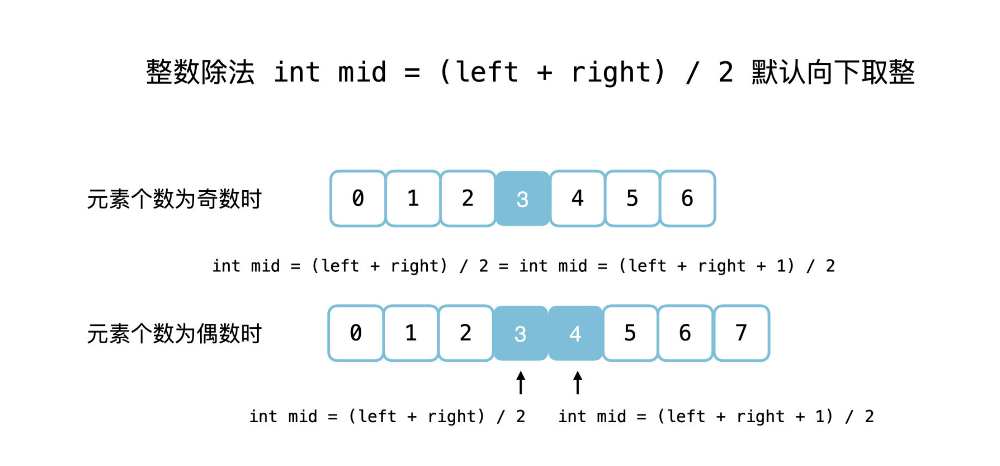

## 34. Find First and Last Position of Element in Sorted Array

---


### template.1

```java
public class _34_FindFirstAndLastPositionInSortedArray {
    public int[] searchRange(int[] nums, int target) {
        int[] res = new int[]{-1, -1};
        res[0] = findFirst(nums, target);
        res[1] = findLast(nums, target);
        return res;
    }

    private int findFirst(int[] nums, int target) {
        int idx = -1;
        int left = 0, right = nums.length - 1;
        while (left <= right) {
            int mid = left + (right - left) / 2;
            if (nums[mid] == target) {
                idx = mid;
                // because nothing after mid can be the first occurrence of target.
                // maybe mid is the first occurrence , maybe not
                // so let's narrow the target for [0... mid-1] and find out
                right = mid - 1;
            } else if (nums[mid] < target) {
                left = mid + 1;
            } else if (nums[mid] > target) {
                right = mid - 1;
            }
        }
        return idx;
    }

    private int findLast(int[] nums, int target) {
        int idx = -1;
        int left = 0, right = nums.length - 1;
        while (left <= right) {
            int mid = left + (right - left) / 2;
            if (nums[mid] == target) {
                idx = mid;
                // because nothing before mid can be the last occurrence of target.
                // maybe mid is the last occurrence , maybe not
                // so let's narrow the target for [mid+1 ... high] and find out
                left = mid + 1;
            } else if (nums[mid] < target) {
                left = mid + 1;
            } else if (nums[mid] > target) {
                right = mid - 1;
            }
        }
        return idx;
    }
}
```

---

#### Python

```py
class Solution:
    def searchRange(self, nums: List[int], target: int) -> List[int]:
        res = [-1, -1]
        res[0] = self.findFirst(nums, target)
        res[1] = self.findLast(nums, target)
        return res
    
    def findFirst(self, nums: List[int], target: int) -> int:
        idx = -1
        left, right = 0, len(nums) - 1
        
        while left <= right:
            mid = (left + right) >> 1
            if nums[mid] == target:
                idx = mid;
                right = mid - 1
            elif nums[mid] < target:
                left = mid + 1
            else:
                right = mid - 1
        return idx
    
    def findLast(self, nums: List[int], target: int) -> int:
        idx = -1
        left, right = 0, len(nums) - 1
        
        while left <= right:
            mid = (left + right) >> 1
            if nums[mid] == target:
                idx = mid;
                left = mid + 1
            elif nums[mid] < target:
                left = mid + 1
            else:
                right = mid - 1
        return idx    
```


---
---

### tempalte.2

- 在搜索区间里只有两个元素的时候，`int mid = (left + right) / 2` 取到的是中间位置**靠左**的元素的位置，
  `int mid = (left + right + 1) / 2` 取到的是中间位置**靠右**的元素的位置。


---

```java
class indFirstAndLastPositionInSortedArray_v2 {
    public int[] searchRange(int[] nums, int target) {
        int len = nums.length;
        if (len == 0) {
            return new int[]{-1, -1};
        }
        int[] res = new int[2];
        res[0] = findFirstPosition(nums, target);
        res[1] = findLastPosition(nums, target);
        return res;
    }

    private int findFirstPosition(int[] nums, int target) {
        int left = 0, right = nums.length - 1;
        while (left < right) {
            int mid = left + ((right - left) >> 1);
            // 小于一定不是解
            if (nums[mid] < target) {
                // 下一轮搜索区间是 [mid + 1..right]
                left = mid + 1;
            } else {
                // nums[mid] >= target，下一轮搜索区间是 [left..mid]
                right = mid;
            }
        }

        // 退出循环以后不能确定 nums[left] 是否等于 target，因此需要再判断一次
        return nums[left] == target ? left : -1;
    }

    private int findLastPosition(int[] nums, int target) {
        int left = 0, right = nums.length - 1;
        while (left < right) {
            int mid = left + ((right - left + 1) >> 1);
            if (nums[mid] > target) {
                // 下一轮搜索区间是 [left..mid - 1]
                right = mid - 1;
            } else {
                // 下一轮搜索区间是 [mid..right]
                left = mid;
            }
        }
        return nums[left] == target ? left : -1;
    }
}
```
