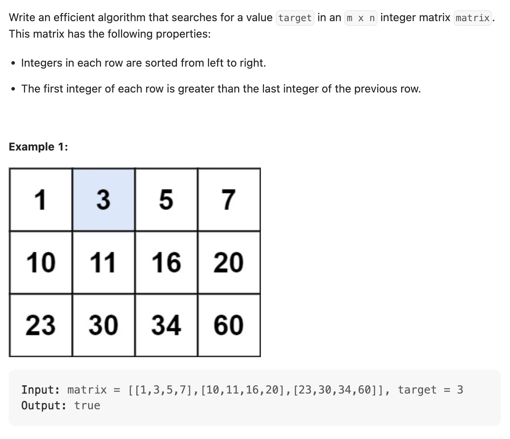
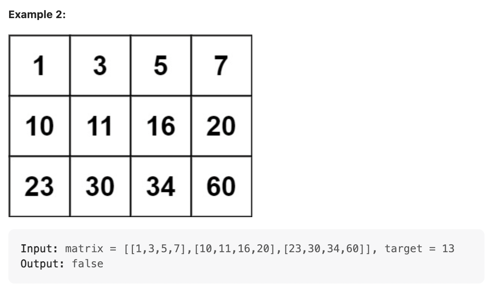
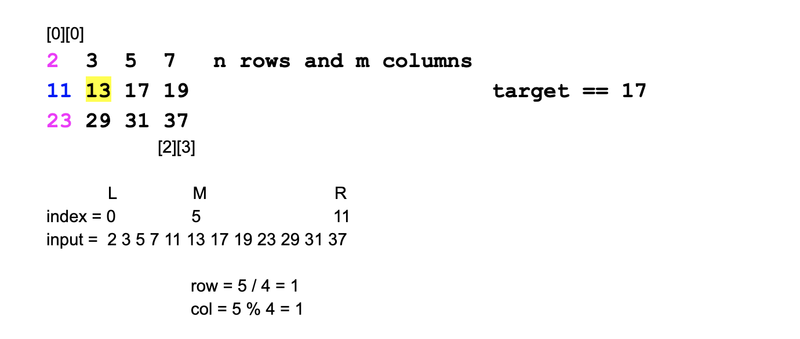

## 74. Search a 2D Matrix | Search In sorted matrix



- `matrix.length` is rows' length
- `matrix[0].length` is column's length

```java
public class searhInMatrix {

    public static void main(String[] args) {
        int[][] table = {{1, 2, 3}, 
                         {4, 5, 6}, 
                         {7, 8, 9}};
        System.out.println(table.length); //output 3
        System.out.println(table[0].length);//output 3
    }
}
```



- map index `mid`(in 1D array) back to 2D array
  - row =  mid / matrix[0].length 
  - column = mid % matrix[0].length

---

```java
/**
 * searhInMatrix
 */
public class searhInMatrix {

    public static boolean searchMatrix(int[][] matrix, int target) {
        if(matrix.length == 0 || matrix[0].length == 0){
            return false;
        }
        
        int row = matrix.length;
        int column = matrix[0].length;
        int left = 0;
        int right = row * column - 1;
        while(left <= right){
            int mid = (left + right) / 2;
            int r = mid / column; //don't  => mid/row   !
            int c = mid % column;

            if(matrix[r][c] == target){
                return true;
            }else if(matrix[r][c] > target){
                right = mid - 1;    
            }else{
                left = mid + 1;
            }
        }
        return false;
    }

    public static void main(String[] args) {
        int[][] matrix = {{1, 3, 5, 7}, 
                            {10, 11, 16, 20}, 
                            {23, 30, 34, 50}};
        
        System.out.println(searchMatrix(matrix, 13)); //output: false
    }
}

```

---

### Brute Force

```java
class _74_SearchA2DMatrix {
    public boolean searchMatrix(int[][] matrix, int target) {
        int m = matrix.length, n = matrix[0].length;
        int[] nums = new int[m * n];
        int idx = 0;
        for (int i = 0; i < m; i++) {
            for (int j = 0; j < n; j++) {
                nums[idx++] = matrix[i][j];
            }
        }

        int left = 0, right = nums.length - 1;
        while (left <= right) {
            int mid = left + (right - left) / 2;
            if (nums[mid] == target) {
                return true;
            } else if (nums[mid] < target) {
                left = mid + 1;
            } else {
                right = mid - 1;
            }
        }
        return false;
    }
}
```