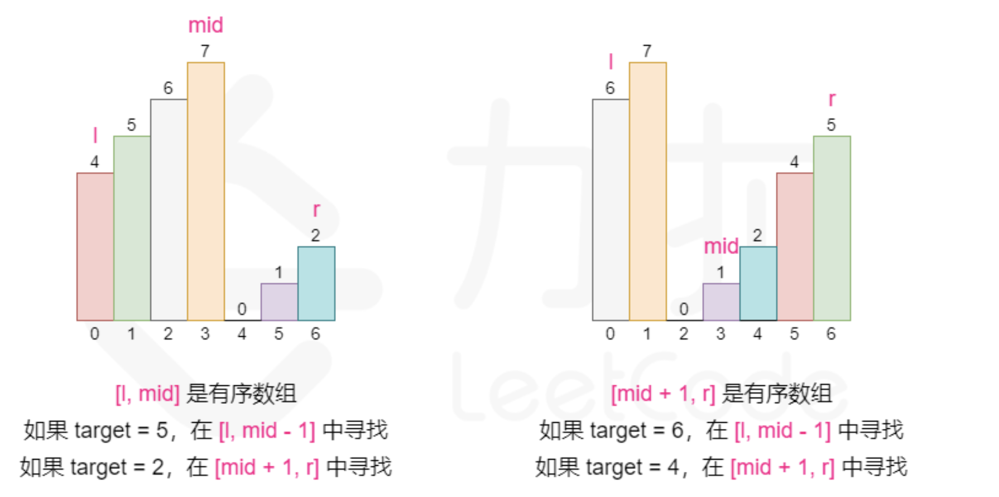
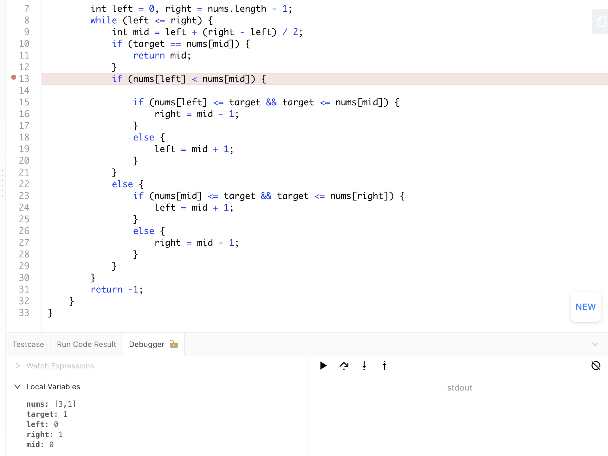
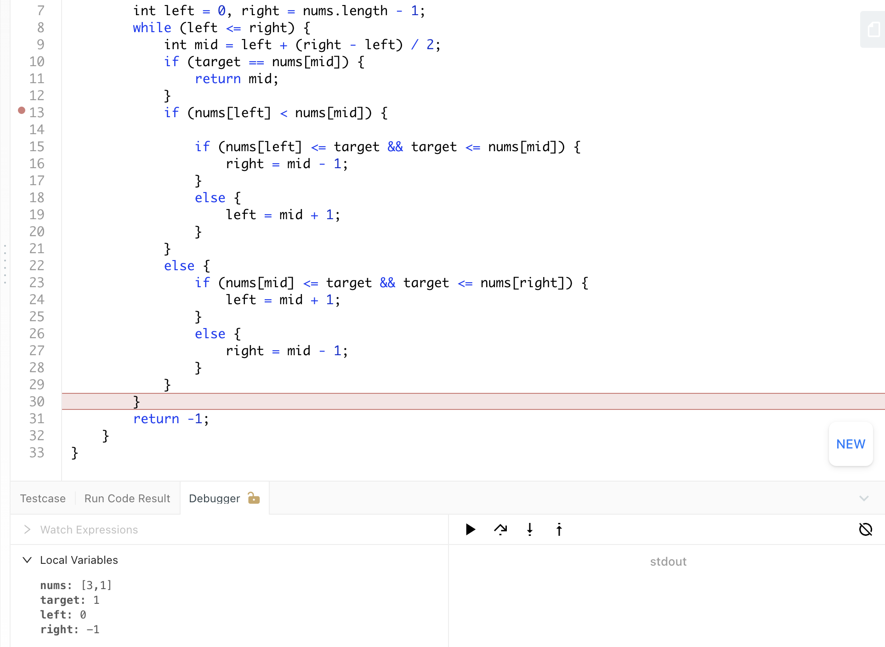
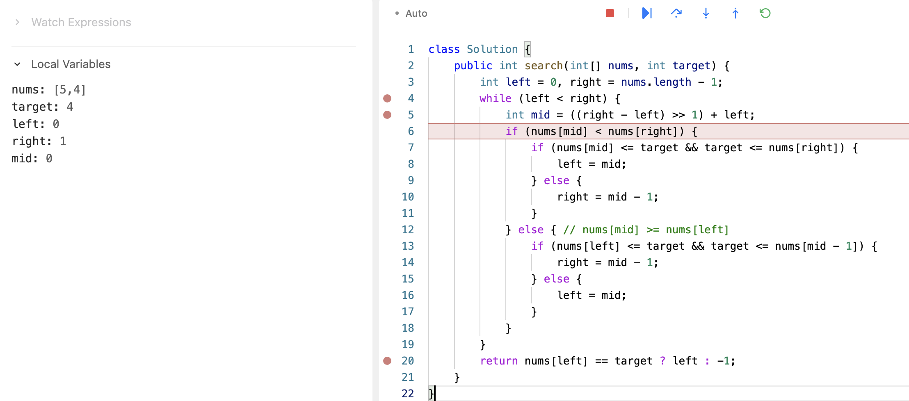

## 33. Search in Rotated Sorted Array


---
### One Pass Method  | Template 1


-  the main idea is that we need to find some parts of array that we could adopt
   binary search on that, which means we need to find some completed sorted parts, 
   then determine whether target is in left part or right part. There is at least one 
   segment (left part or right part) is monotonically increasing.

- If the entire left part is monotonically increasing, which means the pivot point is 
  on the right part
  - If `left <= target < mid` ------> drop the right half
  - Else ------> drop the left half
- If the `entire right part` is `monotonically increasing`, which means the `pivot` point 
  is on the `left part`
  - If `mid < target <= right` ------> drop the left half
  - Else ------> drop the right half


---
```java
class Solution {
    public int search(int[] nums, int target) {
        if (nums == null || nums.length == 0) {
            return -1;
        }

        int left = 0, right = nums.length - 1;
        while (left <= right) {
            int mid = left + (right - left) / 2;
            if (target == nums[mid]) {
                return mid;
            }
            if (nums[left] <= nums[mid]) {

                if (nums[left] <= target && target <= nums[mid]) {
                    right = mid - 1;
                }
                else {
                    left = mid + 1;
                }
            }
            else {
                if (nums[mid] <= target && target <= nums[right]) {
                    left = mid + 1;
                }
                else {
                    right = mid - 1;
                }
            }
        }
        return -1;
    }
}
```
---


- **将数组一分为二，其中一定有一个是有序的，另一个可能是有序，也能是部分有序。此时有序部分用二分法查找。无序部分再一分为二，其中一个一定有序，另一个可能有序，可能无序。就这样循环.**

```ruby
if (nums[0] <= nums[mid]) {
    // 左半边有序
} else {
    // 右半边有序
}
```

---

- 注意代码，可以全部统一成两边都是 **闭区间**
- 但是不可以写成： `if (nums[left] < nums[mid])` 因为:



 
- 可以看到right 会向左边越界!

- [本题如何debug? 可以看b站](https://www.bilibili.com/video/BV1pp4y1W7eZ/?spm_id_from=333.880.my_history.page.click&vd_source=333bb18bd89bdbb4a7c9b3b16c3947f3)
---

- [中文解释](https://suanfa8.com/binary-search/solutions-1/0033-search-in-rotated-sorted-array)


---

### Find Peak Element

- [中文教程](https://www.youtube.com/watch?v=IQyJX5ddEx0)

- 1. Find index of **peak element**
- 2. Apply Binary Search on the subarray


```java
class searchInRotatedSortedArray_findPeak {
    public int search(int[] nums, int target) {
        if (nums==null || nums.length ==0) return -1;

        int peakIdx = findPeakIndex(nums);
        // if (peakIdx >= 0 && (nums[0] <= target && target <= nums[peakIdx]))
        if (nums[0] <= target && target <= nums[peakIdx]) {
            return binarySearch(nums, 0, peakIdx, target);
        } else {
            return binarySearch(nums, peakIdx + 1, nums.length - 1, target);
        }
    }

    private int findPeakIndex(int[] nums) {
        if (nums.length == 1) return 0;

        if (nums[0] < nums[nums.length - 1]) {
            // 如果是一个纯单调递增的数组，那么return 最后一个index
            return nums.length - 1;
        }
        int left = 0, right = nums.length - 1;
        while (left <= right) {
            int mid = left + (right - left) / 2;
            if (nums[mid] > nums[mid + 1]) {
                return mid;
            } else if (nums[left] <= nums[mid]) { // 注意这里： nums[left] <= nums[mid]
                left = mid + 1;
            } else if (nums[right] > nums[mid]){
                right = mid - 1;
            }
        }
        return 0;
    }

    private int binarySearch(int[] nums, int left, int right, int target) {
        while (left <= right) {
            int mid = left + (right - left) /2;
            if (nums[mid] == target) {
                return mid;
            } else if (nums[mid] < target) {
                left = mid + 1;
            } else {
                right = mid - 1;
            }
        }
        return -1;
    }
}
```

---

### Template 2

```java
class binarySearchInRotatedSortedArray_t2 {
    public int search(int[] nums, int target) {
        int left = 0, right = nums.length - 1;
        while (left < right) {
            // 根据分支的逻辑将中间数改成上取整
            int mid = left + ((right - left + 1) >> 1);
            if (nums[mid] < nums[right]) {
                // 此时 [mid..right] 有序

                if (nums[mid] <= target && target <= nums[right]) {
                    // 如果 target 的值落在这个区间里，下一轮搜索区间是 [mid..right]，此时设置 left = mid;
                    left = mid;
                } else {

                    // 否则，下一轮搜索区间是 [left..mid - 1]，此时设置 right = mid - 1;
                    right = mid - 1;
                }
            } else {
                // 此时 nums[mid] >= nums[right]，注意此时 mid 可能与 right 重合
                // 数组前半部分有序，即 [left..mid] 有序，为了与上一个分支的逻辑一致，认为 [left..mid - 1] 有序
                if (nums[left] <= target && target <= nums[mid - 1]) {
                    // 如果 target 的值落在区间 [left..mid - 1] 里，设置 right = mid - 1;
                    right = mid - 1;
                } else {
                    // 否则，下一轮搜索区间是 [mid..right]，此时设置 left = mid;
                    left = mid;
                }

                // 补充说明：由于中间数上取整，在区间只剩下两个元素的时候，mid 与 right 重合，逻辑走到 else 分支里
                // 此时恰好 if 这个分支看到的是 left 和 mid - 1 ，用到的都是 == 号，等价于判断 nums[left] == target
                // 因此依然可以缩减区间，注意这里 if 里面的 nums[left] <= target && target <= nums[mid - 1] ，
                // 不可以写成 nums[left] <= target && target < nums[mid]
            }
        }

        return nums[left] == target ? left : -1;
    }
}
```

= if ` int mid = left + ((right - left + 1) >> 1);`, ==> ` int mid = left + ((right - left) >> 1);` :



- we can see the result will loop forever
