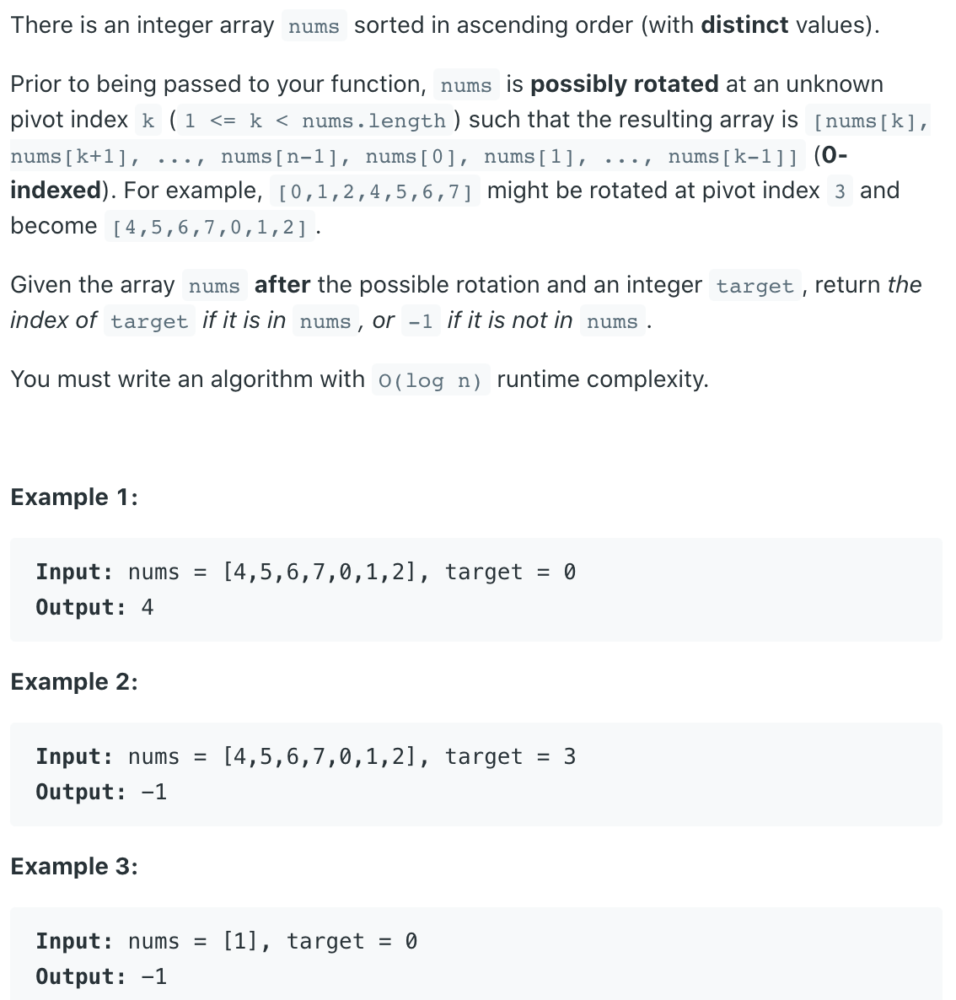
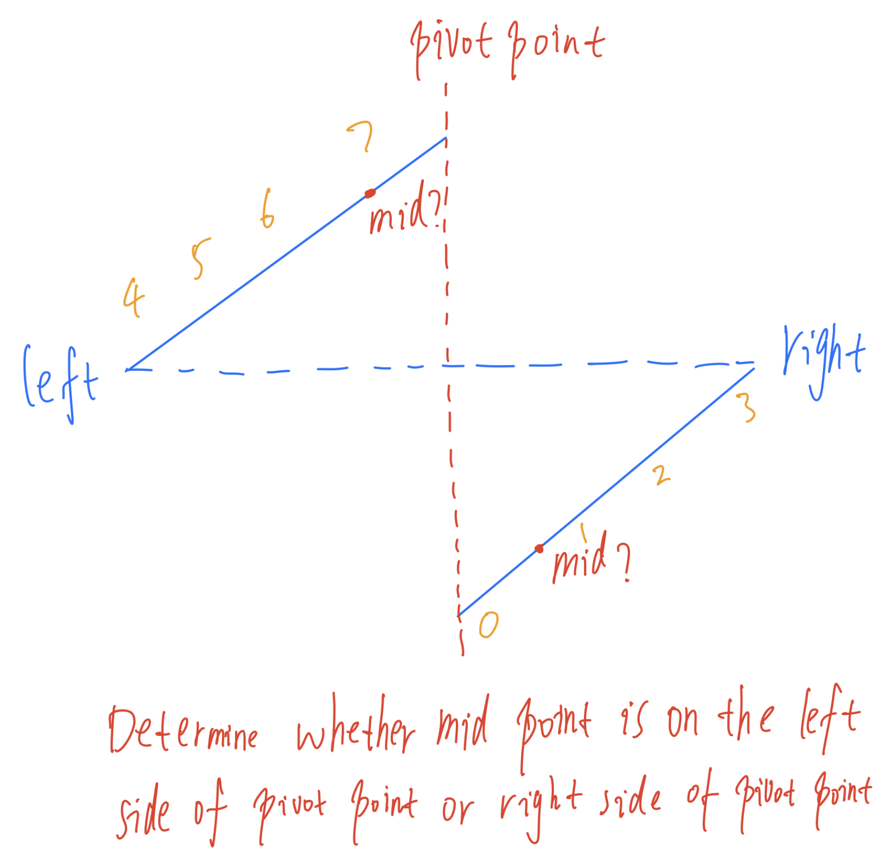
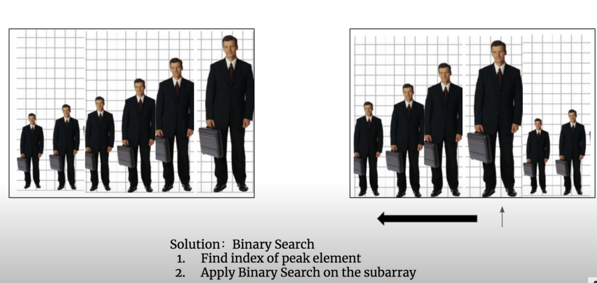
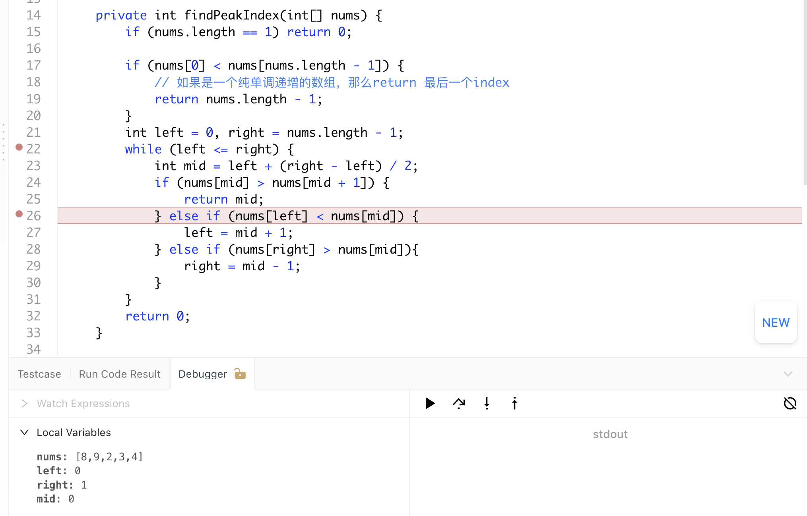
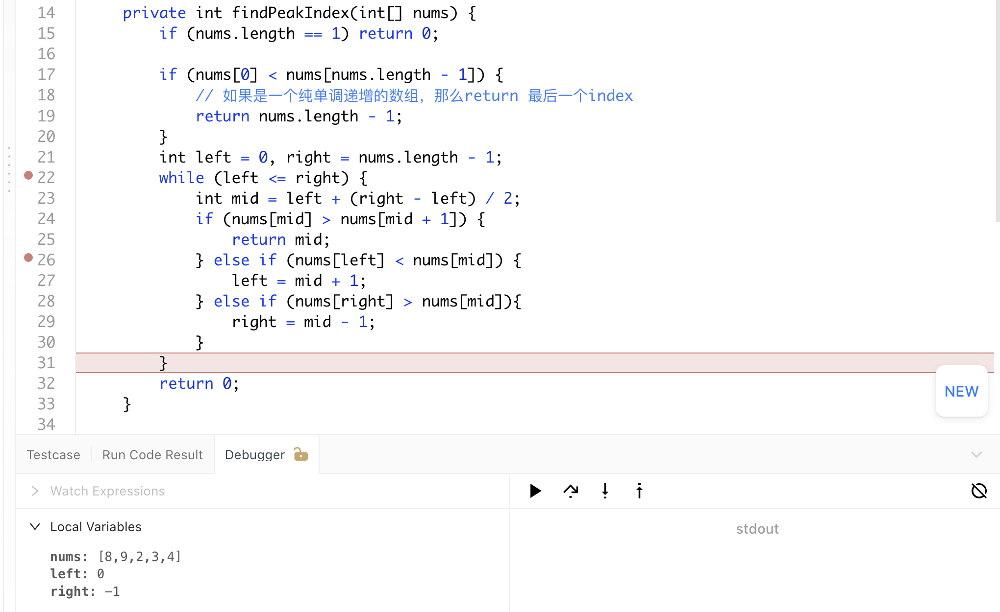

## 33. Search in Rotated Sorted Array

---
### One Pass Method


-  the main idea is that we need to find some parts of array that we could adopt
   binary search on that, which means we need to find some completed sorted parts, 
   then determine whether target is in left part or right part. There is at least one 
   segment (left part or right part) is monotonically increasing.

- If the entire left part is monotonically increasing, which means the pivot point is 
  on the right part
  - If `left <= target < mid` ------> drop the right half
  - Else ------> drop the left half
- If the `entire right part` is `monotonically increasing`, which means the `pivot` point 
  is on the `left part`
  - If `mid < target <= right` ------> drop the left half
  - Else ------> drop the right half



```java
class Solution {
    public int search(int[] nums, int target) {
        if (nums == null || nums.length == 0) {
            return -1;
        }

        int left = 0, right = nums.length - 1;
        while (left <= right) {
            int mid = left + (right - left) / 2;
            if (target == nums[mid]) {
                return mid;
            }
            if (nums[left] <= nums[mid]) {

                if (nums[left] <= target && target < nums[mid]) {
                    right = mid - 1;
                }
                else {
                    left = mid + 1;
                }
            }
            else {
                if (nums[mid] < target && target <= nums[right]) {
                    left = mid + 1;
                }
                else {
                    right = mid - 1;
                }
            }
        }
        return -1;
    }
}
```


---

### Binary Search

- [中文教程](https://www.youtube.com/watch?v=IQyJX5ddEx0)

- 1. Find index of **peak element**
- 2. Apply Binary Search on the subarray




```java
class searchInRotatedSortedArray_findPeak {
    public int search(int[] nums, int target) {
        if (nums==null || nums.length ==0) return -1;

        int peakIdx = findPeakIndex(nums);
        // if (peakIdx >= 0 && (nums[0] <= target && target <= nums[peakIdx]))
        if (nums[0] <= target && target <= nums[peakIdx]) {
            return binarySearch(nums, 0, peakIdx, target);
        } else {
            return binarySearch(nums, peakIdx + 1, nums.length - 1, target);
        }
    }

    private int findPeakIndex(int[] nums) {
        if (nums.length == 1) return 0;

        if (nums[0] < nums[nums.length - 1]) {
            // 如果是一个纯单调递增的数组，那么return 最后一个index
            return nums.length - 1;
        }
        int left = 0, right = nums.length - 1;
        while (left <= right) {
            int mid = left + (right - left) / 2;
            if (nums[mid] > nums[mid + 1]) {
                return mid;
            } else if (nums[left] <= nums[mid]) { // 注意这里： nums[left] <= nums[mid]
                left = mid + 1;
            } else if (nums[right] > nums[mid]){
                right = mid - 1;
            }
        }
        return 0;
    }

    private int binarySearch(int[] nums, int left, int right, int target) {
        while (left <= right) {
            int mid = left + (right - left) /2;
            if (nums[mid] == target) {
                return mid;
            } else if (nums[mid] < target) {
                left = mid + 1;
            } else {
                right = mid - 1;
            }
        }
        return -1;
    }
}
```
---
- 注意这里：

```java
    while (left <= right) {
        int mid = left + (right - left) / 2;
        if (nums[mid] > nums[mid + 1]) {
            return mid;
        } else if (nums[left] <= nums[mid]) { // 注意这里： nums[left] <= nums[mid]
            left = mid + 1;
        } else if (nums[right] > nums[mid]){
            right = mid - 1;
        }
    }
```

- 可以假设： else if (nums[left] < nums[mid])  吗?
- **不能**，因为会**往左边越界**:




---
### Clever idea making it simple
- [Clever idea making it simple](https://leetcode.com/problems/search-in-rotated-sorted-array/discuss/14435/clever-idea-making-it-simple)


```java
/**
        [12, 13, 14, 15, 16, 0, 1, 2, 3, 4]

 - If target is let's say 14, then we adjust nums to this, where "inf" means infinity:
        [12, 13, 14, 15, 16, inf, inf, inf, inf, inf]

 - If target is let's say 3, then we adjust nums to this:
        [-inf, -inf, -inf, -inf, -inf, 0, 1, 2, 3, 4]

 */
class BinarySearchInRotatedSortedArray {
    public int search(int[] nums, int target) {
        int left = 0, right = nums.length - 1;
        while (left <= right) {
            int mid = left + (right - left) / 2;

            int num = nums[mid];
            // If nums[mid] and target are "on the same side" of nums[0], we just take nums[mid].
            if ((nums[mid] < nums[0]) == (target < nums[0])) {
                num = nums[mid];
            } else {
                //Otherwise we use -infinity or +infinity as needed.
                num = target < nums[0] ? Integer.MIN_VALUE : Integer.MAX_VALUE;
            }

            if (num < target)
                left = mid + 1;
            else if (num > target)
                right = mid - 1;
            else
                return mid;
        }
        return -1;
    }
}
```