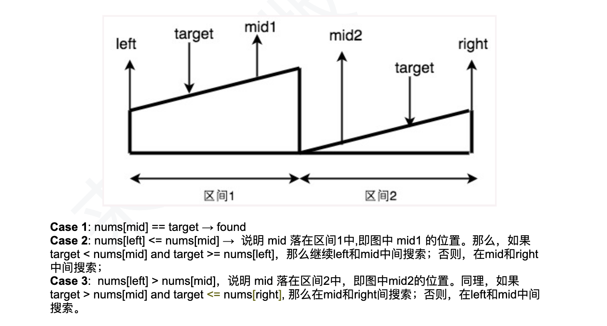

## 33. Search in Rotated Sorted Array

---
### Template 2:



```py
class Solution:
    def search(self, nums: List[int], target: int) -> int:
        if nums is None or len(nums) == 0:
            return -1
        left, right = 0, len(nums) - 1
        while left < right - 1:
            mid = (left + right) >> 1
            if nums[mid] == target:
                return mid
            if nums[left] <= nums[mid]:
                if target >= nums[left] and target < nums[mid]:
                    right = mid - 1
                else:
                    left = mid + 1
            elif nums[left] > nums[mid]:
                if nums[mid] < target and target <= nums[right]:
                    left = mid + 1
                else:
                    right = mid - 1
        
        if nums[left] == target:
            return left 
        if nums[right] == target:
            return right 
        return -1 
```


---
### One Pass Method  | Template 1


---
```py
class Solution:
    def search(self, nums: List[int], target: int) -> int:
        if nums is None or len(nums) == 0:
            return -1
        left, right = 0, len(nums) - 1
        while left <= right:
            mid = (left + right) >> 1

            # Case 1: find target
            if nums[mid] == target:
                return mid

            # Case 2: subarray on mid's left is sorted
            if nums[left] <= nums[mid]:
                if nums[left] <= target and target < nums[mid]:
                    right = mid - 1
                else:
                    left = mid + 1
            # Case 3: subarray on mid's right is sorted
            elif nums[left] > nums[mid]:
                if nums[mid] < target and target <= nums[right]:
                    left = mid + 1
                else:
                    right = mid - 1
        return -1;
```
---


