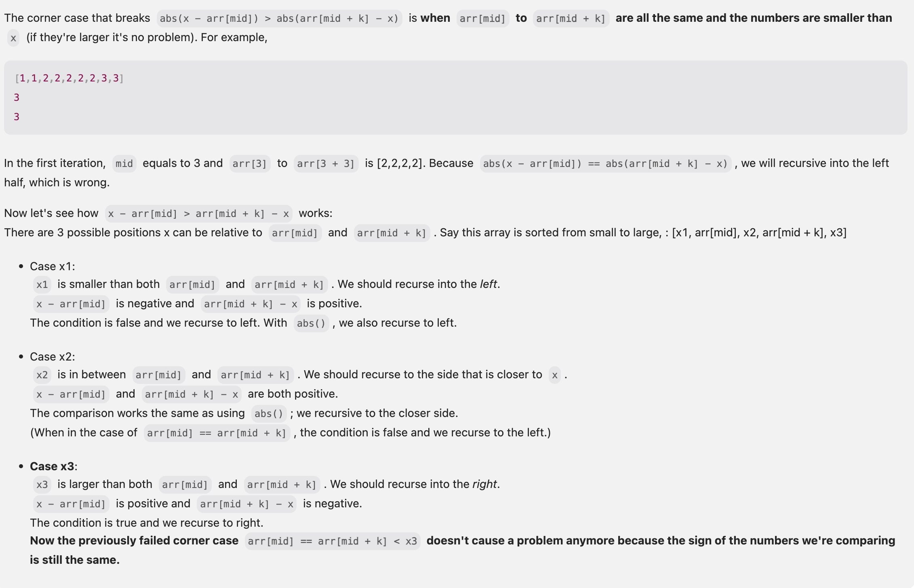

## 658. Find K Closest Elements

---

- [discuss](https://leetcode.com/problems/find-k-closest-elements/discuss/106426/JavaC%2B%2BPython-Binary-Search-O(log(N-K)-%2B-K))
---

### Binary Search

- [LC discussion](https://leetcode.com/problems/find-k-closest-elements/solutions/106426/java-c-python-binary-search-o-log-n-k-k/#:~:text=4-,%5BJava/C%2B%2B/Python%5D%20Binary%20Search%2C%20O(log(N%2DK)%20%2B%20K),-lee215)

```ruby
Assume A[mid] ~ A[mid + k] is sliding window

case 1: x - A[mid] < A[mid + k] - x, need to move window go left
-------x----A[mid]-----------------A[mid + k]----------

case 2: x - A[mid] < A[mid + k] - x, need to move window go left again
-------A[mid]----x-----------------A[mid + k]----------

case 3: x - A[mid] > A[mid + k] - x, need to move window go right
-------A[mid]------------------x---A[mid + k]----------

case 4: x - A[mid] > A[mid + k] - x, need to move window go right
-------A[mid]---------------------A[mid + k]----x------

If x - A[mid] > A[mid + k] - x,
it means A[mid + 1] ~ A[mid + k] is better than A[mid] ~ A[mid + k - 1],
and we have mid smaller than the right i.
So assign left = mid + 1.
```


- [那么为什么不用 `Math.abs(arr[mid] - x) < Math.abs(arr[mid + k] - x)` ?](https://leetcode.com/problems/find-k-closest-elements/editorial/comments/1197180/) 




---

```java
class FindKClosestElements {
    public List<Integer> findClosestElements(int[] arr, int k, int x) {
        List<Integer> res = new ArrayList<>();

        int left = 0, right = arr.length - k;
        while (left < right) {
            int mid = left + ((right - left) >> 1);
            if ((x - arr[mid]) > (arr[mid + k] - x)) {
                left = mid + 1;
            } else {
                right = mid;
            }
        }

        for (int i = left; i < left + k; i++) {
            res.add(arr[i]);
        }
        return res;
    }
}
```

---

### Customized Comparator

```java
class FindKClosestElements_Custom_Comparator {
    public List<Integer> findClosestElements(int[] arr, int k, int x) {
        List<Integer> res = new ArrayList<>();
        for (int num : arr) {
            res.add(num);
        }

        Collections.sort(res, (num1, num2) -> Math.abs(num1 - x) - Math.abs(num2 - x));
        res = res.subList(0, k);

        Collections.sort(res);
        return res;
    }
}
```