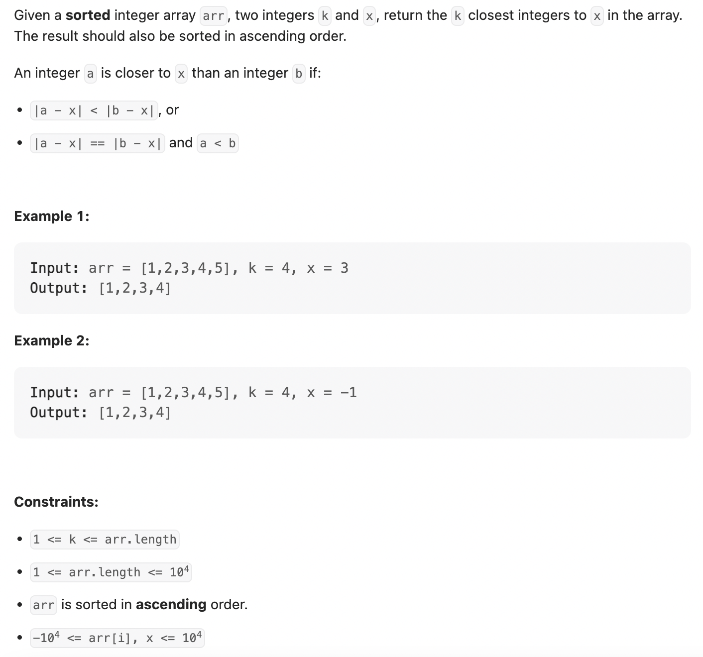
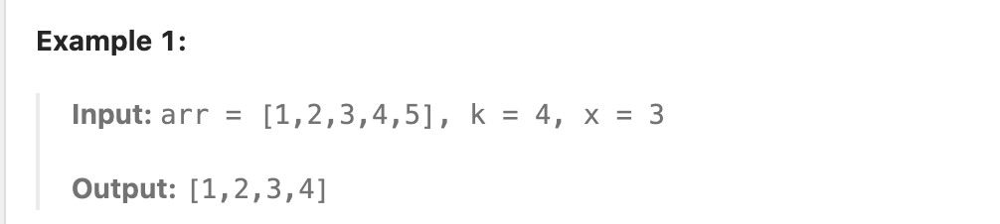

## 658. Find K Closest Elements

---
- Look at the example 1:

]

- can we return `[2, 3, 4, 5]` ?, **No!**
- even though `|1 - 3| == |5 - 3| == 2` but it doesn't meet **a < b** because **5 > 1**


---
### Binary Search

---

```java
class FindKClosestElements {
    public List<Integer> findClosestElements(int[] arr, int k, int x) {
        List<Integer> res = new ArrayList<>();

        int left = 0, right = arr.length - k;
        while (left < right) {
            int mid = left + ((right - left) >> 1);
            if ((x - arr[mid]) > (arr[mid + k] - x)) {
                left = mid + 1;
            } else {
                right = mid;
            }
        }

        for (int i = left; i < left + k; i++) {
            res.add(arr[i]);
        }
        return res;
    }
}
```
