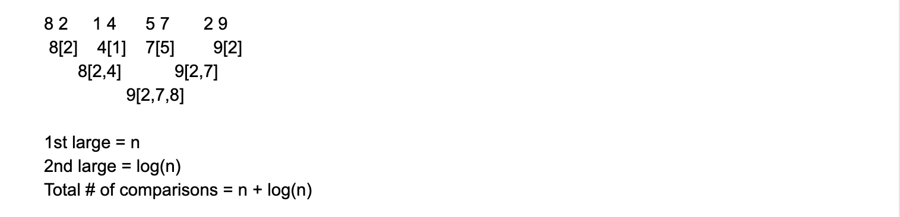

# Largest And Second Largest

```ruby
Use the least number of comparisons to get the largest and 
2nd largest number in the given integer array. 
Return the largest number and 2nd largest number.

Assumptions

The given array is not null and has length of at least 2
Examples

{2, 1, 5, 4, 3}, the largest number is 5 and 2nd largest number is 4.
```


- How to use the **least number of comparisons** to find the largest and 
  second largest number?

- [reference to Largest And Smallest](https://novemberfall.github.io/LeetCode-NoteBook/#/m3/maxMin)

- 假如本题还用 两两比较法：


- Better idea: 可以用两两比较完, 把loser放进winner 的 “shame” list里面， 
  然后在最大值的“shame" list里面找最大的即为第二大的值




```js
    { 2       1       5       4       3 }      len = 5


len = 5,    5/2 = 2
for(i = 0; i < len/2; i ++)
   if(help[i].val < help[len -1-i].val)
        swap(i, len-i-1)
   help[i].loserList.add(help[len - i - 1].value)

help{ 3       4       5       1       2 }
     [2]      [1]                          while(len > 1)    len = (5+1)/2 = 3


len = 3,    3/2 = 1
for(i = 0; i < len/2; i ++)
   if(help[i].val < help[len -1-i].val)
        swap(i, len-i-1)
   help[i].loserList.add(help[len - i - 1].value)

help{ 5       4       3       1       2 }
     [3]      [1]     [2]                     while(len > 1)    len = (3+1)/2 = 2


len = 2,    2/2 = 1
for(i = 0; i < len/2; i ++)
   if(help[i].val < help[len -1-i].val)
        swap(i, len-i-1)
   help[i].loserList.add(help[len - i - 1].value)

help{ 5       4       3       1       2 }
     [3,4]    [1]     [2]                     while(len > 1)    len = (2+1)/2 = 1,  jump loop
```


```java
public class Solution {
  class element{
    private int val;
    private List<Integer> losers;

    public element(int val){
      this.val = val;
      losers = new ArrayList<>();
    }
  }
  public int[] largestAndSecond(int[] array) {
    // Write your solution here
    int len = array.length;
    element[] els = convertArrayToElement(array);
    while(len > 1){
      compareSwap(els, len);
      len = (len + 1) / 2;
    }
    return new int[]{els[0].val, largest(els[0].losers)};
  }

  private element[] convertArrayToElement(int[] arr){
    element[] e = new element[arr.length];
    for(int i = 0; i < arr.length; i++){
      e[i] = new element(arr[i]);
    }
    return e;
  }

  private void compareSwap(element[] helper, int len){
    for(int i = 0; i < len/2; i++){
      if(helper[i].val < helper[len - 1 - i].val){
        swap(helper, i, len - 1 - i);
      }
      helper[i].losers.add(helper[len-1-i].val);
    }
  }

  private void swap(element[] ele, int left, int right){
    element temp = ele[left];
    ele[left] = ele[right];
    ele[right] = temp;
  }

  private int largest(List<Integer> list){
    int max = list.get(0);
    for(Integer num : list){
      max = Math.max(max, num);
    }
    return max;
  }
}
```


## 一个简单的解法

```java
public class Solution {
  public int[] largestAndSecond(int[] array) {
    int largest = array[0], sLargest = Integer.MIN_VALUE; // 初始化最大值和第二大值
    //从第二个number开始，遍历整个数组
    for (int i = 1; i < array.length; i++) {
      if (array[i] > largest) { // 当前数大于最大值
        sLargest = largest; //第二大值等于 最大值
        largest = array[i]; //最大值 等于 当前值
      } else if (array[i] > sLargest) { // 当前数比最大数小或者相等 且 大于第二大值
        sLargest = array[i]; //更新第二大值为当前值
      }
    }
    return new int[] {largest, sLargest}; 
  }
}
```