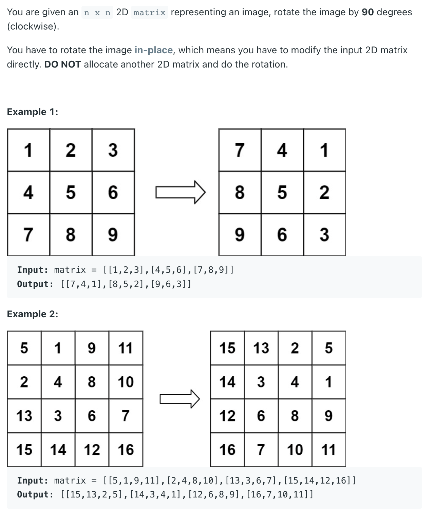

## 48. Rotate Image || Rotate Matrix

---

```ruby
  [ 1,  2,  3,  4]
  [ 5,  6,  7,  8]
  [ 9, 10, 11, 12]
  [13, 14, 15, 16]


  [13, 14, 15, 16]  
  [ 5,  6,  7,  8]
  [ 9, 10, 11, 12]
  [ 1,  2,  3,  4] 
  

  [13, 14, 15, 16]  
  [ 9, 10, 11, 12]
  [ 5,  6,  7,  8]  
  [ 1,  2,  3,  4] 


  [13,  9,  5,  1]  
  [14, 10,  6,  2]
  [15, 11,  7,  3]  
  [16, 12,  8,  4]   
```

```java
/*
 * clockwise rotate
 * first reverse up to down, then swap the symmetry 
 * 1 2 3     7 8 9     7 4 1
 * 4 5 6  => 4 5 6  => 8 5 2
 * 7 8 9     1 2 3     9 6 3
*/

public void rotate(int[][] matrix) {
    int s = 0, e = matrix.length - 1;
    while(s < e){
        int[] temp = matrix[s];
        matrix[s] = matrix[e];
        matrix[e] = temp;
        s++; e--;
    }

    for(int i = 0; i < matrix.length; i++){
        for(int j = i+1; j < matrix[i].length; j++){
            int temp = matrix[i][j];
            matrix[i][j] = matrix[j][i];
            matrix[j][i] = temp;
        }
    }
}
```