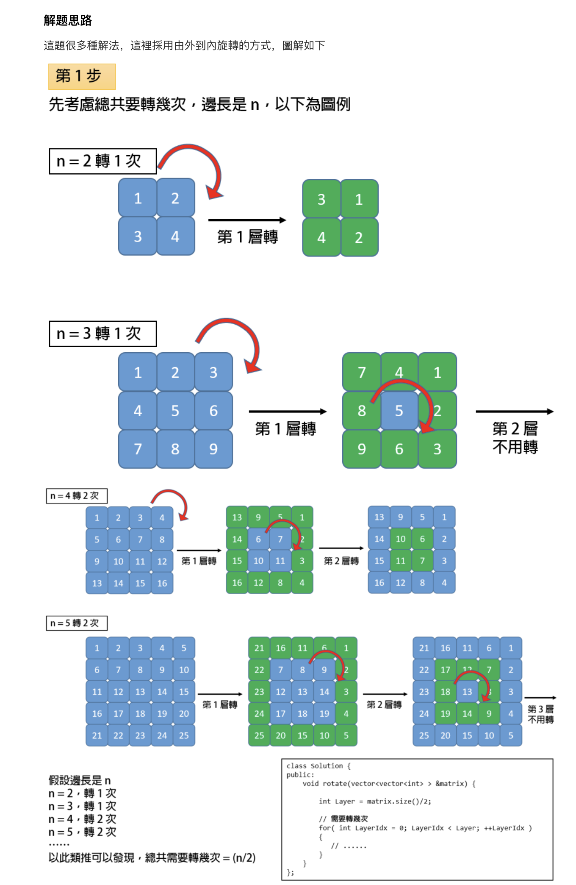
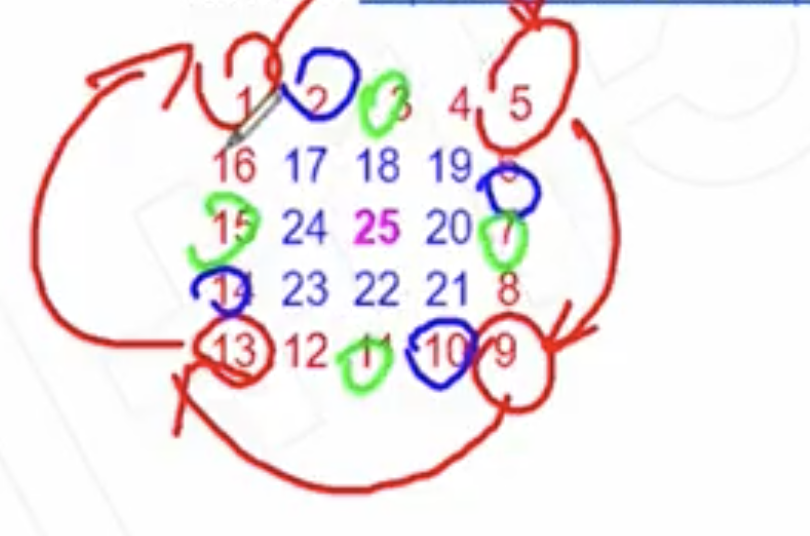

## 48. Rotate Image || Rotate Matrix

- You are given an n x n 2D matrix representing an image.
  Rotate the image by 90 degrees (clockwise).

- You have to rotate the image in-place, which means you have to modify 
  the input 2D matrix directly. DO NOT allocate another 2D matrix and do the rotation.


```ruby
Example 1:

Given input matrix = 
[
  [1,2,3],
  [4,5,6],
  [7,8,9]
],

rotate the input matrix in-place such that it becomes:
[
  [7,4,1],
  [8,5,2],
  [9,6,3]
]
Example 2:

Given input matrix =
[
  [ 5, 1, 9,11],
  [ 2, 4, 8,10],
  [13, 3, 6, 7],
  [15,14,12,16]
], 

rotate the input matrix in-place such that it becomes:
[
  [15,13, 2, 5],
  [14, 3, 4, 1],
  [12, 6, 8, 9],
  [16, 7,10,11]
]
```

---





---

```java
class Solution {
    public void rotate(int[][] matrix) {
        if (matrix.length <= 1) {
            return;
        }
        
        int n = matrix.length;
        int round = n / 2;
        for (int level = 0; level < round; level++) {
            int left = level;
            int right = n - 2 - level;
            for (int i = left; i <= right; i++) {
                int tmp = matrix[left][i];
                matrix[left][i] = matrix[n - 1 - i][left];
                matrix[n - 1 - i][left] = matrix[n - 1 - left][n - 1 - i];
                matrix[n - 1 - left][n - 1 - i] = matrix[i][n - 1 - left];
                matrix[i][n - 1 - left] = tmp;
            }            
        }
    }
}
```