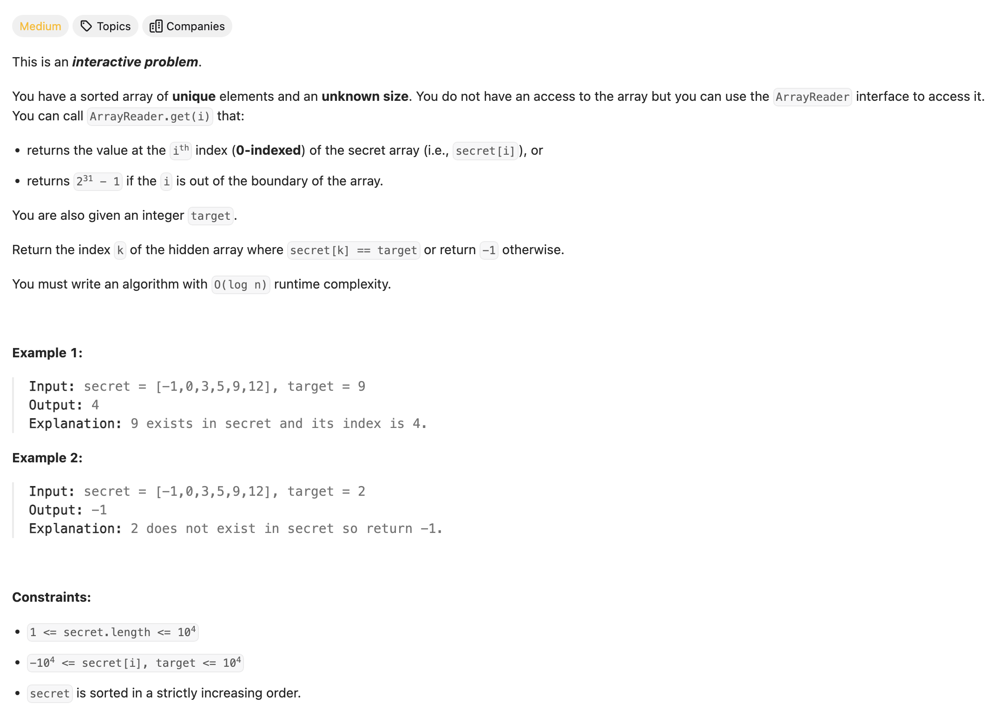
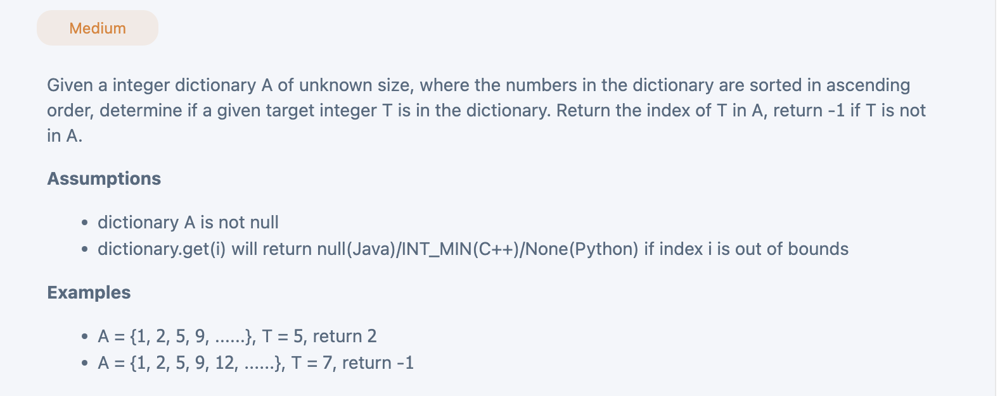

## 702. Search in a Sorted Array of Unknown Size

---


## Analysis:

- 本题最大难点在于如何向右扩展size, 也就是说这个字典很可能非常大size, 所以如何extend, 成为本题关键要素
  - when `reader.get(right) < target` 最右边那个元素还是 < target的情况下 => 扩容 
  - 既然已经知道 每一次的极右元素已经小于target, 那就没有必要保留left index, 所以我们 `left = right`
  - 然后采用 `right = 2 * right` 向右扩容
- 然后采取经典binarySearch

```java
class Solution {
    public int search(ArrayReader reader, int target) {
        if (reader == null) {
            return 0;
        }
        int left = 0;
        int right = 1;
        //find the right boundary for binary search
        //extends until we  are sure the target is within the [left, right] range.
        while (reader.get(right) < target) {
            //1. move left to right
            //2. double right index
            left = right;
            right = 2*right;
        }
        return binarySearch(reader, target, left, right);
    }
  
    private int binarySearch(ArrayReader reader, int target, int left, int right) {
        //classical binary search
        while (left <= right) {
            int mid = left + (right - left) / 2;
            if (reader.get(mid) > target) {
                right = mid-1;
            } else if (reader.get(mid) < target) {
                left = mid + 1;
            } else {
                return mid;
            }
        }
        return -1;
    }
}
```
---

### 一道变种题目，需要处理是否 每一次字典里是否存在该单词，以及是否已经越界，因为在越界的情况，也应当向左边缩减size


---

```java
/*
*  interface Dictionary {
*    public Integer get(int index);
*  }
*/

// You do not need to implement the Dictionary interface.
// You can use it directly, the implementation is provided when testing your solution.
public class Solution {
  public int search(Dictionary dict, int target) {
    // Write your solution here
    if(dict == null){
      return -1;
    }
    int left = 0;
    int right = 1;
    while(dict.get(right) != null && dict.get(right) < target){
      left = right;
      right = right * 2;
    }
    return binarySearch(dict, target, left, right);
  }
  private int binarySearch(Dictionary dict, int target, int left, int right){
    while(left <= right){
      int mid = left + (right - left) / 2;
      if(dict.get(mid) == null || dict.get(mid) > target){
        //注意这里，因为极其有可能，right边界已经越界，所以这种情况出现也要向左边缩减 size
        right = mid - 1;
      }else if(dict.get(mid) < target){
        left = mid + 1;
      }else{
        return mid;
      }
    }
    return -1;
  }
}
```
---


#### Python

```py
# """
# This is ArrayReader's API interface.
# You should not implement it, or speculate about its implementation
# """
#class ArrayReader:
#    def get(self, index: int) -> int:

class Solution:
    def search(self, reader: 'ArrayReader', target: int) -> int:
        left = 0
        right = 1
        while reader.get(right) is not None and reader.get(right) < target: 
            left = right
            right = right * 2
        return self.binarySearch(reader, target, left, right)
        
    def binarySearch(self, reader, target, left, right):
        while left <= right:
            mid = (left + right) >> 1
            if reader.get(mid) == target:
                return mid
            elif reader.get(mid) < target:
                left = mid + 1
            else:
                right = mid - 1
        return -1
```