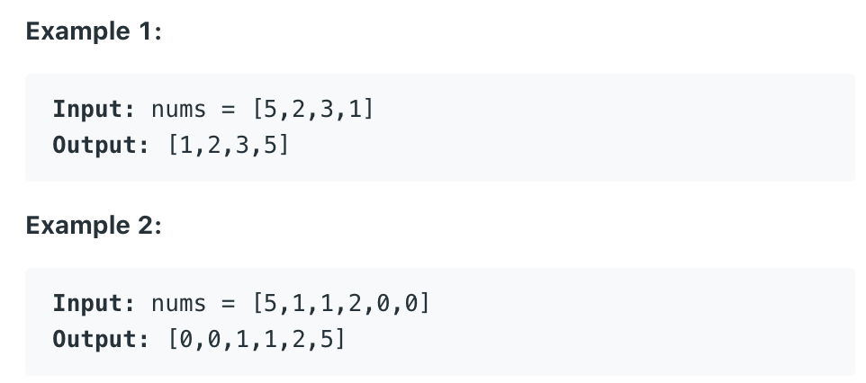
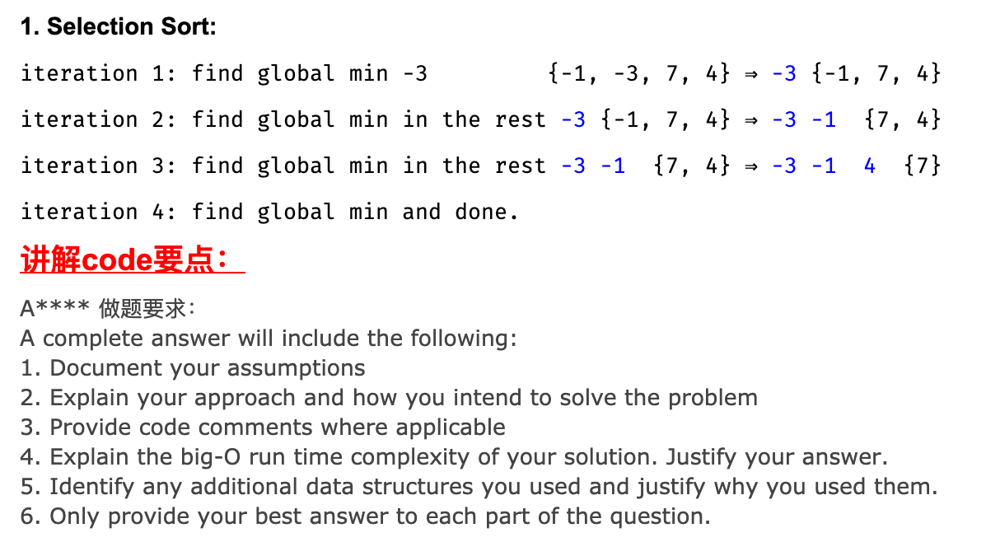
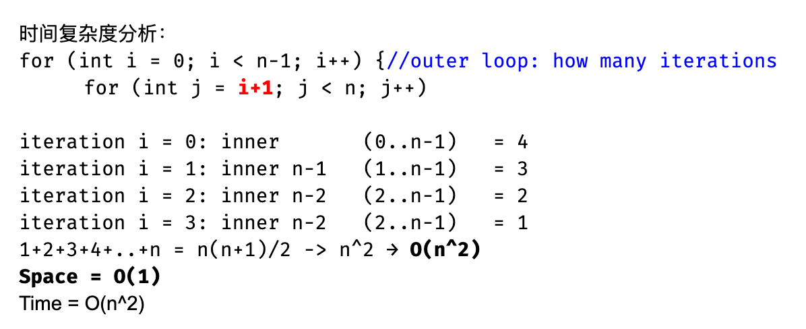

## 912. Sort an Array

- Given an array of integers nums, sort the array in ascending order.



---

### selection sort





- 尽管 `selection sort` 不是最快的，但是它空间复杂度非常节省。 `in-place`
  - since the method return `void`, it is in-place

```java
class Solution {
    public int[] sortArray(int[] nums) {
        if (nums == null || nums.length <= 1) {
            return nums;
        }
        
        int n = nums.length;
        for (int i = 0; i < n - 1; i++) {
            int globalMin = i;
            for (int j = i + 1; j < n; j++) {
                if (nums[j] < nums[globalMin]) {
                    globalMin = j;
                }
            }
            int tmp = nums[i];
            nums[i] = nums[globalMin];
            nums[globalMin] = tmp;
        }
        return nums;
    }
}
```

---

### Merge Sort

