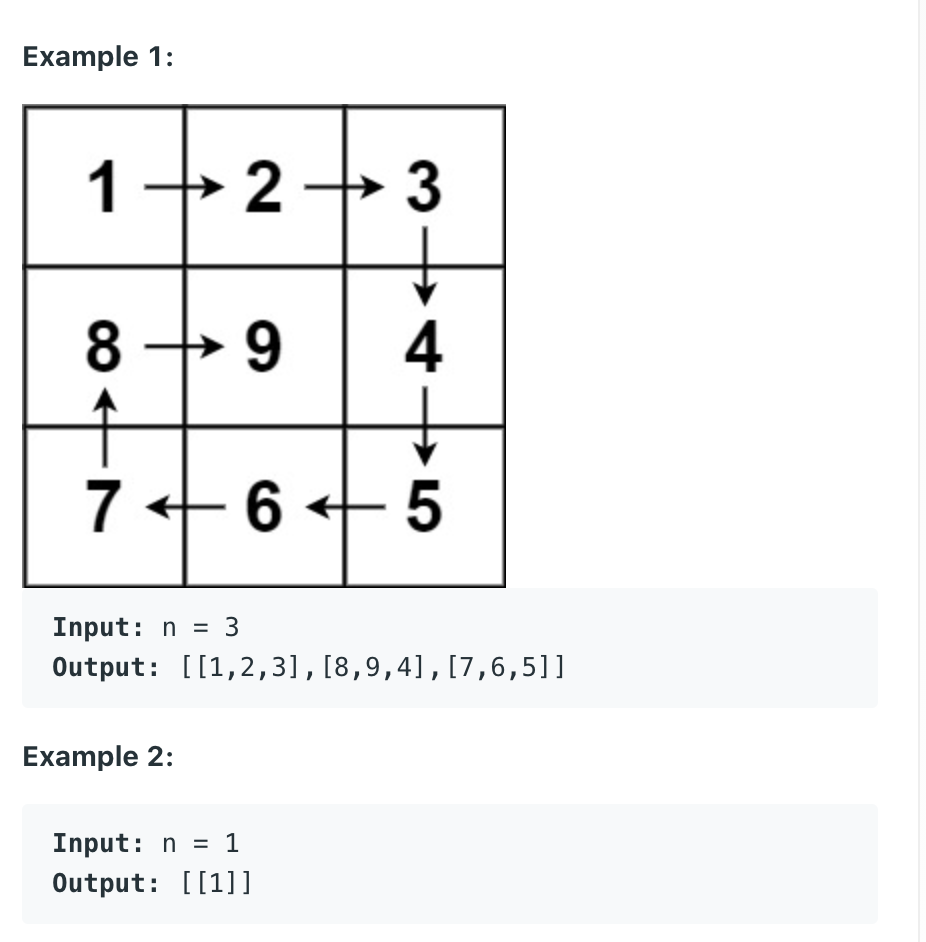

## 59. Spiral Matrix II

- Given a positive integer n, generate an `n x n` matrix 
  filled with elements from 1 to n2 in spiral order.



- Time = O(n^2)
- Space = O(1)

```java
class Solution {
    public int[][] generateMatrix(int n) {
        int[][] res = new int[n][n];
        
        int rowBegin = 0;
        int rowEnd = n - 1;
        int colBegin = 0;
        int colEnd = n - 1;
        
        int target = n * n;
        int num = 1;
        
        while (num <= target){
            for (int i = colBegin; i <= colEnd; i++) {
                res[rowBegin][i] = num;
                num++;
            }
            rowBegin++;
            
            for (int i = rowBegin; i <= rowEnd; i++) {
                res[i][colEnd] = num;
                num++;
            }
            colEnd--;
            
            for (int i = colEnd; i >=colBegin ; i--) {
                res[rowEnd][i] = num;
                num++;
            }
            rowEnd--;
            
            for (int i = rowEnd; i >= rowBegin; i--) {
                res[i][colBegin] = num;
                num++;
            }
            colBegin++;
        }
        return res;
    }
}
```
