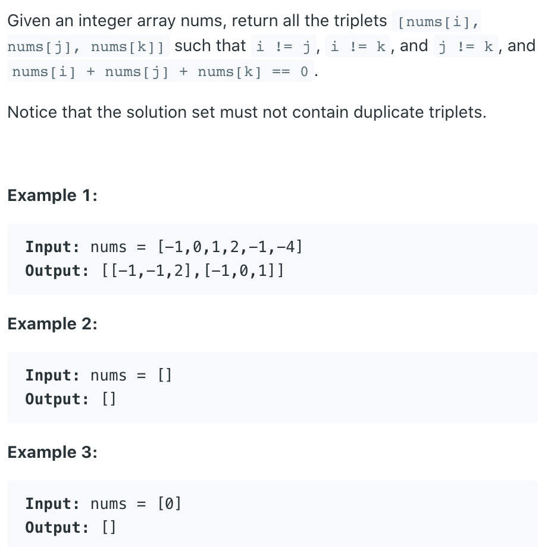
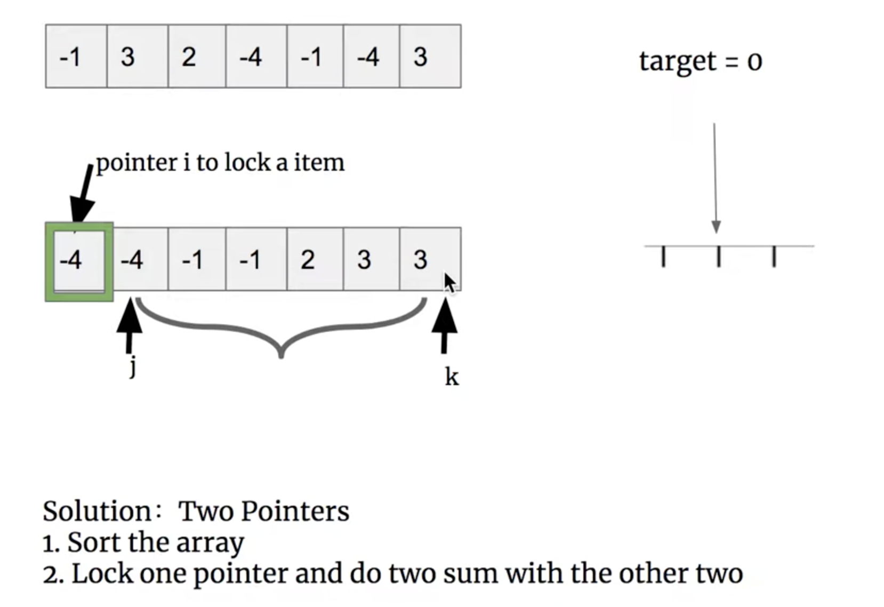

## 15. 3Sum




```java
class Solution {
    public List<List<Integer>> threeSum(int[] nums) {
        List<List<Integer>> res = new ArrayList<>();
        Arrays.sort(nums);
        int target = 0;
        for (int i = 0; i < nums.length; i++) {
            //e.g. if we have 2, 2, 2 only the first 2 will be selected as i
            if (i > 0 && nums[i] == nums[i - 1]) {
                continue;//skip duplicates
            }
            int left = i + 1;
            int right = nums.length - 1;
            while (left < right) {
                if (nums[i]+nums[left]+nums[right] == target) {
                    res.add(Arrays.asList(nums[i],nums[left],nums[right]));
                    left++;
                    right--;
                    while (left < right && nums[left] == nums[left - 1]) {
                        left++;//skip duplicates
                    }
                    while (left < right && nums[right] == nums[right + 1]) {
                        right--;//skip duplicates
                    }                    
                } else if (nums[i]+nums[left]+nums[right] < target) {
                    left++;
                    while (left < right && nums[left] == nums[left - 1]) {
                        left++;//skip duplicates
                    }                    
                } else {
                    right--;
                    while (left < right && nums[right] == nums[right + 1]) {
                        right--;//skip duplicates
                    }                    
                }
            }
        }
        return res;
    }
}
```