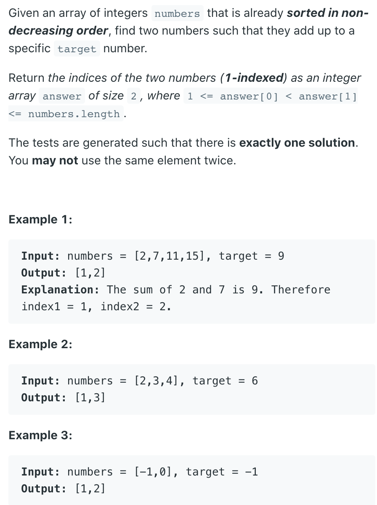
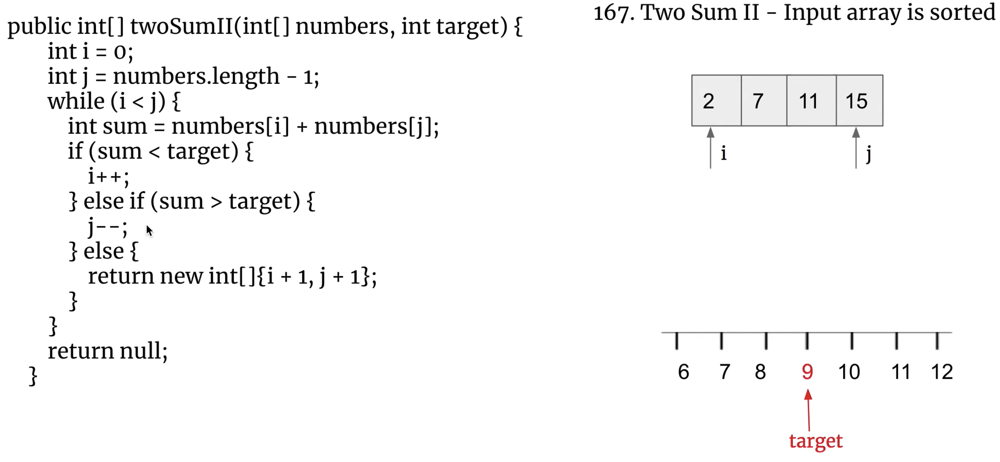

## 167. Two Sum II - Input array is sorted




```java
class Solution {
    public int[] twoSum(int[] numbers, int target) {
        int i = 0;
        int j = numbers.length - 1;
        while (i < j) {
            int sum = numbers[i] + numbers[j];
            if (sum < target) {
                i++;
            } else if (sum > target) {
                j--;
            } else {
                return new int[]{i + 1, j + 1};
            }
        }
        return null;
    }
}
```