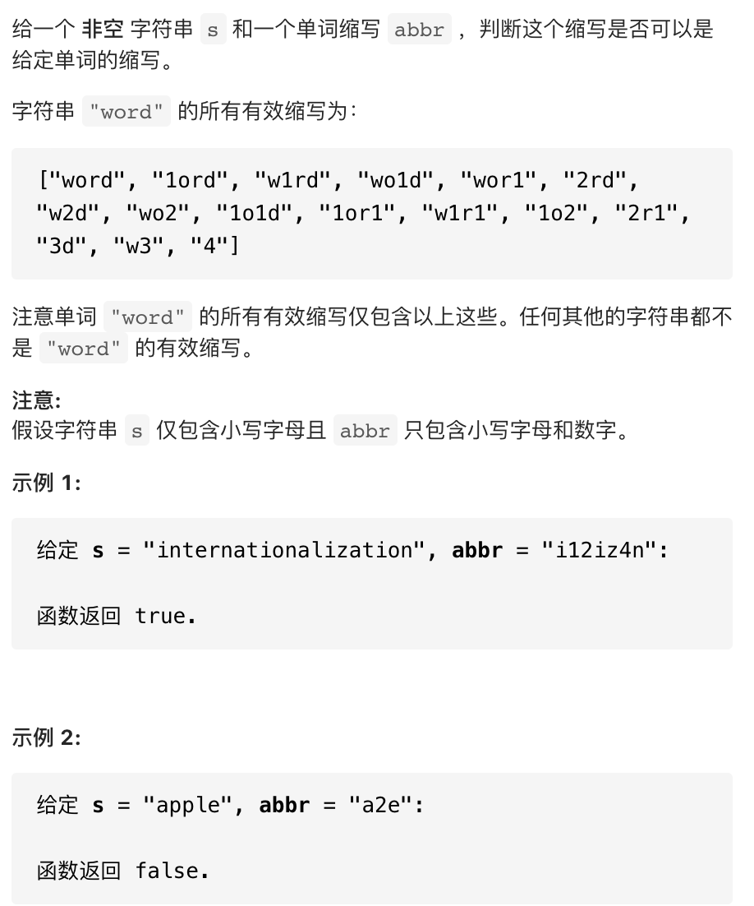
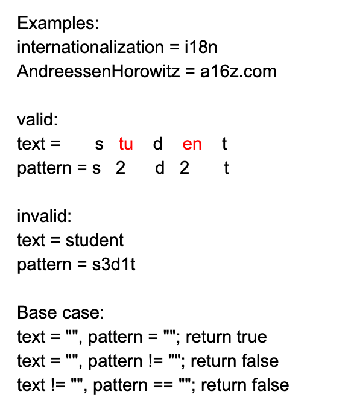
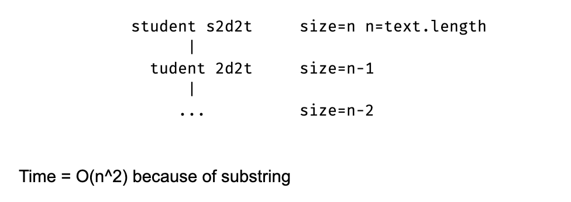

## 408 Valid Word Abbreviation







```java
class Solution {
    public boolean validWordAbbreviation(String word, String abbr) {
        if (word.length() == 0 && abbr.length() == 0) {
            return true;
        } 
        if (word.length() == 0 || abbr.length() == 0) {
            return false;
        }

        
        if (Character.isLetter(abbr.charAt(0))) {
            if (word.charAt(0) != abbr.charAt(0)) {
                return false;
            } else {
                return validWordAbbreviation(word.substring(1), abbr.substring(1));
            }
        } else {
            if (abbr.charAt(0) == '0') {
                return false;
            }
            int i = 0;
            int num = 0;
            while (i < abbr.length() && Character.isDigit(abbr.charAt(i))) {
                num = num * 10 + (abbr.charAt(i) - '0');
                i++;
            }
            if (num > word.length()) {
                return false;
            } else {
                return validWordAbbreviation(word.substring(num), abbr.substring(i));
            }
        }
    }
}
```